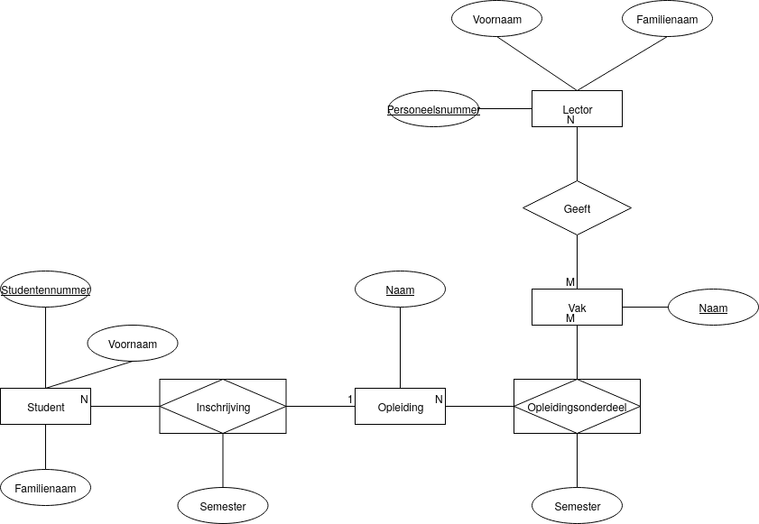

# Labo oefeningen

Om zelf tekeningen te maken, kan je gebruik maken van [draw.io](https://github.com/v-nys/cursusdatabanken/tree/5459e6b87d285922b7e01682b80f98f12b8096a0/semester-1-databanken-intro/erm/www.draw.io). Kies bij het aanmaken voor een blanco diagram en kies dan het onderdeel "Entity Relation".

Let op! Deze tool ondersteunt verschillende notaties! Gebruik de icoontjes vanaf dat voor "Entity" tot en met dat voor "Recursive Relationship (M:N)". Deze notatie lijkt sterk op die in \[dit voorbeeld op Wikipedia], maar gebruikt stippellijnen om entiteittypes en relatietypes te verbinden (met als uitleg "optional participation") wanneer het voorbeeld op Wikipedia gewone lijnen gebruikt. Het gebruikt volle lijnen waar het voorbeeld op Wikipedia dubbele lijnen gebruikt 😩.

Op draw.io trek je een stippellijn tussen een entiteittype en een relatietype als een entiteit niet hoeft deel te nemen aan een relatie. Bijvoorbeeld: regio in een game _hoeft_ geen personages te bevatten, want het kan zijn dat alle spelers in een _andere_ regio zitten. Langs de andere kant bevindt elk personage zich altijd wel in een regio, dus je trekt op draw.io een volle lijn tussen het entiteittype voor personages en het relatietype dat personages en regio's verbindt.

## Hogeschool

Zet onderstaand ERD om naar databasetabellen volgens [de procedure in de cursus](https://apwt.gitbook.io/cursus-databanken/semester-1-databanken-intro/erm/herleiden-van-erds-tot-tabellen).

Afspraken:

* Alle tekstattributen (voornamen, familienamen, namen van vakken en opleidingen) definieer je als `VARCHAR(100)`.
* De semesters definieer je als `TINYINT UNSIGNED`.
* Alle attributen op dit schema zijn verplicht.
* Gebruik de onderlijnde attributen als primary keys. Studentennummer en personeelsnummer mag je als automatisch ophogende `INT` definiëren; de sleutelattributen `Naam` definieer je als tekst met daarop de constraint `PRIMARY KEY`. In dit geval hoef je de primary key dus **niet** `Id` te noemen.
* Vreemde sleutels volgen dezelfde afspraken als eerder.

Noem het script dat deze tabellen toevoegt 0564\_\_Oefening.sql.

## Vakantieclub

Teken een entity relationship diagram (ERD) voor volgende situatie.

Vakantieclub SummerParks wil zijn klanten regelmatig mailen met promoties en informatie over vakantieverblijven, en dit gericht op het voorkeurprofiel van de klant.

1. Van elke klant houden ze naam, voornaam, adres, telefoon en een uniek klantennummer bij.
2. Van elk vakantieverblijf houden ze naam, regio, prijscategorie en profielen (sportief, kindvriendelijk, cultureel, ...) bij. Er is ook een unieke code per vakantieverblijf.
3. Van elke klant houden ze ook bij welk profiel zijn voorkeur heeft.


Omdat je wil dat de profielen voor klanten en vakantieverblijven in overeenstemming zijn, maak je best een entiteit voor profielen.


## Reservaties

Teken een entity relationship diagram (ERD) voor volgende situatie.

1. In een bedrijf moeten personeelsleden regelmatig vergaderingen organiseren. Hiervoor zijn een aantal lokalen voorzien. Men moet deze vooraf reserveren. Men kan ook bepaalde apparatuur (beamers, overheadprojectoren, laptops, geluidsinstallatie,...) lenen.
2. Elk lokaal heeft een uniek lokaalnummer en een omschrijving. Per lokaal houden we verder ook bij voor hoeveel personen het maximaal geschikt is, en in welke bedrijfsvestiging het lokaal gelegen is.
3. Elk apparaat heeft een uniek nummer en een omschrijving. We houden ook het serienummer van de producent bij en een aankoopwaarde.
4. Personeelsleden hebben een uniek personeelsnummer, een naam en voornaam, en een telefoonnummer. We houden ook bij op welke dienst ze werkzaam zijn.
5. Het secretariaat wil voor elke reservatie bijhouden wie welk lokaal en welke apparatuur gereserveerd heeft, de datum met begin- en eindtijdstip, en een korte motivatie.
6. Voor apparatuur moet de ontlener bovendien een borg moet betalen bij het secretariaat. De borg is voor elk afzonderlijk apparaat. Het secretariaat ontvangt en registreert de borg. Bij terugbrengen van het apparaat krijgt men de borg terug. Ook die terugbetaling wordt geregistreerd.


Je kan zelf kiezen of je een entiteittype gebruikt om een bedrijfsvestiging voor te stellen. In een grotere applicatie lijkt dat aangewezen, maar als oefening is het diagram al groot genoeg... Idem voor een dienst waarop personeel werkt.



draw.io ondersteunt geen notatie voor overerving, maar die zou hier wel van pas kunnen komen. Je kan, om dit op te lossen, een "note" element toevoegen aan je diagram en zeggen welke entiteittypes specifieke gevallen zijn van andere entiteittypes.

