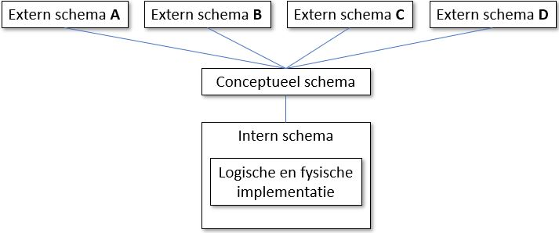

# Architectuur van een databank

Hieronder begrijpen we de wijze en de verschillende stappen die normaal gesproken doorlopen worden voordat een database kan opgesteld worden.

## **Extern schema**

Het extern schema staat het dichtst bij de eindgebruiker. Het gaat er hier over hoe een individuele eindgebruiker bepaalde gegevens benadert. Voor elk soort eindgebruiker wordt er een extern schema opgesteld, door te vertrekken vanuit de vraag: "Wat zijn de behoeften van deze gebruiker?"

Uiteraard zijn er een aantal aandachtspunten die men niet uit het oog mag verliezen, nl.

* Welke definities worden aan bepaalde gegevens toegekend?
* Welke gebruiker heeft toegang tot welke gegevens?

Hier worden ook de constraints \(beperkingen\) bepaald. Bijvoorbeeld: bepaalde data mag nooit ontbreken.

## **Conceptueel schema**

Het conceptueel schema houdt in dat de afzonderlijke externe schema's worden samengebracht. Dit gaat dan de basisstructuur vormen voor het opzetten van de database.

Ook wordt er getracht om bij het opstellen van het conceptuele schema de volgende principes in acht te nemen:

* uniciteit: d.w.z. dat dezelfde data niet onnodig herhaald wordt
* integriteit: d.w.z. dat de data voldoet aan alle veronderstelde beperkingen
* veiligheid 

In dit stadium wordt nog niet bepaald welk type van database zal opgesteld worden.

## **Intern schema**

Het intern schema houdt in dat het conceptuele schema wordt geïmplementeerd.

Hierbij worden volgende vragen gesteld:

* wat zijn de gewenste datastructuren en welke zijn de beperkingen m.b.t. het conceptuele schema?
* wat zijn de mogelijkheden van het gekozen model?

Het interne schema bevat twee onderdelen, nl.

* de logische implementatie
* de fysieke implementatie

