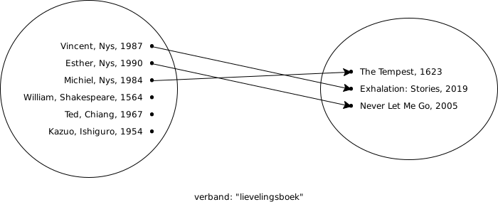
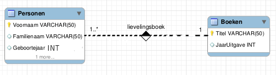
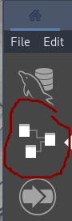

# Diagramnotatie


[Kennisclip bij deze inhoud](https://youtu.be/EEho14DAyZE)


Om een beter overzicht van het databaseschema te krijgen, maken we vaak gebruik van een diagram. Dit wordt een entity-relationship diagram \(of "ERD"\) genoemd. Dit lijkt wat op de verzamelingennotatie die we eerder zagen, maar werkt op een ander niveau.

Neem volgend voorbeeld:



Dit zegt volgende zaken:

```text
Exhalation is het lievelingsboek van Vincent
The Tempest is het lievelingsboek van Michiel
Never Let Me Go is het lievelingsboek van Esther
```

In het algemeen kunnen we dus stellen: personen hebben een lievelingsboek. Als we verder vastleggen dat personen altijd exact één lievelingsboek hebben, kunnen we dit grafisch uitdrukken als volgt:



Hier staat niets over Vincent, Esther of Michiel. Maar er staat dat er een relatietype is dat personen en boeken verbindt. De exacte betekenis van de getallen, de icoontjes en de stippellijn laten we voor iets later, maar onthoud alvast dat de rechthoeken de entiteiten voorstellen \(met hun kolommen\) en de ruiten relaties.

Let op: er zijn veel stijlen van notatie voor het entity-relationship diagram. Wij hebben dit met MySQL Workbench getekend door eerst volgende knop te gebruiken:



Daarna hebben we de plusknop gebruikt en op "Add diagram" geklikt.

Ten slotte hebben we via de menuknop "Model" gekozen voor "Object Notation" → "Workbench \(Simplified\)" en voor "Relationship Notation" → "Classic". Dit is ook de afspraak die we zullen hanteren voor de rest van de cursus.

Als je een ERD tegenkomt op het internet, ga dan eerst na welke notatie gebruikt is. Anders kan je niet weten wat het ERD precies voorstelt.

