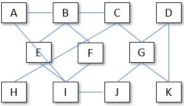

# Logische databankstructuren

We weten al wat een database is, maar er bestaan bepaalde types, hieronder worden de voornaamste types kort besproken. 

## **De hiërarchische database \(of semantische database\)** 

Deze vertrekt van een centraal punt en gaat telkens een hiërarchische trap lager. 

Hierbij wordt ervan uitgegaan dat, van zodra men een zgn. “tak” heeft aangesproken, deze “tak” verder onafhankelijk hiërarchisch vertakt. 

Iedere tak blijft dus onafhankelijk verder vertakken en relaties tussen de takken die van hetzelfde centraal punt zijn vertrokken, zijn onmogelijk. 

Een dergelijke aanpak of structuur is dus uitermate bruikbaar voor structuren die onafhankelijke substructuren bevatten. 

Zoals je reeds begrepen zal hebben, geldt een dergelijke structuur, of beter nog, is een dergelijke structuur enkel praktisch bruikbaar voor zeer goed gestructureerde verzamelingen van gegevens. Een bijzonder nadeel daarentegen is wel dat het niet eenvoudig is om een dergelijke structuur zgn. zuiver \(cfr. normalisatie\) te houden. Hierbij is de \(gegevens\)onafhankelijkheid uiteraard een sleutelgegeven. Indien men in het opzet slaagt om hetgeen hierboven vermeld wel degelijk op te zetten, dan zijn de onderscheiden relaties bijzonder sterk. 

Een nadeel is dan weer wel dat de verschillende vertakkingen steeds vertrekken van dat ene centrale punt.

Zoals blijkt uit bovenvermelde figuur is de hiërarchische structuur een "**boomstructuur**". 

Evenwel bestaat er nog een groot nadeel, nl. de structuur is vrij stijf, ttz. wanneer er een wijziging dient aangebracht is er misschien een totaal nieuwe analyse noodzakelijk, ofwel moet men de structuur herzien en dit is geen gemakkelijke opgave. 

Een betrekkelijk groot voordeel daarentegen is dat in deze structuur er op een eenvoudige manier bepaalde onafhankelijk opererende takken kan verwijderen. Hierin schuilt dan weer de zgn. sterke relatie. 

Bijzondere problemen kunnen ontstaat als de analyse van de zgn. grote takken wordt uitgevoerd door verschillende personen. Het kan dan voorkomen dat er bepaalde overlappingen van gegevens ontstaan.

## **Het relationele model** 

De analyse van dit model gaat ervan uit dat men de zgn. structuur van dit model gaat openbreken in substructuren van een steeds onderliggend niveau. Het is duidelijk dat men hier de zo sterk mogelijke onafhankelijk nastreeft. Hierbij wordt er evenwel geen inspanning geleverd om een bepaalde structurele vorm op te zetten, maar men bewerkstelligd een losse structuur. Het is daarentegen wel belangrijk dat iedere substructuur een welbepaalde relatie vertoont met een andere substructuur 

Zoals onderstaande figuur duidelijk vertoont, is dat de structuur lijkt op een spinneweb of mazennet. De verschillende lijnen van de ene substructuur naar de andere vertegenwoordigen de relaties.

Het is vanzelfsprekend dat een dergelijke structuur veronderstelt dat het te analyseren systeem echt wel goed gekend moet zijn.   
De verschillende substructuren volledig onafhankelijk maken, is dan ook niet eenvoudig.

Een nadeel evenwel is dat invoeren van nieuwe substructuren met nieuwe relaties t.o.v. andere substructuren moeilijk kan verlopen. In ieder geval zal dit enige tijd in beslag nemen. 

Een tweede nadeel is dat de database in feite geen structuur vertoont. 

Een voordeel daarentegen is dan weer dat deze structuur kan benaderd worden vanuit eender welke substructuur. Via de onderliggende relaties bereikt men de vereiste gegevens. Hier vormen dus de relaties een belangrijk gegeven.

