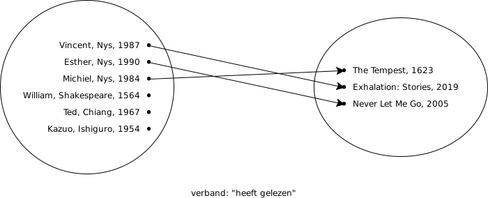

# Wat is een relationele databank


[Kennisclip voor deze inhoud](https://youtu.be/wKcjQbXl-g4)


De "relationele" database is waarschijnlijk de meestgebruikte soort database. Dit type database is uitgewerkt in de jaren 1970 en steunt op de wiskundige verzamelingenleer.

Zonder deze wiskundige fundering in veel detail te behandelen: het basisidee is dat "interessante gehelen" van informatie in verzamelingen van één soort data worden opgedeeld. Tussen deze verzamelingen bestaan verbanden.

Onderstaande figuur illustreert dit. Op deze figuur zijn de interessante gehelen personen en boeken. Deze twee verzamelingen bestaan los van elkaar, maar er is een verband: sommige personen hebben sommige boeken gelezen.

Er kunnen veel verbanden zijn. We kunnen bijvoorbeeld een tweede verband hebben dat uitdrukt dat een bepaalde persoon een bepaald boek heeft geschreven:

Om dit in een elektronisch systeem voor te stellen, maken we geen tekeningen, maar gebruiken we tabellen. We doen dit zowel voor de "interessante gehelen" \(dus de elementen van de verzamelingen\) als voor de verbanden tussen elementen van deze verzamelingen.

Voor de eerste tekening zou een tabelvoorstelling van de verzamelingen er zo kunnen uitzien:

| Voornaam | Familienaam | Geboortejaar |
| :--- | :--- | :--- |
| Vincent | Nys | 1987 |
| Esther | Nys | 1990 |
| Michiel | Nys | 1984 |
| William | Shakespeare | 1564 |
| Ted | Chiang | 1967 |
| Kazuo | Ishiguro | 1954 |

| Titel | Jaar van uitgave |
| :--- | :--- |
| The Tempest | 1623 |
| Exhalation: Stories | 2019 |
| Never Let Me Go | 2005 |

Ook het verband zou kunnen worden uitgedrukt met een tabel. Hoe dat precies werkt is voor iets verder, maar een vereenvoudiging die een goed beeld geeft is als volgt:

| Lezer | Titel |
| :--- | :--- |
| Michiel | The Tempest |
| Vincent | Exhalation: Stories |
| Esther | Never Let Me Go |

Zowat alle DBMS'en voor relationele databases spreken \(ongeveer\) dezelfde taal: de "Structured Query Language" of SQL. Deze taal is ook gebaseerd op de relationele algebra's en ze maakt dat je vrij snel kan leren werken met één relationele database als je al met een andere relationele database overweg kan. Elk DBMS spreekt wel een eigen "dialect" van SQL, dus je kan niet verwachten dat code voor bijvoorbeeld PostgreSQL \(een type relationele database\) letterlijk kan worden uitgevoerd in SQLite \(een ander type relationele database\). Maar normaal moet je er niet veel aan aanpassen.

Typisch voor relationele databases is dat je op voorhand moet vastleggen wat de structuur van je database is: welke tabellen er zijn en wat voor gegevens hier in mogen worden geplaatst. Deze structuur noemen we het "schema". Als je nieuwe gegevens wil bijhouden die niet passen binnen de structuur, moet je eerst de structuur aanpassen. Dit is niet bij alle soorten databanken zo. Andere types databanken hebben soms een heel losse structuur. Dit geeft hen soms meer flexibiliteit, maar zorgt er soms ook voor dat ze minder kunnen waken over de integriteit van hun gegevens.

