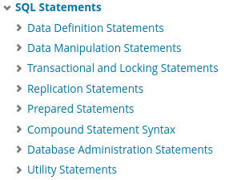

# (My)SQL

## Structuur van MySQL


[Kennisclip voor deze inhoud](https://youtu.be/jGGsXvdEYyI)


MySQL is opgedeeld in een aantal deeltalen. Elke deeltaal dient voor een bepaald soort gebruik. Het is nuttig (sommige van) deze deeltalen meteen te kunnen herkennen, want ze maken het makkelijker de syntax te onthouden.

De volledige lijst deeltalen vind je terug in de (uitstekende) MySQL documentatie. Hij ziet er zo uit:

Je hoeft deze niet uit het hoofd te leren, maar het is wel nuttig om vanaf het begin een onderscheid te maken tussen data definition statements en data manipulation statements.

Data definition statements (ook de "**Data Definition Language**" of "**DDL**") dienen om vast te leggen hoe je gegevens er zullen uitzien. Met andere woorden, de structuur van de data. Ze bieden een antwoord op vragen zoals:

* Welke tabellen zijn er?
* Welk type gegevens mag ik in een bepaalde kolom bijhouden?
* Is het toegestaan bepaalde cellen leeg te laten?

Data manipulation statements (of de "**Data Manipulation Language**" of "**DML**") dient om specifieke data te beheren en niet de structuur van de data. Voorbeelden hiervan zijn:

* Maak een nieuwe rij aan in de tabel Personen.
* Pas Said aan naar Saïd.
* Verwijder Sanae uit de tabel Personen.

Als je jezelf steeds de vraag stelt of iets thuishoort in de DML of in de DDL, zal je veel makkelijker de juiste syntax terugvinden.

## Voorbeeldinstructies MySQL


[Kennisclip voor deze inhoud](https://youtu.be/c4nAguBLFAc)


MySQL-instructies zijn vrij leesbaar in vergelijking met veel programmeertalen. Hieronder volgen enkele voorbeelden. Je hoeft deze nog niet zelf te kunnen gebruiken. Ze staan er alleen om je een idee te geven van hoe MySQL syntax er uitziet.

Volgend stukje code voegt een nieuwe persoon, Zadie Smith, toe aan de tabel met personen: `INSERT INTO Personen(Voornaam,Familienaam,Geboortejaar) VALUES ('Zadie','Smith',1975);` Hier betekent INSERT dat er iets nieuws wordt toegevoegd.

Volgend stukje code voegt een nieuwe tabel, Liedjes, toe aan de database. Elk liedje heeft een titel en een duurtijd. De titel is tekst met maximum 100 symbolen en de duurtijd is een geheel getal: `CREATE TABLE Liedjes(Titel VARCHAR(100), Duurtijd INT);`

Instructies zoals deze zal je intypen in je MySQL client (typisch MySQL Workbench).


MySQL-instructies zijn **voor een deel** hoofdlettergevoelig. De syntax van MySQL zelf is niet hoofdlettergevoelig. Identifiers, d.w.z. namen van tabellen of andere structuren zijn wel hoofdlettergevoelig. Ook de data die je zelf in het systeem plaatst kan hoofdlettergevoelig zijn, afhankelijk van je instellingen. Behandel alles behalve de sleutelwoorden van MySQL zelf als hoofdlettergevoelig om problemen te vermijden.

