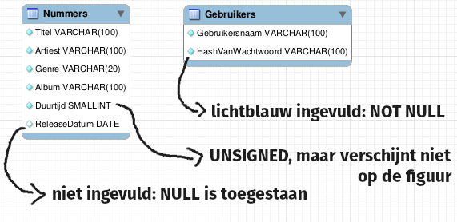

# apTunes project

Relationele databases vormen regelmatig de ruggegraat van \(web\)applicaties. We zullen dat in de verdere labo-oefeningen demonstreren. Voor de verdere oefeningen zullen we voornamelijk werken met een database genaamd `apTunes`. Dit is een database die je zou kunnen gebruiken om een streamingdienst \(vergelijkbaar met Spotify, Deezer,...\) te ondersteunen.

`apTunes` moet allerlei functionaliteit ondersteunen die je gewend bent van echte streamingdiensten, onder meer:

* voor de eindgebruiker:
  * zoeken op titel, artiest, genre, etc. van een nummer
  * bijhouden van een persoonlijke collectie nummers, albums, playlists
  * nummers opslaan als favorieten
  * enzovoort
* voor de eigenaar:
  * de populairste nummers binnen een bepaalde periode opvragen
  * per artiest het aantal afgespeelde nummers in een bepaalde periode opvragen
  * enzovoort

Tegen het einde van de cursus ken je genoeg MySQL om de databasekant van een prototype van een dergelijke streamingdienst te schrijven.


We zeggen uitdrukkelijk "prototype". Je zal de nodige data kunnen bijhouden en opzoeken, maar in een echte applicatie moet je ook rekening houden met performantie, beveiliging en stabiliteit. Die zaken laten we voor later.


### Het startpunt

We starten vanaf een voorstelling die we steeds beter en beter zullen maken:

Schrijf zelf code die deze twee tabellen aanmaakt en noem ze _**aptunes\_\_0001.sql**_. Merk op dat de duurtijd uitgedrukt wordt in seconden.

### Mogelijkheden verkennen


Voer je een foute instructie uit? Voer dan in volgorde elk script uit dat in het vet en cursief staat tot vlak voor het script waarbij het fout liep en corrigeer dan je script.



Als gevraagd wordt om "een nummer" of "alle nummers" te tonen, lees dan "alle kolommen uit de tabel `Nummers`" in hun oorspronkelijke volgorde.




* Voer bovenstaand script uit en zet het in je map met scripts met de naam _**aptunes\_\_0002.sql**_.
* Schrijf een script, aptunes\_\_0003.sql, dat alle nummers van Led Zeppelin in het systeem toont volgens titel.
* Schrijf een script, aptunes\_\_0004.sql, dat alle nummers van Ghostface Killah en alle nummers van Blues Pills samen toont, eerst volgens artiest en dan volgens titel. Dus eerst komen alle nummers van Blues Pills in alfabetische volgorde en dan alle nummers van Ghostface Killah in alfabetische volgorde.
* Wis alle nummers die geen releasedatum hebben. Noem je script _**aptunes\_\_0005.sql**_.
* Schrijf een script, aptunes\_\_0006.sql, dat alle nummers die geen klassieke muziek zijn toont. Bekijk de data om te achterhalen hoe je klassieke nummers kan herkennen.
* Schrijf een script aptunes\_\_0007.sql dat de titels van alle nummers toont die strikt minder dan 2 minuten duren en daarnaast ook toont hoe veel minder. Je zou dus iets als dit kunnen zien als "Kortjakje" 55 seconden duurt en "'k Zag twee beren" 40 seconden duurt:

| titel | \(wat hier staat is niet belangrijk\) |
| :--- | :--- |
| Kortjakje | 65 |
| 'k Zag twee beren | 80 |

Denk nu even na over een aantal zoekopdrachten die je met dit model nog niet zou kunnen doen. Noteer ze voor jezelf. Bespreek tijdens het labo klassikaal.

### Structuur verbeteren

Voor onze streamingdienst is het handiger te werken met een vaste set van genres. Anders krijgen we zo veel subgenres dat het niet meer handig is genres te gebruiken. Vandaar volgende wijziging:

* Voeg met script _**aptunes\_\_0008.sql**_ een kolom GenreEnum toe. Deze is voorlopig niet verplicht en kan alleen volgende waardes bevatten: `Klassiek`, `Pop`, `Jazz`, `Metal`, `Rap`, `Electro`, `Folk`, `Wereldmuziek`, `Blues`, `Rock`. Het is niet de bedoeling dat je de oude kolom `Genre` verwijdert of dat je de nieuwe kolom al invult! Verderop zullen we vertalen van de oude kolom naar de nieuwe!
* Vul met script _**aptunes\_\_0009.sql**_ de kolom GenreEnum in. Doe dit door gebruik te maken van de LIKE operator om volgende "vertalingen" toe te passen:
  * alles met de \(hoofdletterongevoelige\) substring "klass" in de oude kolom wordt "Klassiek" in de nieuwe kolom
  * alles dat eindigt op de \(hoofdletterongevoelige\) substring "rock" in de oude kolom wordt "Rock" in de nieuwe kolom
  * "rap" en "hiphop" \(hoofdletterongevoelig\) worden gegroepeerd onder "Rap"
  * alles met het woord "metal" \(hoofdletterongevoelig\) in wordt "Metal"
  * alles dat eindigt op "blues" \(hoofdletterongevoelig\) wordt "Blues"
* Test met script aptunes\_\_0010.sql of alle nummers nu een \(nieuw\) genre hebben door de nummers zonder genre te selecteren.
* Verwijder met script _**aptunes\_\_0011**_.sql de oude kolom `Genre` en hernoem `GenreEnum` naar `Genre`. Maak hierbij het nieuwe genre ook een verplichte kolom.

We merken ook dat het niet erg nuttig is om een exacte datum bij te houden per nummer. We willen alleen het jaar. Je kan het jaar uit een datum halen door er de `YEAR`-functie op toe te passen.

* Maak met script _**aptunes\_\_0012.sql**_ een kolom `ReleaseJaar` aan, vul deze automatisch in op basis van de releasedatum die je al hebt, maak de nieuwe kolom verplicht en verwijder ten slotte de kolom `ReleaseDatum`. Dit zal niet werken voor de nummers van Debussy, omdat ze te oud zijn om met het YEAR-datatype voor te stellen. Vul daarom het jaar van de uitvoering in voor deze nummers: 1985.

### Functionaliteit toevoegen

Nu willen we weten wat de prijs is die de artiest verdient \(in eurocent\) wanneer een nummer gestreamd wordt. We zullen dit bijhouden met een kolom `Royalties`. Deze heeft type `TINYINT`en is unsigned.  Er is een vuistregel voor het vastleggen van royalties, maar voor sommige nummers is er een speciale regeling. Omdat er alleen in gehele bedragen in eurocent wordt gewerkt, heb je de functie `ROUND` nodig om een getal af te ronden.

* Voeg met script _**aptunes\_\_0013.sql**_ deze kolom toe. Vul ze in als volgt:
  * Klassieke nummers krijgen normaal 1 eurocent per 60 seconden, dus je stelt de royalties in als de duurtijd gedeeld door 60 \(afgerond\).
  * Rocknummers en metalnummers krijgen 1 eurocent per 20 seconden.
  * Rap krijgt 1 eurocent per 15 seconden.
  * Nummers van Led Zeppelin krijgen 1 eurocent per 10 seconden.
* Er is een wijziging in de prijsstructuur! Verhoog met script _**aptunes\_\_0014.sql**_ alle royalties met 20%. Rond opnieuw af om een geheel bedrag te krijgen.

### Informatie voor de eigenaars

De eigenaars van onze streamingdienst willen statistieken over de artiesten.

Gebruik eerst volgend script _**aptunes\_\_0015.sql**_ om meer data in het systeem te plaatsen:



Nu er redelijk wat data is, moeten we die gaan samenvatten eerder dan rij per rij te bekijken.

* Schrijf een script aptunes\_\_0016.sql dat toont hoe veel rocknummers er in het systeem zijn.
* Schrijf een script aptunes\_\_0017.sql dat voor elk genre toont hoe veel nummers er zijn. Het formaat van de uitvoer is als volgt en de genres zijn gesorteerd volgens de volgorde van de enum die de genres voorstelt:

| Genre | \(titel maakt niet uit\) |
| :--- | :--- |
| Genre 1 | \(aantal nummers in genre 1\) |
| Genre 2 | \(aantal nummers in genre 2\) |
| ... | ... |

* Toon het releasejaar van het oudste nummer in het systeem. De uitvoer is één rij met één kolom. De titel van deze kolom maakt niet uit. Noem je script aptunes\_\_0018.sql.
* Herschrijf volgende query zonder `DISTINCT` zodat je toch nog hetzelfde resultaat krijgt en noem je script aptunes\_\_0019.sql: `SELECT DISTINCT Artiest FROM Nummers;`
* Herschrijf volgende query zonder BETWEEN zodat je toch nog hetzelfde resultaat krijgt en noem je script aptunes\_\_0020.sql: `SELECT Titel From Nummers WHERE ReleaseJaar BETWEEN 1975 AND 1985;`
* Toon alle nummers die minstens 5 minuten duren volgens titel. Noem je script aptunes\_\_0021.sql.
* Toon alle genres waarvan de nummers gemiddeld minstens 5 minuten duren, in de volgorde die is vastgelegd voor de genre enum. Noem je script aptunes\_\_0022.sql.
* Het blijkt dat erg lange klassieke nummers niet erg winstgevend zijn voor onze dienst. Toon daarom alfabetisch alle artiesten die klassieke nummers hebben, maar enkel als hun klassieke nummers ook gemiddeld langer dan 8 minuten duren. Noem je script aptunes\_\_0023.sql. **Tip: je hebt hier een combinatie van** [**alle clausules** ](dml/select/select-met-clausules.md)**nodig.**

## Normalisatie van de apTunes databank

De apTunes database, zoals ze ontwikkeld is met scripts 1 tot 23, is niet erg efficiënt ontworpen. We zullen ze herstructureren met relationele concepten.

### 1-op-N relaties

Volg eerst volgende [kennisclip](https://youtu.be/PBBrW4f14Dg) **\(let vooral goed op bij de uitleg over wat de getallen bij een relatie betekenen\)**. Maak zelf mee de scripts \(voer eerst het calibratiescript en script 0015 uit!\) en nummer als volgt:


Een eerdere versie van deze instructies bevatte een fout die niet was opgemerkt tot na het labo. Waarschijnlijk heb je de foute instructies gebruikt. Zie de modeloplossing.


* het script om een tabel `Artiesten` te maken is `aptunes__0024.sql`
* het script om data te migreren naar `Artiesten` is `aptunes__0025.sql`
* het script om `Nummers` te voorzien van een foreign key is `aptunes__0026.sql`
* het script om de artiesten te linken hoef je op dit moment niet te begrijpen, maar krijg je hieronder \(`aptunes__0027.sql`\)
* het script om de kolom `Artiest` uit `Nummers` te verwijderen is `aptunes__0028.sql`
* het script om `Albums` te maken is `aptunes__0029.sql` \(schrijf je zelf\)
* het script om data te migreren naar `Albums` is `aptunes__0030.sql` \(schrijf je zelf\)
* het script om `Albums` te voorzien van een foreign key waarmee je naar de artiest verwijst is `aptunes__0031.sql` \(schrijf je zelf\)
* het script om de albums te linken krijg je hieronder \(`aptunes__0032.sql`\)
* **er is geen script aptunes\_\_0033.sql omwille van een fout in een eerdere versie van deze opgave**
* het script om gebruikers toe te voegen krijg je hieronder \(`aptunes__0034.sql`\)







### Veel-op-veel \(M-op-N\) relaties



Volg eerst [deze kennisclip](https://youtu.be/QEPXHLC9Nqw). Dit is het vervolg van de vorige kennisclips. Fris het vorige deel dus op indien je ergens niet kan volgen, want deze leerstof bouwt rechtstreeks voort op de vorige.

* Het script om `GebruikerHeeftAlbum` toe te voegen noem je `aptunes__0035.sql`
* Het script om de data toe te voegen \(`aptunes__0036.sql`\) vind je hieronder terug.
* Het script om `NummerOpAlbum` toe te voegen noem je `aptunes__0037.sql`. Het tracknummer past in een `tinyint` en is altijd positief en is verplicht 
  * In deze tabel sla je volgende informatie op met een eigen script `aptunes__0038.sql`. \(Om dit te doen zoek je met de hand de `Id` van het nummer en van het album op in hun tabellen en `INSERT` je hun combinatie in de nieuwe tabel `NummerOpAlbum`. De werkwijze is dus dezelfde als in script 36.\)
    * Het nummer met titel _Stairway to Heaven_ is het vierde nummer op het album Led Zeppelin IV
    * Het nummer met titel _Problem Child_ is het tweede nummer op het album met titel Let There Be Rock
* Het script om `GebruikerHeeftNummer` toe te voegen noem je `aptunes__0039.sql`
  * In deze tabel sla je volgende informatie op met een eigen script `aptunes__0040.sql`. De werkwijze is dezelfde als eerder.
    * tuneBoY5 heeft het nummer _Little Sun_, maar het is geen favoriet
    * musicfan111 heeft het nummer _Eat the Rich_ en het is een favoriet



