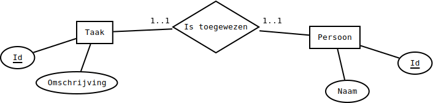
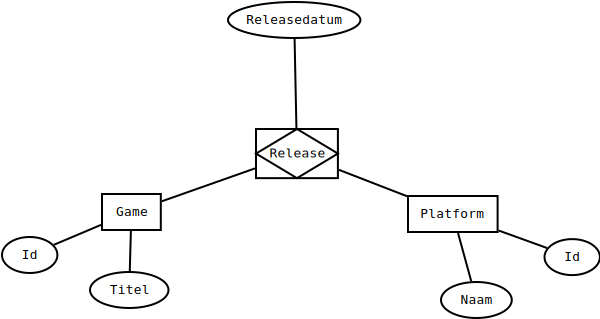

# Relaties-voorstellen

## Relatietypes voorstellen

Afhankelijk van hoe entiteiten aan elkaar gekoppeld kunnen zijn, delen we de koppelingen tussen deze entiteiten op in categorieën:

* een-op-een-relaties
* een-op-veel-relaties \(ook wel 1-op-N relaties genoemd\)
* veel-op-veel-relaties \(ook wel M-op-N relaties genoemd\)

### een-op-een relaties

De simpelste verbanden zijn één-op-één verbanden. Dat wil zeggen: precies twee rijen nemen deel aan de relatie. Normaal zijn dit rijen van verschillende entiteittypes.

Een voorbeeld: een sportclub organiseert een jaarlijks etentje en alle leden krijgen precies één taak. Eén lid zorgt bijvoorbeeld voor bestek, een ander voor frisdrank, een ander voor onderleggers, enzovoort. De club gebruikt een database om de taken en de leden bij te houden en de taken zijn elk jaar dezelfde. Bijvoorbeeld:

* taken:
  * bestek voorzien
  * frisdrank meebrengen
  * aardappelsla maken
* leden:
  * Yannick
  * Bavo
  * Max

Onderstaande figuur stelt deze indeling voor in een ERD in [Chen-notatie](https://en.wikipedia.org/wiki/Entity%E2%80%93relationship_model):



In dit geval is het logisch om een aparte tabel \(`Taken`\) voor taken en een aparte tabel \(`Leden`\) voor leden te gebruiken. Het is onhandig om uit te leggen dat één rij in de databank een lid en een taak voorstelt, omdat de tabellen best zo goed mogelijk overeenstemmen met duidelijke concepten. Het is logischer de leden en de taken als aparte entiteiten te beschouwen en een relatie tussen beide vast te leggen.

#### voorstelling van één-op-één relaties

Om een relaties tussen rijen van de tabellen vast te leggen, maken we de rijen eerst identificeerbaar met een primaire sleutel. Bijvoorbeeld, voor de taken:

| omschrijving | Id |
| :--- | :--- |
| bestek voorzien | 1 |
| frisdrank meebrengen | 2 |
| aardappelsla maken | 3 |

Voor de leden:

| voornaam | Id |
| :--- | :--- |
| Yannick | 1 |
| Bavo | 2 |
| Max | 3 |

Zet de structuur van de twee tabellen om in SQL-tabellen met een script 0059\_\_CreateTakenLeden.sql. Elke normale kolom bestaat uit een reeks van maximaal 50 karakters \(zonder accenten e.d.\) en is verplicht. De `Id`-kolom stel je voor met een `INT` die automatisch ophoogt.

Vul de twee tabellen, `Taken` en `Leden` in met een script 0060\_\_InsertTakenLeden.sql.

Als Bavo bestek voorziet, Yannick frisdrank meebrengt en Max aardappelsla maakt, kunnen we dat als volgt bijhouden in een aparte tabel die alleen vreemde sleutels bevat:

| Leden\_Id | Taken\_Id |
| :--- | :--- |
| 2 | 1 |
| 1 | 2 |
| 3 | 3 |

In de praktijk wordt er normaal niet voor gekozen om deze relatie in een aparte tabel vast te leggen. Dat zou gaan, maar het is gewoon een beetje te veel van het goede. Je hebt geen aparte tabel nodig. Eén van de twee tabellen wordt uitgebreid met een foreign key. Er zijn twee mogelijkheden:

| omschrijving | Id | Leden\_Id |
| :--- | :--- | :--- |
| bestek voorzien | 1 | 2 |
| frisdrank meebrengen | 2 | 1 |
| aardappelsla maken | 3 | 3 |

of

| voornaam | Id | Taken\_Id |
| :--- | :--- | :--- |
| Yannick | 1 | 2 |
| Bavo | 2 | 1 |
| Max | 3 | 3 |

Beide zijn even goed. Typisch wordt gekozen om de foreign key in de tabel te zetten met het kleinste aantal kolommen, om alles een beetje in evenwicht te houden. Hier hebben beide even veel kolommen dus het maakt helemaal niet uit.

Pas je tabel Leden aan zodat ze de tweede mogelijkheid van hierboven implementeert in een script 0061\_\_AlterLeden.sql. Je mag **niet** verhinderen dat de vreemde sleutel de waarde `NULL` aanneemt.

Om de data te combineren, moet je nu [gebruik maken van een `JOIN`-operatie](../dml-gevorderd/joins-simpele-relaties.md). Voor een een-op-een-relatie is dit iets makkelijker.

### een-op-veel relaties

Een een-op-veel \(of 1-op-N\) verband is een verband dat je heel vaak tegenkomt op websites met een achterliggende databank. Bij dit soort verband stemt een rij uit een bepaalde tabel A overeen met meerdere rijen uit een tabel B. In de omgekeerde richting stemt een rij uit tabel B maar met één rij van tabel A overeen. Bijvoorbeeld, als je tweets bijhoudt in een databank, kan één persoon meerdere tweets hebben, maar één tweet kan oorspronkelijk slechts van één persoon komen. Hier moet je je inbeelden dat personen bijgehouden worden in tabel A en tweets in tabel B.

In een database van een webshop kan één persoon meerdere bestellingen plaatsen, maar één bestelling kan slechts van één klant komen. Hier geldt: personen in A, bestellingen in B.

Hier zijn enkele tweets die we als voorbeeld zullen gebruiken, voorafgegaan door de handle van de gebruiker die ze geschreven heeft:

```text
@NintendoEurope: Don't forget -- Nintendo Labo: VR Kit launches 12/04!
@NintendoEurope: Splat it out in the #Splatoon2 EU Community Cup 5 this Sunday!
@NintendoEurope: Crikey! Keep an eye out for cardboard crocs and other crafty wildlife on this jungle train ride! #Yoshi
@Xbox: You had a lot to say about #MetroExodus. Check out our favorite 5-word reviews.
@Xbox: It's a perfect day for some mayhem.
@Xbox: Drift all over N. Sanity Beach and beyond in Crash Team Racing Nitro-Fueled.
```

Zoals in het geval van de 1-op-1 relatie, kunnen we deze relatie tussen gebruikers en tweets voorstellen in een tabel:

| user | tweet |
| :--- | :--- |
| 1 | 1 |
| 1 | 2 |
| 1 | 3 |
| 2 | 4 |
| 2 | 5 |
| 2 | 6 |

Dit is opnieuw iets meer dan we nodig hebben. We kunnen een foreign key van één tabel toevoegen aan een andere. Maar, in tegenstelling tot de precieze 1-op-1-relatie, mogen we niet kiezen. We zetten de foreign key in de tabel die niet aan de "exact-1"-kant van de relatie zit. Zorg er ook voor dat de vreemde sleutel nooit NULL is met een constraint.

Voer dit zelfstandig uit voor de reeks tweets hierboven. Volg de reeds afgesproken afspraken: één tabel `Users` voor users \(met een kolom `Handle`\), één tabel `Tweets` voor tweets \(met een kolom Bericht\), beide voorzien van primaire sleutels, met de vreemde sleutel aan de "N-kant". Stel gebruikersnamen en tweets voor met kolommen van variabele lengte \(tot 144 tekens\), zonder internationale tekens. De @ maakt geen deel uit van een gebruikersnaam. Zet de SQL-code die je nodig hebt om de tabellen te maken in een script 0062\_\_CreateUsersTweets.sql. Zet de code die je nodig hebt om de vreemde sleutel toe te voegen in 0063\_\_AlterTweets.sql. Zet ten slotte de code om de tabel in te vullen in een script 0064\_\_InsertUsersTweets.sql.

#### speciaal geval: een-op-max-een-relaties

Een een-op-max-een relatie is een relatie waarbij één entiteit A gelinkt is aan **hooguit** één andere entiteit B. Het kan ook zijn dat A aan geen enkele B gelinkt is. Deze stel je voor zoals een 1-op-N relatie, dus met de vreemde sleutel in de tabel aan de niet-exact-1-kant. Dit voorkomt vreemde sleutels met de waarde `NULL`.

Hoe je de tweets terug koppelt aan de juiste account, lees je ook bij de uitleg rond [`JOIN`-operaties bij simpele relaties](../dml-gevorderd/joins-simpele-relaties.md). Koppel users aan de juiste tweets in een script 0065\_\_SelectUsersTweets.sql.

### veel-op-veel relaties

Een auteur kan meerdere boeken hebben en een boek kan verschillende auteurs hebben. Een game kan op verschillende platformen uitgebracht zijn en voor elk platform zijn er verschillende games beschikbaar. Een student volgt verschillende vakken en in elk vak zitten verschillende studenten. Dit zijn allemaal voorbeelden waar één rij uit een tabel A gekoppeld kan zijn aan meerdere rijen uit een tabel B en één rij uit dezelfde tabel B gekoppeld kan zijn aan meerdere rijen uit dezelfde tabel A. We zeggen dan ook dat er een veel-op-veel of M-op-N-relatie bestaat tussen de entiteiten A en B.

Bij 1-op-1-relaties mochten we de vreemde sleutel in tabel A of B zetten. Bij 1-op-max-1 of 1-op-N relaties zetten we de vreemde sleutel in de tabel die niet precies één keer gekoppeld was. Dit werd vooral gedaan om geen overbodige tabellen toe te voegen. We konden in principe de takenverdeling voor het etentje ook als volgt voorstellen, met een aparte tabel:

| Leden\_Id | Taken\_Id |
| :--- | :--- |
| 2 | 1 |
| 1 | 2 |
| 3 | 3 |

We deden dit alleen anders omdat we het met een tabel minder \(en dus in totaal ook een kolom minder\) konden. Voor een M-op-N-relatie is deze voorstelling echter onze beste optie.

#### voorbeeld

Een game kan beschikbaar zijn op meerdere platformen en op elk platform zijn er natuurlijk meerdere games beschikbaar. Bijvoorbeeld:

* Anthem: beschikbaar op PS4, XBox One, Windows
* Sekiro: beschikbaar op PS4, XBox One, Windows
* Devil May Cry 5: beschikbaar op PS4, XBox One
* Mega Man 11: beschikbaar op PS4, XBox One, Windows, Nintendo Switch

Veronderstel dat Anthem ID 1 heeft, Sekiro 2, enzovoort. Veronderstel ook dat PS4 ID 1 heeft, Xbox One ID 2, Windows ID 3 en Nintendo Switch ID 4. Dan kunnen we voorstellen welke games uitgebracht zijn op welke platformen als volgt:

| Games.Id | Platformen.Id |
| :--- | :--- |
| 1 | 1 |
| 1 | 2 |
| 1 | 3 |
| 2 | 1 |
| 2 | 2 |
| 2 | 3 |
| 3 | 1 |
| 3 | 2 |
| 4 | 1 |
| 4 | 2 |
| 4 | 3 |
| 4 | 4 |

Voeg zelf de nodige structuur toe. Je hebt drie tabellen nodig: een voor games, een voor platformen, een voor de koppeling. De tabel `Games` heeft naast de `Id` één kolom: `Titel`, een stuk tekst van maximaal 50 karakters dat nooit leeg mag zijn en mogelijk Unicode karakters bevat. Voor `Platformen` is er een gelijkaardige structuur, maar de naam van de kolom die niet als sleutel wordt gebruikt is `Naam`. Noem de tabel die de koppeling afhandelt `Releases`. Volg de conventie voor de naam van de kolommen die naar beide andere tabellen verwijzen. Sla de DDL-instructies op als 0066\_\_CreateGamesPlatformsReleases.sql. Voeg de DML-instructies toe als 0067\_\_InsertGamesPlatformsReleases.sql.

[`JOIN`-operaties bij simpele relaties](../dml-gevorderd/joins-via-tussenliggende-tabel.md) legt uit hoe je nu toont welke games op welk platform verschenen zijn. Schrijf een script dat dit doet en noem het 0068\_\_SelectReleases.sql.

#### Relaties met attributen

Attributen horen meestal bij entiteiten, maar kunnen ook bij relaties horen. Bovenstaande tabel `Releases` geeft bijvoorbeeld aan welk spel op welk platform verschenen is, maar wat als we de releasedatum willen bijhouden? Deze hoort niet in de tabel `Games`. Hij hoort ook niet in de tabel Platformen. Hij hoort bij de combinatie van een game en een platform, d.w.z. bij de relatie die wordt voorgesteld met de tabel Releases. Daarom kunnen we de tabel ook uitbreiden met een kolom `Releasedatum`. Voor het leesgemak stellen we de games en de platformen niet voor via hun `Id`-attribuut.

| Titel | Naam | Releasedatum |
| :--- | :--- | :--- |
| Anthem | PS4 | 22 februari 2019 |
| Anthem | XBox One | 22 februari 2019 |
| Anthem | Windows | 22 februari 2019 |
| Sekiro: Shadows Die Twice | PS4 | 22 maart 2019 |
| Sekiro: Shadows Die Twice | XBox One | 22 maart 2019 |
| Sekiro: Shadows Die Twice | Windows | 22 maart 2019 |
| Devil May Cry 5 | PS4 | 8 maart 2019 |
| Devil May Cry 5 | XBox One | 8 maart 2019 |
| Mega Man 11 | PS4 | 2 oktober 2018 |
| Mega Man 11 | XBox One | 2 oktober 2018 |
| Mega Man 11 | Windows | 2 oktober 2018 |
| Mega Man 11 | Nintendo Switch | 2 oktober 2018 |

In een ERD stellen we dit als volgt voor:



In dit geval is `Releases` niet gewoon een tabel die een **relatie** voorstelt, maar wel een **associative entity**: een relatie tussen `Games` en `Platformen` die eigen kenmerken bezit, zodat je ze eigenlijk ook als een entiteit zou kunnen zien.

Voeg zelf de nodige info toe. Hiervoor volg je volgende stappen:

1. Voeg een kolom van type `DATE` toe aan de tabel `Releases`. Deze kan nog niet verplicht zijn. Noem het script 0069\_\_AlterReleases.sql.
2. Kopieer je script dat games en hun releaseplatform weergeeft naar een nieuw script, 0070\_\_UpdateReleases.sql.
3. Pas op de gecombineerde tabel de datum aan volgens de gegevens hierboven. Je kan in deze tabel een `SET` uitvoeren op `Releasedatum`.
4. Gebruik `WHERE Games.Titel = ... AND Platformen.Naam = ...` in plaats van eerst de sleutels af te lezen!
5. Maak de kolom voor de releasedatum verplicht via 0071\_\_AlterReleases.sql, zodat nieuwe games altijd een releasedatum moeten krijgen.

## Verdere soorten relaties

Tabellen kunnen meer dan twee entiteiten verbinden. Voor releases van games kan je bijvoorbeeld een spel, een uitgever en een platform aan elkaar linken met een M-op-N-op-K relatie. Dit is wel niet vaak nodig, dus denk altijd even goed na voor je dit doet. De keuze berust vooral op een goede analyse en goed overleg met de klant! In deze cursus zal je nooit een ternaire \(d.w.z. tussen drie entiteiten\) of hogere relatie nodig hebben.

