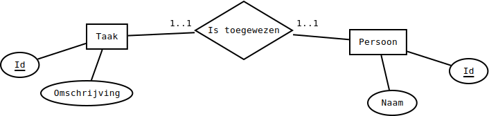

# Relatietypes voorstellen
Afhankelijk van hoe entiteiten aan elkaar gekoppeld kunnen zijn, delen we de koppelingen tussen deze entiteiten op in categorieën:

* een-op-een-relaties
* een-op-veel-relaties (ook wel 1-op-N relaties genoemd)
* veel-op-veel-relaties (ook wel M-op-N relaties genoemd)

## een-op-een relaties
De simpelste verbanden zijn één-op-één verbanden.
Dat wil zeggen: precies twee rijen nemen deel aan de relatie.
Normaal zijn dit rijen van verschillende entiteittypes.

Een voorbeeld: een sportclub organiseert een jaarlijks etentje en alle leden krijgen precies één taak.
Eén lid zorgt bijvoorbeeld voor bestek, een ander voor frisdrank, een ander voor onderleggers, enzovoort.
De club gebruikt een database om de taken en de leden bij te houden en de taken zijn elk jaar dezelfde. Bijvoorbeeld:

* taken:
  * bestek voorzien
  * frisdrank meebrengen
  * aardappelsla maken
* leden:
  * Yannick
  * Bavo
  * Max

Onderstaande figuur stelt deze indeling voor:

In dit geval is het logisch om een aparte tabel (`Taken`) voor taken en een aparte tabel (`Leden`) voor leden te gebruiken.
Het is onhandig om uit te leggen dat één rij in de databank een lid en een taak voorstelt, omdat de tabellen best zo goed mogelijk overeenstemmen met duidelijke concepten.
Het is logischer de leden en de taken als aparte entiteiten te beschouwen en een relatie tussen beide vast te leggen.

### voorstelling van één-op-één relaties
Om een relaties tussen rijen van de tabellen vast te leggen, maken we de rijen eerst identificeerbaar met een primaire sleutel.
Bijvoorbeeld, voor de taken:

| omschrijving | Id |
|--------------|----|
| bestek voorzien | 1 |
| frisdrank meebrengen | 2 |
| aardappelsla maken | 3 |

Voor de personen:

| voornaam | Id |
|----------|----|
| Yannick | 1 |
| Bavo | 2 |
| Max | 3 |

Zet de structuur van de twee tabellen om in SQL-tabellen met een script ???CreateTakenLeden. Elke kolom bestaat uit een reeks van maximaal 50 karakters (zonder accenten e.d.).

Vul de twee tabellen, Taken en Leden in met een script ???InsertTakenLeden.

Als Bavo bestek voorziet, Yannick frisdrank meebrengt en Max aardappelsla maakt, kunnen we dat als volgt bijhouden in een aparte tabel die alleen vreemde sleutels bevat:

| Leden_Id | Taken_Id |
|----------|----------|
| 2 | 1 |
| 1 | 2 |
| 3 | 3 |

In de praktijk wordt er normaal niet voor gekozen om deze relatie in een aparte tabel vast te leggen.
Dat zou gaan, maar het is gewoon een beetje te veel van het goede.
Je hebt geen aparte tabel nodig.
Eén van de twee tabellen wordt uitgebreid met een foreign key.
Er zijn twee mogelijkheden:

| omschrijving | Id | Leden_Id |
|--------------|----|----------|
| bestek voorzien | 1 | 2 |
| frisdrank meebrengen | 2 | 1 |
| aardappelsla maken | 3 | 3 |

of

| voornaam | Id | Taken_Id |
|----------|----|----------|
| Yannick | 1 | 2 |
| Bavo | 2 | 1 |
| Max | 3 | 3 |

Beide zijn even goed.
Typisch wordt gekozen om de foreign key in de tabel te zetten met het kleinste aantal kolommen, om alles een beetje in evenwicht te houden.
Hier hebben beide even veel kolommen dus het maakt helemaal niet uit.

Pas je tabel Leden aan zodat ze de tweede mogelijkheid van hierboven implementeert in een script ???ModifyLeden.
Je mag niet verhinderen dat de vreemde sleutel de waarde `NULL` aanneemt.

## een-op-veel relaties
Een 1-op-N verband is een verband dat je heel vaak tegenkomt op websites met een achterliggende databank. Bij dit soort verband stemt een rij uit een bepaalde tabel A overeen met meerdere rijen uit een tabel B. In de omgekeerde richting stemt een rij uit tabel B maar met één rij van tabel A overeen. Bijvoorbeeld, als je tweets bijhoudt in een databank, kan één persoon meerdere tweets hebben, maar één tweet kan (oorspronkelijk) slechts van één persoon komen. Hier moet je je inbeelden dat personen bijgehouden worden in tabel A en tweets in tabel B.

In een database van een webshop kan één persoon meerdere bestellingen plaatsen, maar één bestelling kan slechts van één klant komen. Hier geldt: personen in A, bestellingen in B.

Hier zijn enkele tweets die we als voorbeeld zullen gebruiken, voorafgegaan door de handle van de gebruiker die ze geschreven heeft:

    @NintendoEurope: Don't forget -- Nintendo Labo: VR Kit launches 12/04!
    @NintendoEurope: Splat it out in the #Splatoon2 EU Community Cup 5 this Sunday!
    @NintendoEurope: Crikey! Keep an eye out for cardboard crocs and other crafty wildlife on this jungle train ride! #Yoshi
    @Xbox: You had a lot to say about #MetroExodus. Check out our favorite 5-word reviews.
    @Xbox: It's a perfect day for some mayhem.
    @Xbox: Drift all over N. Sanity Beach and beyond in Crash Team Racing Nitro-Fueled.

Zoals in het geval van de 1-op-1 relatie, kunnen we deze relatie tussen gebruikers en tweets voorstellen in een tabel:
user	tweet
1	1
1	2
1	3
2	4
2	5
2	6

Dit is opnieuw iets meer dan we nodig hebben. We kunnen een foreign key van één tabel toevoegen aan een andere. Maar, in tegenstelling tot de precieze 1-op-1-relatie, mogen we niet kiezen. We zetten, net als bij de "1-op-maximum-1"-relatie de foreign key in de tabel die niet aan de "exact-1"-kant van de relatie zit. Zorg er ook voor dat de vreemde sleutel nooit NULL is met een constraint.

Voer dit zelfstandig uit voor de reeks tweets hierboven. Volg de reeds afgesproken afspraken: één tabel Users voor users (met een kolom Handle), één tabel Tweets voor tweets (met een kolom Bericht), beide voorzien van primaire sleutels, met de vreemde sleutel aan de "N-kant". Stel gebruikersnamen en tweets voor met kolommen van variabele lengte (tot 144 tekens), zonder internationale tekens. De @ maakt geen deel uit van een gebruikersnaam. Zet de SQL-code die je nodig hebt om de tabellen te maken in een script 0085__CreateUsersTweets. Zet de code die je nodig hebt om de vreemde sleutel toe te voegen in 0086__AlterNSide. Zet ten slotte de code om de tabel in te vullen in een script 0087__InsertUsersTweets.

Schrijf ten slotte een script, 0088__SelectUsersTweets, dat twee kolommen weergeeft: één voor gebruikersnamen en één voor de inhoud van hun tweets. Doe dit met INNER JOIN. Je resultaat zou dus zes rijen moeten bevatten!

### speciaal geval: een-op-max-een-relaties
Een een-op-max-een relatie is een relatie waarbij één entiteit A gelinkt is aan **hooguit** één andere entiteit B. Het kan ook zijn dat A aan geen enkele B gelinkt is.

TODO voorstelling diagram?

## veel-op-veel relaties
Een auteur kan meerdere boeken hebben en een boek kan verschillende auteurs hebben. Een game kan op verschillende platformen uitgebracht zijn en voor elk platform zijn er verschillende games beschikbaar. Een student volgt verschillende vakken en in elk vak zitten verschillende studenten. Dit zijn allemaal voorbeelden waar één rij uit een tabel A gekoppeld kan zijn aan meerdere rijen uit een tabel B en één rij uit dezelfde tabel B gekoppeld kan zijn aan meerdere rijen uit dezelfde tabel A. We zeggen dan ook dat er een M-op-N-relatie bestaat tussen de entiteiten A en B.

Bij 1-op-1-relaties mochten we de vreemde sleutel in tabel A of B zetten. Bij 1-op-max-1 of 1-op-N relaties zetten de vreemde sleutel in de tabel die niet precies één keer gekoppeld was. Herinner je dat dit vooral gedaan werd om geen overbodige tabellen toe te voegen. We konden de takenverdeling voor het etentje ook als volgt voorstellen, met een aparte tabel:
Leden_Id	Taken_Id
2	1
1	2
3	3

We deden dit alleen anders omdat we het met een tabel minder (en dus in totaal ook een kolom minder) konden. Voor een M-op-N-relatie is deze voorstelling echter perfect.
Voorbeeld

Een game kan beschikbaar zijn op meerdere platformen en op elk platform zijn er natuurlijk meerdere games beschikbaar. Bijvoorbeeld:

    Anthem: beschikbaar op PS4, XBox One, Windows
    Sekiro: beschikbaar op PS4, XBox One, Windows
    Devil May Cry 5: beschikbaar op PS4, XBox One
    Mega Man 11: beschikbaar op PS4, XBox One, Windows, Nintendo Switch

Veronderstel dat Anthem ID 1 heeft, Sekiro 2, enzovoort. Veronderstel ook dat PS4 ID 1 heeft, Xbox One ID 2, Windows ID 3 en Nintendo Switch ID 4. Dan kunnen we voorstellen welke games uitgebracht zijn op welke platformen als volgt:
Games.Id	Platformen.Id
1	1
1	2
1	3
2	1
2	2
2	3
3	1
3	2
4	1
4	2
4	3
4	4

Je vindt deze informatie dan ook terug in de tabel Releases, die is toegevoegd door het recentste script om de database te kalibreren. Merk ook op dat de tabel Games wat gewijzigd is en dat er een tabel Platformen is toegevoegd. Ten slotte is de tabel Boeken grondig aangepast.
Opdracht

Schrijf zelf een tabel, BoekenNaarAuteurs die enkele auteurs koppelt aan boeken die ze hebben geschreven met een script 0089__CreateBoekenNaarAuteurs.

0090__CalibrateDB.sql omvat alle aanpassingen tot hier. Gebruik volgende informatie om deze tabel in te vullen met 0091__InsertBoekenNaarAuteurs:

    Haruki Murakami schreef Norwegian Wood en Kafka on the Shore
    Neil Gaiman schreef American Gods en The Ocean at the End of the Lane
    Stephen King schreef Pet Sematary
    Terry Pratchett en Neil Gaiman schreven samen Good Omens
    Stephen King en Peter Straub schreven samen The Talisman

De beste manier om dit te doen is met een INNER JOIN zonder ON, maar met WHERE. Zo kan je een combinatie nemen van aan voornaam (uit de tabel Auteurs), familienaam (uit de tabel Auteurs) en een titel (uit de tabel Boeken) en hoef je nooit zelf de sleutels af te lezen. Je gebruikt bijvoorbeeld de WHERE om na te gaan dat in een combinatie van een auteur en een boek de voornaam "Haruki" is, de familienaam "Murakami" en de titel "Norwegian Wood" en dan selecteer je alleen de sleutelkolommen.
Relaties met attributen
Basisidee

Attributen horen meestal bij entiteiten, maar kunnen ook bij relaties horen. Bovenstaande tabel Releases geeft bijvoorbeeld aan welk spel op welk platform verschenen is, maar wat als we de releasedatum willen bijhouden? Deze hoort niet in de tabel Games. Hij hoort ook niet in de tabel Platformen. Hij hoort bij de combinatie van een game en een platform, d.w.z. bij de relatie die wordt voorgesteld met de tabel Releases. Daarom kunnen we de tabel ook als volgt uitbreiden:
Titel	Naam platform	Releasedatum
Anthem	PS4	22 februari 2019
Anthem	XBox One	22 februari 2019
Anthem	Windows	22 februari 2019
Sekiro: Shadows Die Twice	PS4	22 maart 2019
Sekiro: Shadows Die Twice	XBox One	22 maart 2019
Sekiro: Shadows Die Twice	Windows	22 maart 2019
Devil May Cry 5	PS4	8 maart 2019
Devil May Cry 5	XBox One	8 maart 2019
Mega Man 11	PS4	2 oktober 2018
Mega Man 11	XBox One	2 oktober 2018
Mega Man 11	Windows	2 oktober 2018
Mega Man 11	Nintendo Switch	2 oktober 2018

Je kan dit zelf doen met de gegeven scripts 0092__AlterReleases en 0093__UpdateReleases. Zorg dat je de werking van deze scripts begrijpt!
Opdracht

Schrijf zelf een tabel die personen koppelt aan boeken die ze hebben uitgeleend in de bibliotheek. Een uitlening heeft een startdatum en eventueel een einddatum. Deze datums stel je voor met het DATE-datatype, zoals in de twee vorige scripts. Gebruik 0094__CreateUitleningen om de tabel aan te maken en 0095__InsertUitleningen om de data in te vullen.

    Max heeft Norwegian Wood geleend van 1 februari 2019 tot 15 februari 2019.
    Bavo heeft Norwegian Wood geleend van 16 februari 2019 tot 2 maart 2019.
    Bavo heeft Pet Sematary geleend van 16 februari 2019 tot 2 maart 2019.
    Yannick heeft Pet Sematary geleend van 1 mei 2019 en heeft het boek nog niet teruggebracht.

Verdere soorten relaties

Tabellen kunnen meer dan twee entiteiten verbinden. Voor releases van games kan je bijvoorbeeld een spel, een uitgever en een platform aan elkaar linken met een M-op-N-op-K relatie. Dit is wel niet vaak nodig, dus denk altijd even goed na voor je dit doet. Als alle versies (d.w.z. release op PS4, Switch, XBox One, PC,...) van een game steeds door dezelfde uitgever verzorgd worden, kan je bijvoorbeeld beter een N-op-1-relatie tussen games en uitgevers gebruiken en de uitgever uit de M-op-N-op-K-relatie laten vallen, zodat het een gewone M-op-N-relatie wordt. De keuze berust vooral op een goede analyse en goed overleg met de klant! In deze cursus zal je nooit een ternaire (d.w.z. tussen drie entiteiten) of hogere relatie nodig hebben.

### speciaal geval: 0 of 1 in plaats van "veel"
