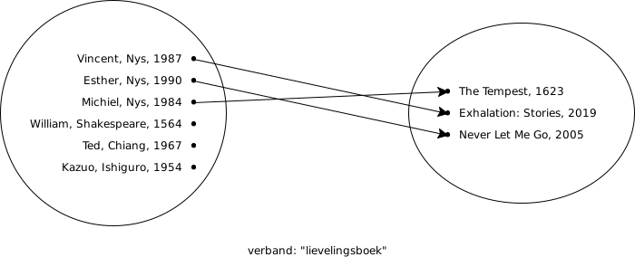

# CREATE

## Opgelet!


Onder Unix (macOS en Linux) zijn databasenamen hoofdlettergevoelig (in tegenstelling tot SQL trefwoorden). Dit geldt overigens ook voor de tabelnamen. Onder Windows is deze beperking standaard niet van toepassing, maar het is een goede gewoonte te doen alsof het wel zo is. Volg daarom de gemaakte afspraken wat betreft naamgeving heel nauwkeurig. Als de code op jouw Windowsmachine werkt maar niet op onze server omdat de code de afspraken niet volgt, bevat ze een fout!


## Aanmaken van je eerste database


Je kan geen nieuwe databases aanmaken als je verbindt met de gedeelde server. Je kan het wel doen als je MySQL installeert op je eigen systeem of in een virtuele machine.


Je zou het volgende SQL statement gebruiken om een database te maken:

```sql
CREATE DATABASE ApDB;
```

Het creëren van een database volstaat niet om die vervolgens te kunnen gebruiken. Je moet in een script expliciet opgeven dat je een bepaalde database wilt gebruiken met de instructie `USE`:

```sql
USE ApDB;
```

Een database moet slechts één keer gemaakt worden, maar je moet vooraleer die te gebruiken ze telkens weer selecteren. Dat doe je met de `USE` instructie zoals in het voorgaande voorbeeld.

## Aanmaken van je eerste tabellen

Het niveau onder dat van de databank is het niveau van de tabel. Een tabel bevat typisch informatie over één entiteit, d.w.z. één soort interessante data. Dat is bijvoorbeeld bijvoorbeeld een tabel `Boeken` in een bibliotheeksysteem. We vertrekken van een voorstelling voor boeken en personen.

We willen volgende gegevens in het systeem bijhouden:



Gebruik eerst `USE` om je database te activeren. Eerst leggen we vast we welke tabellen en welke datatypes we nodig hebben:


Negeer de "1 more" onder "Geboortejaar". Negeer ook het gele sleuteltje. Die zaken komen later. Om de tabel "Personen" aan te maken, schrijven we:

```sql
CREATE TABLE Personen(Voornaam VARCHAR(50), Familienaam VARCHAR(50), Geboortejaar INT);
```

### Enkel aanmaken wat niet bestaat

Via het `CREATE`-commando maak je een nieuwe structuur aan met een bepaalde naam. Als die naam al bestaat, levert dat een foutmelding. Daarom moeten we voorzichtig omspringen met het `CREATE` commando. We doen dit door onze `CREATE` enkel uit te voeren als de naam die we willen gebruiken (voor een database of een tabel of een andere structuur) nog niet gebruikt wordt. Hiervoor vervangen we bijvoorbeeld `CREATE TABLE MyTable (MyColumn VARCHAR(100));` door `CREATE TABLE IF NOT EXISTS MyTable (MyColumn VARCHAR(100));`. Dit vermijdt dat we op een foutmelding botsen. Het kan wel een waarschuwing opleveren, maar dat is op zich niet erg.
