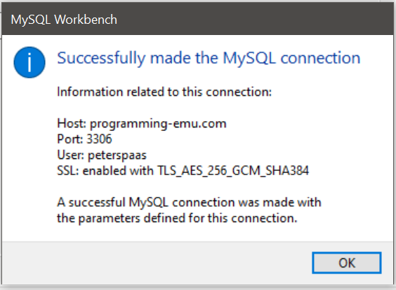

# Installatie van alle software

Download: [https://dev.mysql.com/downloads/workbench/](https://dev.mysql.com/downloads/workbench/)


installatie MySQL Workbench


## Login

Basisscherm MySQL Workbench:

<figure><figcaption></figcaption></figure>

**Stap 1:** Klik op het plusje.

.png>)

**Stap 2:** Vul de juiste gegevens in.

Voor jouw gebruikersnaam en paswoord verwijzen we naar de e-mail die je hebt ontvangen van lector V. Nys.

<figure><figcaption></figcaption></figure>

Je klikt na het invullen van de juiste gegevens op de knop "**Store in Vault**" en vult het paswoord dat je via vermelde mail hebt ontvangen in.

.png>)

**Stap 3:** Connectie testen.

Je moet volgende boodschap krijgen.

