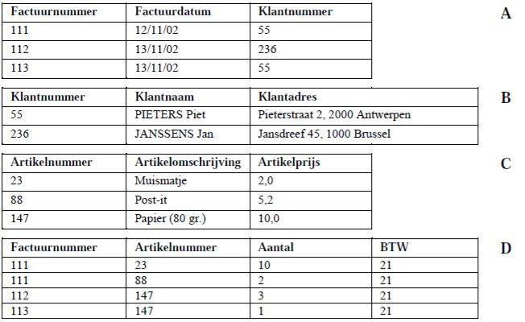

# Een databank ontwerpen

Het is belangrijk dat wanneer een database wordt ontworpen er voldoende doordacht wordt nagedacht over de gewenste structuur van de te onwikkelen database. 

Enkele aandachtspunten kunnen dan zijn:

* Welke gegevens wenst u op te slaan?
* Moeten die gegevens aan bepaalde criteria voldoen?
* Waarvoor moeten die gegevens achteraf gebruikt worden?
* ...

## **Enkele begrippen** 

**Tabel**   
__Gegevens worden opgeslagen in een tabel. Deze tabel heeft steeds een naam, of tabelnaam. Eén tabel bevat normaal gesproken samenhorende gegevens. \(bv. personen, facturen, …\) of entiteiten.

**Record**   
__Een tabel bestaat uit rijen of records. Eén record bevat alle gegevens van de zgn. rij. \(bv. alle gegevens betreffende een persoon\) 

**Kolommen**   
__Iedere kolom omvat één aanduiding van een gegeven binnen een tabel. \(bv. voornaam van een persoon, adres, enz...\) Iedere kolom heeft uiteraard een unieke naam, of veldnaam. 

**Sleutels**   
__Ieder record behoeft één veld \(kolom\) dat ervoor zorgt dat dat record uniek kan worden aangegeven. Dit veld noemt men de primaire sleutel. Bijvoorbeeld een persoons ID. Alleen de familienaam is waarschijnlijk niet voldoende. Daarentegen zouden we kunnen veronderstellen dat de combinatie van achternaam, voornaam, geboortedatum waarschijnlijk wel uniek is, maar dit is evenwel veel te omslachtig. Het is wel duidelijk dat de velden, hierboven aangehaald, een samengestelde of alternatieve sleutel vormen. Laten we volgend voorbeeld nemen, nl. de postcodes en gemeenten. Deze twee gegevens zijn samenhorend en het is niet echt zinvol om steeds de twee gegevens in een hele reeks tabellen te gaan bijhouden. Daarom kunnen we een afzonderlijke tabel aanmaken waarin de postcodes en gemeenten vervat zijn. Door dan in alle andere tabellen enkel de postcode bij te houden, kunnen we door die postcode perfect de gemeente opzoeken in de tabel met alle postcodes en gemeenten. Men noemt een dergelijke sleutel in een andere tabel dan die van de postcodes en gemeenten een vreemde sleutel.

## **Enkele aandachtspunten** 

Wanneer je bv. naam en adresgegevens wil bewaren in een database, mag je dit niet doen door gewoonweg in één veld de naam, voornaam, adres, postcode en gemeente in die volgorde te vermelden. De oplossing ligt er namelijk in dat je per gegeven een afzonderlijke kolom gaat voorzien. 

Ook is het niet aan te raden om één veld voor evt. meerdere doeleinden te gebruiken, bv. het veld telefoonnummer gebruik je best niet voor de vermelding van een sis-nummer. 

Het komt nog vaak voor dat de opbouw of normalisatie van een gegevensverzameling niet voldoende doordacht is. Volgend voorbeeld zal dit verduidelijken.

## **Voorbeeld** 

Een firma wil de gegevens betreffende zijn uitgeschreven facturen bijhouden in een database. Hiervoor zijn volgende gegevens noodzakelijk nl. 

* Factuurnummer: het nummer van de factuur
* Factuurdatum: de datum van de factuur
* Artikelnummer: de code van het betreffende artikel dat gefactureerd werd
* Artikelomschrijving: de omschrijving van het gefactureerde artikel
* Artikelprijs: de prijs van het gefactureerde artikel
* Aantal: aantal eenheden van één artikel
* BTW-percentage: het doorgerekende BTW-tarief uitgedrukt in percentage
* Klantnummer: het nummer van de gefactureerde klant
* Klantnaam: de naam van de klant vermeld op de factuur
* Klantadres: het adres van de klant vermeld op de factuur

Bovenvermelde gegevens kunnen we dus in één tabel onderbrengen, hetgeen hetvolgende geeft.

Zoals je wel zal bemerken zijn er een aantal zgn. problemen, nl. 

* Er worden een aantal gegevens herhaald, nl. de factuurnummer, de factuurdatum, klantnummer, klantnaam en klanadres worden evenwel per gefactureerd artikel herhaald. Dit is dus een overtolligheid van gegevens.
* Zonder dat er een factuur werd opgesteld kan geen nieuwe klant worden toegevoegd.
* Wanneer we bijvoorbeeld de artikelomschrijving van een bepaald artikelnummer willen aanpassen, dienen we het hele bestand te doorlopen om deze aanpassingen door te voeren.
* Wanneer we de inhoud van een bepaalde factuur zouden verwijderen \(dit bv. ter annulatie\), dan kan het zijn dat alle informatie van een klant mee wordt verwijderd. Bijvoorbeeld, wanneer we de inhoud van factuurnummer 112 zouden wissen, dan verdwijnt ook alle informatie aangaande de klant JANSSENS Jan.

Om ervoor te zorgen dat o.a. bovenstaande problemen worden opgelost, kunnen we de onderscheiden gegevens gaan spreiden over verschillende tabellen. Let wel, we moeten er wel voor zorgen dat er steeds geen verbanden tussen de onderliggende gegevens verloren gaat.

Zoals hierboven vermeld, bekomen we bij de uitsplitsing tot vier afzonderlijke tabellen. Niettegenstaande de uitsplisting in deze vier tabellen ontstaat er geen gegevensverlies. Geen gevensverlies, even verklaren, o.a.

* bij tabel A is er een verband tussen de factuurnummer en de klantnummer. We weten hierbij dus perfect welke factuur voor welke klant bestemd is omdat we de informatie aangaande de

  betreffende klantnummer kunnen gaan opzoeken in tabel B en dit d.m.v. de klantnummer.

* Ook weten we welke artikels er gefactureerd werden. In tabel D wordt de factuurnummer in combinatie met de artikelnummer vermeld en hierdoor weten we welk artikel\(s\) moet gefactureerd

  worden. De prijs van het artikel en omschrijving vinden we dan waar terug in tabel C, waarbij we door middel van het artikelnummer betreffend item kunnen opzoeken.

Zoals je wel zal bemerken zijn de problemen opgelost, nl. 

* Er worden geen gegevens meer herhaald per gefactureerd artikel . De overtolligheid van gegevens is dus opgelost.
* Een nieuwe klant kan zonder problemen worden opgenomen in de tabel van de klanten \(tabel B\).
* Wanneer we bijvoorbeeld de artikelomschrijving van een bepaald artikelnummer willen aanpassen, dienen we dat maar op één plaats door te voeren, nl. in de tabel van de artikelen \(tabel C\).
* Wanneer we de inhoud van een bepaalde factuur zouden verwijderen \(dit bv. ter annulatie\), dan wordt de informatie van een bepaalde klant niet mee gewist.

