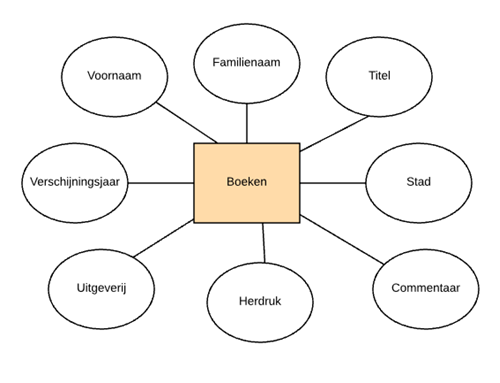

# CREATE

## Opgelet!


Onder Unix \(macOS en Linux\) zijn databasenamen hoofdlettergevoelig \(in tegenstelling tot SQL trefwoorden\). Je moet dus je altijd verwijzen naar je database met de zelfde naam als de naam waaronder je database hebt aangemaakt. Dit geldt overigens ook voor de tabelnamen. Onder Windows is deze beperking standaard niet van toepassing, maar het is een goede gewoonte. Volg daarom de gemaakte afspraken wat betreft naamgeving heel nauwkeurig. Als de code op jouw Windowsmachine werkt maar niet op onze testserver omdat de code de afspraken niet volgt, bevat ze een fout!


## Aanmaken van je eerste database

Gebruik het volgende SQL statement om een database te maken:

```sql
CREATE DATABASE ModernWays
```

We kunnen ook eerst nagaan als de database al bestaat:

```sql
-- Maak alleen een databank als er nog geen bestaat met dezelfde naam.
-- Dit is trouwens hoe je commentaar schrijft in MySQL.
CREATE DATABASE IF NOT EXISTS ModernWays;
```

Het creëren van een database volstaat niet om die vervolgens te kunnen gebruiken. Je moet in een script expliciet opgeven dat je een bepaalde database wilt gebruiken met de instructie `USE`:

```sql
USE ModernWays;
```

Een database moet slechts één keer gemaakt worden, maar je moet vooraleer die te gebruiken ze telkens weer selecteren. Dat doe je met de `USE` instructie zoals in het voorgaande voorbeeld.

Sla de code die de database aanmaakt op in een eerste script met als naam 0001\_\_CreateDatabase.sql.

## Aanmaken van je eerste tabel

Het niveau onder dat van de databank is het niveau van de tabel. Een tabel bevat typisch informatie over één entiteit, d.w.z. één soort interessante data. Dat is bijvoorbeeld bijvoorbeeld een tabel `Boeken` in een bibliotheeksysteem. We vertrekken van een model van een boek.



Hieronder krijg je een vereenvoudigd logisch model van een boek. Hier staat "CHAR" voor een aantal karakters. Soms moet dat aantal precies zijn, soms is het alleen begrensd. Hier zijn de aantallen alleen begrensd. Een voorbeeld van een precies aantal is een postcode in België: die bestaat uit precies vier cijfers. Internationale tekens zijn tekens die typisch niet gebruikt worden in Engelstalige teksten.

| Kolomnaam | Type | Maximale lengte | Variabele lengte | Internationale tekens |
| :--- | :--- | :--- | :--- | :--- |
| Voornaam | CHAR | 50 | JA | JA |
| Familienaam | CHAR | 80 | JA | JA |
| Titel | CHAR | 255 | JA | JA |
| Stad | CHAR | 50 | JA | JA |
| Verschijningsjaar | CHAR | 4 | JA | NEE |
| Uitgeverij | CHAR | 80 | JA | JA |
| Herdruk | CHAR | 4 | JA | NEE |
| Commentaar | TEXT | NVT | NVT | NA |

### Commentaar toevoegen

Schrijf bovenaan in je script, in commentaar, de tekst "dit is mijn eerste tabel".

### Database selecteren

Zoals eerder aangegeven, moet je eerst een database selecteren waar de nieuwe tabel onderdeel van zal worden. Dit doe je met de USE-instructie. Je gebruikt de database die we met het eerste script hebben aangemaakt. Verwijs er naar met de juiste naam, volgens de afspraak over hoofdlettergevoeligheid!

### Tabel aanmaken

Dit doe je met CREATE TABLE. Kijk naar de tabelvoorstelling hierboven en kijk naar het verband met de code. Dit wordt later toegelicht.

```sql
CREATE TABLE Boeken(
    Voornaam VARCHAR(50) CHAR SET utf8mb4,
    Familienaam VARCHAR(80) CHAR SET utf8mb4,
    Titel VARCHAR(255) CHAR SET utf8mb4,
    Stad VARCHAR(50) CHAR SET utf8mb4,
    -- alleen het jaartal, geen datetime
    -- omdat de kleinste datum daarin 1753 is
    -- varchar omdat we ook jaartallen kleiner dan 1000 hebben
    Verschijningsjaar VARCHAR(4),
    Uitgeverij VARCHAR(80) CHAR SET utf8mb4,
    Herdruk VARCHAR(4),
    Commentaar TEXT
);
```

### Benoemen en opslaan van het script

We spreken af dat alle scripts een duidelijke naam krijgen die uitdrukt wat de volgorde is ten opzichte van bestaande scripts, wat voor operatie plaatsvindt en welke data worden aangepast. We zullen het script dat deze tabel aanmaakt 0002\_\_CreateBoeken.sql noemen.

