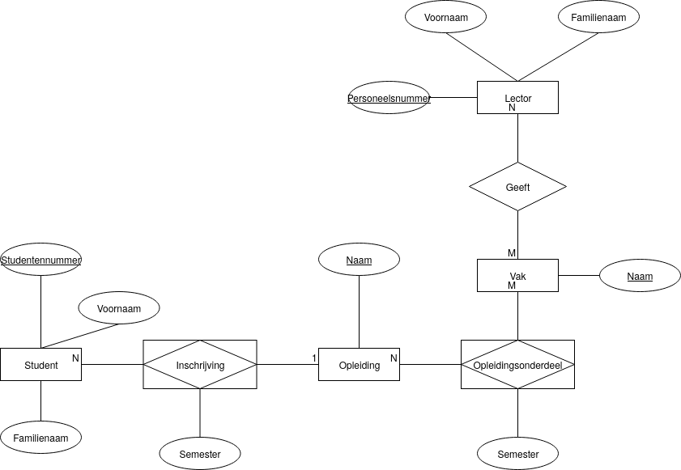
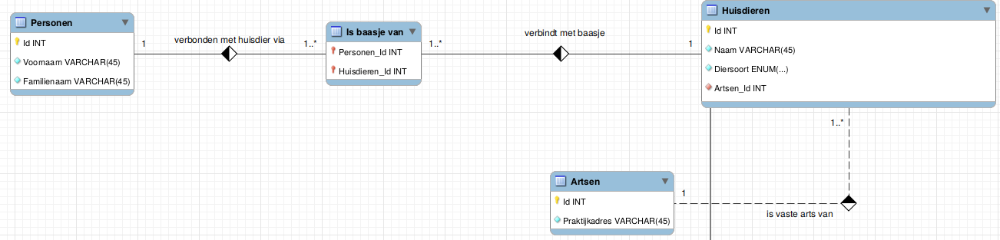

# Labo oefeningen

## Oefening 1 (deel 1)

Onderstaand diagram is in een minder technische ERD-notatie:

Hermaak dit diagram in de diagrameditor van MySQL Workbench. Deze editor ondersteunt een verwante, maar andere notatie. Zie eventueel het [filmpje](https://www.youtube.com/watch?v=yq9iCb2JRHk) over deze editor in de cursus. Zet via de knop "model" in de werkbalk bovenaan de objectnotatie op "Workbench (simplified)" en de notatie van relaties op "classic". Zet ook via "edit" → "preferences" → "diagram" de optie "show captions" aan.

De betekenis van de icoontjes voor elke kolom vind je [hier](https://stackoverflow.com/questions/10778561/what-do-the-mysql-workbench-column-icons-mean) terug.


Van het verschil tussen identifying en non-identifying relations moet je je niets aantrekken als je dit labo hebt voor de theorie.


Een ander ERD met de juiste instellingen zie je hier:

## Oefening 1 (deel 2)

* Genereer SQL-code uit je model via "export"
* Je hoeft geen van de opties aan te vinken om bestaande tabellen te droppen,...
* Controleer dat dit script uitvoerbaar is en overeenstemt met wat je zelf zou schrijven
  * onderdelen die we nog niet behandeld hebben mag je negeren
  * namen van keys,... moeten wel de afspraken volgen die wij volgen

## Oefening 2 (deel 1)

We maken een entity-relationshipmodel voor iets als [Trakt](https://trakt.tv/). Dit is een website waarmee je kan bijhouden welke films en series je hebt bekeken of aan het bekijken bent. Teken zelf een diagram uit, op basis van volgende informatie:

* We willen zowel films als series kunnen opvolgen. Beide hebben titels.
* Zowel films als series kunnen behoren tot één of meer genres.
* Series bestaan uit afleveringen, met individuele releasedatums. We hoeven geen info over seizoenen te kunnen opzoeken.
* Films hebben één releasedatum.
* In elke film en elke aflevering spelen acteurs mee. We willen ook details (naam, geboortedatum, leeftijd) over een bepaalde acteur kunnen opzoeken.
* Gebruikers kunnen een rating van 1 tot 5 geven aan films of afleveringen die ze gezien hebben.
* Gebruikers kunnen bijhouden wanneer ze een film of aflevering gezien hebben. Ze kunnen een film of aflevering meermaals bekeken hebben.

## Oefening 2 (deel 2)

Zelfde als oefening 1, deel 2.
