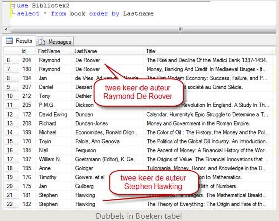
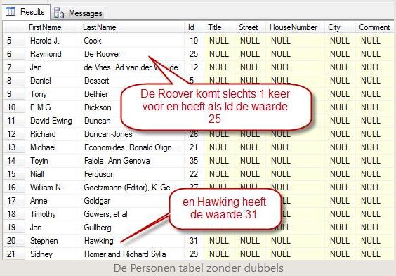
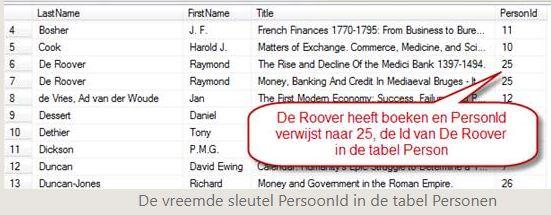

# Normaliseren in de praktijk


Volgende oefening is oorspronkelijk opgesteld door [Jef Inghelbrecht](https://modernways.be/myap/it/page/sql/mysql/ddl/MySQL%20Normaliseren%20in%20de%20praktijk.html). Deze versie is licht gewijzigd om te voldoen aan de afspraken die we gemaakt hebben met betrekking tot de cursus.


## Probleem

We gaan het eerst in een eenvoudig voorbeeld toepassen en pas achteraf de theorie zien. In het normalisatieproces komt het erop neer ervoor te zorgen dat een betekenisvol stukje informatie slechts 1 keer voorkomt in je database. De letters "a" en "b" bijvoorbeeld zijn niet betekenisvol. Op zichzelf hebben ze geen enkele betekenis. Dus moet je ze ook niet normaliseren.

## Oplossing

We nemen terug ons voorbeeld met de boeken.

We selecteren de database [`ModernWays`](../joins/#startpunt) en voeren een select query uit op de tabel `Boeken`. Als we de lijst met de kolommen grondig analyseren zien we dat er nogal wat dubbele waarden in sommige kolommen zitten:



Die auteurs zouden ook een adres, een biografie en misschien nog andere relevante gegevens kunnen hebben. Dat wil zeggen dat we voor elk boek van één auteur al die gegevens moeten herhalen. Als er één van die gegevens gewijzigd moet worden mogen we niet vergeten dat gegeven bij alle boeken te gaan wijzigen. Vergeten we dat bij één boek, dan is de integriteit van onze database zoek.

We doen er dus goed aan de gegevens van auteur uit de tabel `Boeken` te halen en een nieuwe tabel te creëren voor auteurs. Maar dan krijgen we een ander probleem. Wat als de auteur ook boeken uit onze bibliotheek ontleent? Dat zullen de gegevens van auteur weer ontdubbeld worden. Ze gaan zitten in de tabel `Auteurs` en in de tabel `Ontleners`.

Als we die dubbels willen vermijden moeten we nog een stap verder gaan. Auteurs en ontleners kunnen samen voorgesteld worden in een tabel `Personen`. We maken dus beter van de eerste keer een meer algemenere tabel `Personen`.

## De tabel Personen creëren op basis van de tabel Boeken

Om de gegevens van de auteur uit de tabel `Boeken` naar de tabel `Personen` te kopiëren, kopiëren we de twee kolommen `Voornaam` en `Familienaam` naar een nieuwe tabel `Personen`. We gebruiken de clausule `distinct` om slects één boek van dezelfde auteur over te houden. In de tabel `Personen` mag de auteur slechts 1 keer voorkomen:

```sql
-- creer een nieuwe tabel met de auteursgegevens
-- Voornaam en Familienaam
use ModernWays;
drop table if exists Personen;
create table Personen (
    Voornaam varchar(255) not null,
    Familienaam varchar(255) not null
);
```

Met een subquery die een tabel materialiseert, kunnen we we de tabel `Personen` meteen invullen:

```sql
-- gegevens uit de tabel Boeken overzetten naar de tabel Personen
-- we gebruiken hiervoor een subquery
use ModernWays;
insert into Personen (Voornaam, Familienaam)
   select distinct Voornaam, Familienaam from Boeken;
```

 Je kan verifiëren dat de dubbele eruit zijn. Gebruik de `ORDER BY` clausule om het verifiëren te vergemakkelijken:

```sql
use ModernWays;
select Voornaam, Familienaam from Personen
    order by Voornaam, Familienaam;
```

## Overige kolommen aan de tabel Personen toevoegen

We hebben nu een nieuwe tabel `Personen`. Maar met slechts twee kolommen. Met de alter instructie voegen we de andere kolommen toe, evenals de primary key en de identity eigenschap:

```sql
use ModernWays;

alter table Personen add (
   Id int auto_increment not null,
   AanspreekTitel varchar(30) null,
   Straat varchar(80) null,
   Huisnummer varchar (5) null,
   Stad varchar (50) null,
   Commentaar varchar (100) null,
   Biografie varchar(400) null);
```

We testen om te zien als we hebben wat we wilden, namelijk een tabel met de voornamen en familienamen van de auteurs:

```sql
select * from Personen order by Familienaam, Voornaam;
```

En dat geeft:



## De tabel Boeken en Personen linken

We hebben nu wel een tabel `Personen` met de naam en de voornaam van de auteur. Maar er is geen relatie tussen die twee. M.a.w. we kunnen niet weten welke boeken door wie geschreven zijn.

Daarvoor zetten we de volgende stappen.

Een foreign key kolom aanmaken in de tabel `Boeken`

In de tabel `Boeken` hebben we een nieuwe kolom nodig die de foreign key bevat die verwijst naar de persoon die het boek geschreven heeft:

```sql
-- JI
-- 24 september 2012
-- Een foreign key toevoegen aan de tabel Boeken
use ModernWays;
alter table Boeken add IdAuteur int not null;
```

Als je dit script uitvoert krijg je de volgende foutmelding:

```sql
Msg 4901, Level 16, State 1, Line 6
ALTER TABLE only allows columns to be added that can contain nulls, or have a DEFAULT definition specified, or the column being added is an identity or timestamp column, or alternatively if none of the previous conditions are satisfied the table must be empty to allow addition of this column. Column 'IdAuteur' cannot be added to non-empty table 'Boeken' because it does not satisfy these conditions.
```

 We moeten bij het toevoegen van de kolom de `not null` constraint laten vallen. Dan de foreign key invullen en dan pas de `not null` constraint toevoegen. Dat gebeurt impliciet op het moment dat we de foreign key constraint toevoegen.

```sql
-- JI
-- 24 september 2012
-- Een foreign key toevoegen aan de tabel Boeken
use ModernWays;
alter table Boeken add IdAuteur int null;
```

## De foreign key kolom in de tabel Boeken invullen

Om de `Id` van `Personen` te kopiëren in de tabel `Boeken` moeten we eerst een relatie leggen tussen de twee tabellen. Welke kolommen zijn in beide tabellen gelijk? De kolom `Voornaam` en `Familienaam` want we hebben ze net gekopiëerd. We kunnen de twee tabellen linken op basis van deze twee kolommen:

```sql
use ModernWays;
select Boeken.Voornaam,
   Boeken.Familienaam,
   Boeken.IdAuteur,
   Personen.Voornaam,
   Personen.Familienaam,
   Personen.Id
from Boeken, Personen
where Boeken.Voornaam = Personen.Voornaam and
    Boeken.Familienaam = Personen.Familienaam;
```

Om de waarde van `Id` van de `Personen` tabel te kopiëren naar de `IdAuteur` kolom van `Boeken` volstaat het om in de where clausule van de `update` instructie de voorwaarde mee te geven dat de waarden beide kolommen aan elkaar gelijk moeten zijn.

In de `set` clausule van de `update` instructie bepalen we dat de waarde van de `Id` van `Personen` in de kolom `IdAuteur` van `Boeken` gekopiëerd moet worden. Met de `from` clause geven we aan dat de `Id` waarde uit de `Personen` tabel moet worden gehaald.

```sql
use ModernWays;
-- select * from Boeken
-- JI
-- 26 september 2012
-- foreign kopiren vanuit de tabel Personen in de tabel Boeken
use ModernWays;
update Boeken, Personen
    set Boeken.IdAuteur = Personen.Id
where Boeken.Voornaam = Personen.Voornaam and
    Boeken.Familienaam = Personen.Familienaam

select * from Boeken;
```

 Nu kunnen we de `not null` constraint aan de kolom `IdAuteur` in de tabel `Boeken` terug toevoegen:

```sql
--set FK IdAuteur op not null
alter table Boeken alter column IdAuteur int not null;
```

We testen als we hebben wat we wilden:

```sql
select Voornaam, Familienaam, IdAuteur from Boeken;
```

Met als resultaat:



## Dubbele kolommen verwijderen uit de tabel Boeken

We zijn er nog niet van af. De gekopiëerde kolommen uit de tabel `Boeken`, `Voornaam` en `Familienaam`, moeten nog gedeletet worden:

```sql
-- JI
-- 26 september 2012
use ModernWays;
alter table Boeken drop column Voornaam,
    drop column Familienaam;

select * from Boeken;
```

## De foreign key constraint op de kolom IdAuteur toevoegen

```sql
-- dan de constraint toevoegen
alter table Boeken add constraint fk_BoekenPersonen_IdAuteur
   foreign key(IdAuteur) references Personen(Id);
```

**Afspraak: de naam van de foreign key bestaat uit een prefix fk\_, gevolgd door de naam van de tabel waarin de de foreign key kolom staat, gevolgd door de naam van de tabel waarnaar verwezen wordt, gevolgd door een underscore en de naam van de foreign key kolom.**

## Opdracht

Stel, op basis van bovenstaande instructies, het volledige script om de tabel `Boeken` te normaliseren (een tabel `Personen` uitsplitsen) en sla het op in een bestand met de naam BoekenPersonNormalize.sql. **Schrijf commentaar bij elke stap.**

### Oefening 1

Een boek en de auteur inserten in de 'genormaliseerde' database

Als voorbeeld nemen we een boek geschreven door Hilary Mantel. De gegevens halen we van Amazon.

We hebben nu twee tabellen. We beginnen met het inserten van de persoonsgevens:

```sql
-- ji
-- 8 januari 2013
--
use ModernWays;
-- alle boeken zijn geschreven door mannen
-- we gaan eerst een boek van een vrouw toevoegen
-- bestandnaam: BoekenNormalizeInsertOne.sql
--
-- auteur toevoegen
insert into Personen (
   Voornaam, Familienaam, AanspreekTitel
)
values (
   'Hilary', 'Mantel', 'Mevrouw'
);

select * from Personen;
```

Onthoud de primary key waarde van Hilary Mantel. In ons voorbeeld is dat 16. Vervolgens voegen we het boek toe:

```sql
insert into Boeken (
   Titel, Stad, Uitgeverij, Verschijningsjaar,
   Herdruk, Commentaar, Categorie, IdAuteur
)
values (
   'Wolf Hall', '', 'Fourth Estate; First Picador Edition First Printing edition',
   '2010', '', 'Goed boek', 'Thriller', 16
);

select * from Boeken;
```

 De relatie tussen het boek en de persoon die het boek geschreven heeft wordt bepaald door foreign key `IdAuteur` in de tabel `Boeken`. De waarde 16 in die kolom verwijst naar een waarde in de primary key `Id` van de tabel `Personen`.

### Oefening 2

Voeg het volgende boek toe:

Jean-Paul Sartre, De Woorden, 1961, De Bezige Bij.

Vul de waarde in de kolom `IdAuteur` niet letterlijk in maar door middel van een SQL statement. M.a.w. hoe kan je de waarde die in de kolom `IdAuteur` moet komen opvragen?

We gebruiken hiervoor een subquery:

```sql
-- bestandnaam: BoekenNormalizeInsertOne2.sql

use ModernWays;
insert into Boeken (
   Titel,
   Stad,
   Verschijningsjaar,
   Commentaar,
   Categorie,
   IdAuteur
)
values (
   'De Woorden',
   'Antwerpen',
   '1962',
   'Een zeer mooi boek.',
   'Roman',
   (select Id from Personen where
       Familienaam = 'Sartre' and Voornaam = 'Jean-Paul'))
```

 Let erop dat de `Id` van de auteur in de tabel `Boeken` opgehaald uit de tabel `Personen` met behulp van een subquerie.

# Normalisatie: het idee samengevat
Er zijn boeken geschreven over normalisatie, maar in de praktijk is de richtlijn heel simpel: vermijd dubbele informatie. Je doet dit door informatie in een tabel te koppelen aan de sleutel. Als twee rijen verschillende sleutels hebben, zou er geen verborgen veronderstelling mogen zijn dat bepaalde data in deze twee rijen moet overeenstemmen.

Dat was wel het geval bij de oorspronkelijke tabel met boeken. Als je daar twee keer dezelfde auteur had, moesten zijn adres,... in overeenstemming gehouden worden tussen alle rijen waarin deze auteur voorkwam.

We hebben hier nog niet heel de tabel genormaliseerd! Je zou bijvoorbeeld ook een tabel voor de uitgeverij kunnen voorzien of voor de verschillende edities van eenzelfde boek.
