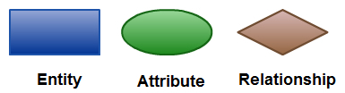
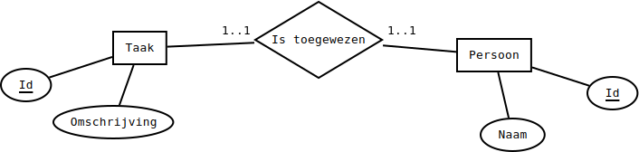

# Overzicht

## Overzicht met klassieke notatie

Een entity-relationshipmodel (ERM) van een databank drukt uit welke informatie aanwezig is in een databank en hoe deze informatie gestructureerd is. Het entity-relationshipdiagram (ERD) is hier een grafische weergave van.

Een ER model bestaat uit de volgende onderdelen:

* entiteittypes: een entiteittype kan worden gezien als een ding, een "tastbaar" iets dat deel uitmaakt van het datamodel. Voorbeelden hiervan zijn: een auto, een werknemer, een lied of een gebied.
* verwantschappen of relaties: een verwantschap geeft het verband weer tussen twee of meer entiteiten, zoals "een werknemer werkt in een fabriek"; "werkt in" is hier de verwantschap tussen de entiteiten werknemer en fabriek.
* attributen: een attribuut is een eigenschap van een entiteit of verwantschap. Zo heeft een werknemer (onder andere) een voornaam, een achternaam, een woonplaats en een sofinummer. Het attribuut dat (of de attributen die) wordt gebruikt als unieke aanduiding van de entiteit (de primaire sleutel), wordt onderstreept weergegeven.

Elk van deze zaken wordt in een ER diagram weergegeven met een bepaald symbool weergegeven. Een entiteit wordt met een rechthoek weergegeven, een verwantschap met een ruit (verbonden met lijnen aan de betrokken entiteiten) en een attribuut wordt als een ovaal weergegeven. Van elk van deze zaken bestaan ook specifiekere varianten.

Een goede plaats voor alles wat met visuele notatie te maken heeft, is [LucidChart](https://www.lucidchart.com/pages/ER-diagram-symbols-and-meaning). Hier vind je ook notatie voor de verschillende varianten.

#### Entiteittypes

**Wat zijn entiteitstypes?**

Zoals we bij het programmeren een onderscheid maken tussen klassen en objecten, maken we hier een onderscheid tussen entiteitstypes en entiteiten. Een entiteitstype is het begrip zelf: "een klant", "een leverancier", "een beroep", "een lied",... Uit deze voorbeelden blijkt dat een entiteittype iets concreet of iets abstract kan zijn. Een entiteit is een specifiek voorkomen hiervan: "_deze_ klant", "_die_ leverancier", "_dat_ beroep", "_mijn lievelingslied_",... Entiteiten hebben eigenschappen, die we voorstellen als attributen. Bijvoorbeeld: "klantnummer", "firmanaam", "barema",... Entiteitstypes zijn gelinkt aan attribuuttypes voor alle eigenschappen die een entiteit kan hebben.

**Verschillende soorten entiteittypen**

Op de figuur hierboven zie je dat er verschillende soorten entiteiten bestaan.

* Gewone entiteiten: dit zijn entiteiten die niet aan volgende twee omschrijvingen voldoen
* Zwakke entiteiten: deze entiteiten zijn op zichzelf niet zinvol en hun attributen volstaan niet om een sleutel uit af te leiden. Bijvoorbeeld: een hotelkamer heeft een nummer, maar meerdere kamers in meerdere hotels hebben hetzelfde nummer. Je kan een hotelkamer wel uniek identificeren door het kamernummer te combineren met een aanduiding van het hotel waartoe de kamer behoort. Met andere woorden: het kamernummer en de vreemde sleutel voor het hotel (de bijbehorende sterke entiteit) vormen de primaire sleutel.
* Associative entities: dit zijn eigenlijk tegelijkertijd entiteiten en relaties. We stellen deze voor als relaties met eigen attributen. Bijvoorbeeld: een relatie tussen personen en boeken om aan te duiden wie welk boek heeft geleend is een associative entity als we de uitleenperiode zien als eigenschap van de relatie.

#### Attribuuttypes

Er zijn ook verschillende soorten attribuuttypes:

* Enkelvoudige attribuuttypes: elke entiteit heeft hooguit één waarde voor dit attribuut. Een voorbeeld is het rijksregisternummer: niemand heeft er hier twee of meer van.
* Meervoudige attribuuttypes: een entiteit heeft mogelijk meerdere waarden voor dit attribuut. Een voorbeeld is de voornaam: sommige mensen hebben er maar één, maar je kan er een heleboel hebben.
* Afgeleide attribuuttypes: dit zijn attribuuttypes die wel interessant lijken vanuit het oogpunt van een model, maar die afgeleid kunnen worden uit reeds aanwezige informatie.
* Sleutelattribuuttypes: deze attributen kunnen gebruikt worden als (deel van) een primaire sleutel.

#### Verwantschapstypes

Een relationshiptype stelt verbanden tussen entiteitstypes voor:

* een relationship is een individueel voorkomen van dergelijk verband
* een relationshiptype heeft een naam
  * bv. het relationshiptype uitgeleend\_door modelleert de verbanden tussen boeken en personen

Een speciaal relatietype is de zwakke relatie: dit is een relatie tussen een zwakke entiteit en de entiteit die gebruikt wordt om de zwakke identiteit uniek identificeerbaar te maken. Bijvoorbeeld "behoort tot" tussen "hotelkamer" en "hotel"

Als het relatietype ook attributen heeft, hebben we een associative entity.

* bv. prijsofferte bij een relatie tussen klant en aannemer

Graad van een relationshiptype: het aantal entiteittypen dat gebruikt is bij het tot stand komen van het verband

* 1 -> unair relationshiptype (bijvoorbeeld: "houdt van" tussen personen)
* 2 -> binair relationshiptype (bv. relationshiptype "heeft besteld" tussen klant en product)
* 3 -> ternair relationshiptype (bv. "game X is geport naar platform Y door developer Z"). Dit soort relatie heb je niet zo vaak nodig. Je kan ze ook altijd vervangen door drie binaire relaties met een nieuw entiteittype (bijvoorbeeld "Port" in dit geval).

rollen bepalen de zin waarin een verband moet worden opgevat

* bv. het verband (‘in bestelling’) tussen leveranciers en aankooporders kan zowel vanaf leverancier, als vanaf aankooporder beschouwd worden (d.w.z. je kan leven "heeft besteld" of "is besteld door")
* iedere rol heeft een naam om dit op te helderen
  * bv. relationshiptype "in\_bestelling": rollen leverancier-besteller
  * deze namen worden vaak weggelaten als de rol meteen duidelijk is uit het entiteittype
    * dit is bijvoorbeeld niet duidelijk als er een relatietype is\_overste Persoon - Persoon is

Cardinaliteit van een rol: het aantal keren dat een entiteit in die rol kan of moet optreden

* minimale cardinaliteit is meestal: 0 of 1
  * 0: als het in die rol niet is vereist dat elke entiteit met een andere entiteit is gekoppeld
  * 1: iedere entiteit moet minstens éénmaal in die rol optreden (bestaansafhankelijkheid), bv. van rol "auteur" in een relatie tussen auteurs en boeken, omdat elk boek minstens één auteur heeft
* maximale cardinaliteit: 1 of n
  * 1: als het in een rol is vereist dat met een entiteit maximaal één andere entiteit mag zijn gekoppeld
  * n: als een entiteit, in een rol, met een onbepaald aantal entiteiten mag zijn gekoppeld
* 4 veelgebruikte combinaties: 0..1, 0..n, 1..1, 1..n

#### Voorbeeld

## EER-notatie in MySQL Workbench

Workbench beschikt over een editor voor "extended" entity relationship diagrammen, dus ER-diagrammen met wat extra info.

### identifying vs. non-identifying relaties

In Workbench moet je soms kiezen tussen een "identifying" en een "non-identifying" relaties. Het verschil tussen de twee is dat er bij een "identifying" relatie een "existence dependency" is, d.w.z. dat één record niet kan blijven voortbestaan als het andere verdwijnt. Een voorbeeld van een identifying relatie is de inschrijving van een persoon voor een evenement. Als de persoon uit het systeem wordt geschrapt, moet de inschrijving ook worden geschrapt, want ze kan niet op zichzelf bestaan: de persoon is **deel van de identiteit** van de inschrijving.

Een voorbeeld van een non-identifying relatie is die tussen een persoon en een land. Een land kan gekoppeld zijn aan een persoon, maar de persoon kan blijven bestaan in het systeem als het land wordt geschrapt. Het land is geen **deel van de identiteit** van de persoon.

Theoretisch gesproken betekent dit dat de primaire sleutel van de afhankelijke entiteit de verwijzing naar de onafhankelijke entiteit bevat. Zo zal een tabel voor inschrijvingen vreemde sleutels hebben om te verwijzen naar een persoon en een evenement. Deze vreemde sleutels vormen **samen** de **primaire sleutel van een inschrijving**. Anders gesteld: de identiteit van een inschrijving wordt bepaald door die van de bijbehorende persoon en evenement.


In de praktijk worden deze concepten niet altijd even strikt gevolgd!


### vertaling van ER naar EER

#### entiteiten

* gewone entiteiten worden tabellen
* zwakke entiteiten worden tabellen die gelinkt zijn via een identifying relationship (want ze hebben een andere entiteit nodig om hun identiteit te bepalen)
* associatieve entiteiten worden:
  * tabellen als het gaat om N-op-M relaties
  * opgenomen aan de "veel"-kant bij 1-op-N relaties
    * dit wil zeggen dat de N-kant voorzien wordt van een extra foreign key kolom
    * hierbij worden ook attributen van de relatie aan de veel-kant gezet
  * opgenomen aan een kant naar keuze bij een 1-op-1 relatie

#### relaties

* zwakke relaties zijn de identifying relaties voor zwakke entiteiten
* voor het overige herbekijk je of iets identifying is of niet

#### attributen

* gewone attributen worden kolommen
* afgeleide (derived) attributen worden niet bijgehouden
* multivalued attributen worden geen kolommen, maar worden bijgehouden in een tabel en gelinkt via een identifying relatie. Dit kan een één-op-veel relatie of een veel-op-veel relatie zijn.
  * bv. om muzieknummers met meerdere genres voor te stellen, maken we een tabel `Genres` en een tabel `NummerGenres`, waarin twee vreemde sleutels zitten
  * bv. om personen met meerdere telefoonnummers voor te stellen, maken we een tabel `Telefoonnummers`, die met vreemde sleutel verwijst naar tabel `Personen`

### betekenis van de icoontjes in Workbench

Zie [hier](https://stackoverflow.com/questions/10778561/what-do-the-mysql-workbench-column-icons-mean). Merk op dat hier sprake is van "(part of) primary/foreign key".

Die "part of" staat er omdat het niet verplicht is getallen te gebruiken die automatisch ophogen. Het kan ook zijn dat je een combinatie van attributen gebruikt die een record uniek identificeert (zoals naam in combinatie met adres).
