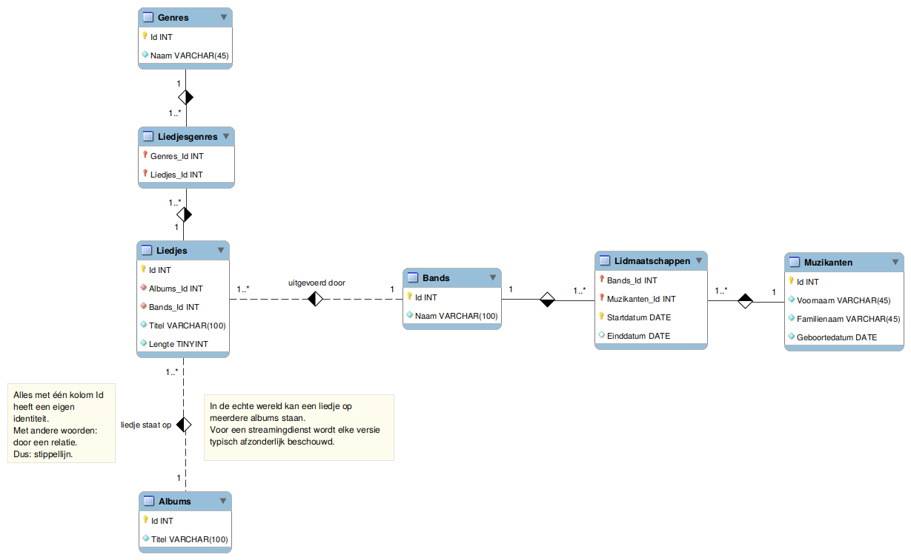
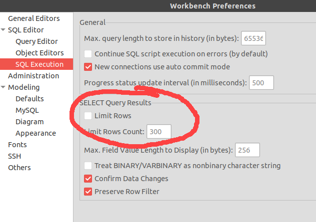
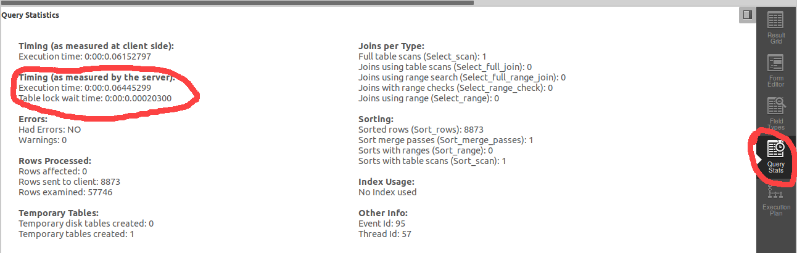

# Algemene instructies

## Startscript
Je krijgt een startscript (zie link op Digitap). Voor deze labosessie maakt het geen database `ModernWays` aan, maar een database `aptunes`. Deze heeft onderstaande structuur:



Let op: dit script is te groot om op de gewoonlijke manier te openen in het tekstvenster van MySQL Workbench. Voer het daarom rechtstreeks uit via "Run SQL script" (onder "File"). Je mag de default (lege) opties laten aanstaan.

## Uitschakelen beperkingen
Om in alle gevallen betrouwbare timings te krijgen, schakelen we een beperking op het aantal resultaten uit. Ga naar "Edit", dan "Preferences" en zorg dat de limiet uit staat zoals op deze screenshot:



# Vraag 1
Activeer eerst deze database (met naam `aptunes`). Voor deze labosessie doe je dat **maar één keer**, niet in elk script. Dat komt omdat je alleen analyses kan krijgen voor scripts die uit één opdracht bestaan.

Maak een gewone index op de kolom `Titel` van de tabel `Albums`. Noem je script dat dit doet `0619__Oefening.sql`.

# Vraag 2
Maak een gewone index op de combinatie van `Voornaam` en `Familienaam` van `Muzikanten`. In de combinatie noteer je eerst `Voornaam`. Noem je script dat dit doet `0620__Oefening.sql`.

# Vraag 3
Verwijder de index uit vraag 2. Noem je script dat dit doet `0621__Oefening.sql`.

# Vraag 4
Zoek, volgens de uitleg in de cursus de ideale prefixlengte voor de kolommen `Voornaam` en `Familienaam` van de tabel `Muzikanten`. Noteer beide voor jezelf. Maak dan opnieuw een index op de combinatie van `Voornaam` en `Familienaam`, ieder met de ideale prefixlengte. Noem je script dat de index met de ideale prefixlengtes aanmaakt `0622__Oefening.sql`.

# Vraag 5
## Algemene uitleg
Deze vraag bestaat uit drie delen. Eerst deze algemene uitleg. Je krijgt in ieder deel een query en je moet een "ideale" index voor deze query zoeken. Lees hiervoor zeker het theoriegedeelte rond het opvolgen van trage queries!

Voer per vraag eerst de gegeven query uit. Ga na het uitvoeren telkens de timing na opgemeten door de server (onder "Query Stats", zie screenshot).



Noteer deze timing per script voor jezelf. Je hoeft de timings niet in te dienen (ze zullen verschillen naargelang je PC) maar je zal ze nodig hebben om na te gaan of je queries versnellen wanneer je indexen toevoegt.

Kijk daarna naar de visuele weergave van het uitvoeringsschema van je query (zie stap 2b op de theoriepagina). Zoek naar "Full table scan" boxes. Deze geven aan dat je **alle** data moet doorlopen om een resultaat te vinden en zijn (bij voldoende data) erg inefficiënt.

Pas daarna het algoritme voor een goede index toe (zie stap 3 op de theoriepagina). Gebruik unieke indexen als de gebruikte waarden inderdaad uniek zouden moeten zijn en gebruik anders een gewone index. Prefixlengtes zijn hier niet nodig. De code die de goede index maakt is wat je in elk deel moet opslaan.

Voer in elke vraag de code uit om de goede index aan te maken en run de query opnieuw. Normaal zou er geen full table search meer mogen zijn.

## deel 1
De te optimaliseren query is:

```sql
-- toont alle geldige combinaties van liedjestitels en genres
select Titel, Naam
from Liedjesgenres inner join Liedjes
on Liedjesgenres.Liedjes_Id = Liedjes.Id
inner join Genres
on Liedjesgenres.Genres_Id = Genres.Id;
```

Je script noem je `0623__Oefening.sql`.

(Tip: hier zal je zoekopdracht normaal niet sneller worden, omdat je een full table search van een kleine tabel vervangt door een full index search. Deze oefening laat zien dat er ook veel afhangt van welke data je hebt en hoe ze doorzocht wordt.)

## deel 2
De te optimaliseren query is:

```
-- toont combinaties van liedjes en bands
-- doet dit enkel voor liedjestitels die beginnen met 'A'
-- gaat van kort naar lang
SELECT Titel, Naam, Lengte FROM Liedjes
inner join Bands
on Liedjes.Bands_Id = Bands.Id
where Titel like 'A%'
order by Lengte;
```

Je script noem je `0624__Oefening.sql`.

(Tip: normaal zou je hier **geen enkele** rode box meer mogen zien in je uitvoeringsdiagram. De query zou ook merkbaar sneller moeten worden als je hem opnieuw uitvoert.)

## deel 3
De te optimaliseren query is:

```sql
-- toont per naam het aantal keer dat iemand met die naam lid is van een groep
-- iemand die lid is van twee groepen, wordt dus twee keer geteld
-- naamgenoten zijn mogelijk en worden samen geteld
select Voornaam, Familienaam, count(Lidmaatschappen.Muzikanten_Id)
from Muzikanten inner join Lidmaatschappen
on Lidmaatschappen.Muzikanten_Id = Muzikanten.Id
group by Familienaam, Voornaam
order by Voornaam, Familienaam;
```

Je script noem je `0625__Oefening.sql`.

(Tip: je zal nog wel een rode box zien, maar het snelheidsverschil zou merkbaar moeten zijn.)
