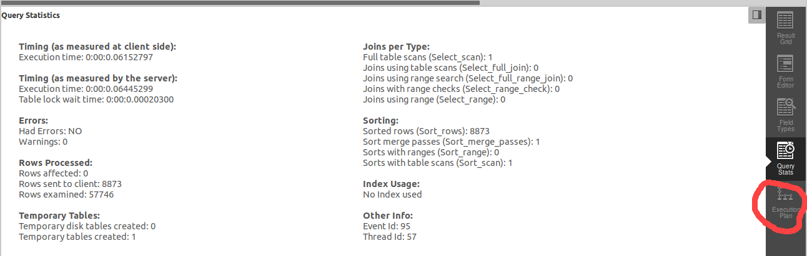

# trage queries opvolgen

## Stap 1: bijhouden

Met de juiste instellingen kan je MySQL queries laten onthouden die langer duren dan een zekere drempelwaarde. Als het gaat om queries die regelmatig terugkomen, is het de moeite waard indexen aan te maken die deze queries kunnen versnellen.

Je ziet in MySQL Workbench hoe lang het duurt om een query uit te voeren:

<figure><figcaption>
De eerste timing drukt uit hoe lang het duurt om de query uit te voeren. De tweede drukt uit hoe lang het duurt om de rsultaten op te halen en wordt niet verbeterd door een index.
</figcaption></figure>


Je kan de trage queries ook opslaan door in het bestand `my.cnf` in je MySQL-installatie de variabele `slow_query_log` op `On` te zetten, `long_query_time` op het aantal seconden dat "te veel" is in te stellen (bv. 0.2 voor 200 milliseconden) en `slow_query_log_file` in te vullen met de locatie van het gewenste logbestand. Alle queries die je vanaf dan uitvoert zullen in het logbestand worden bijgehouden.


## Stap 2a: uitpluizen zonder MySQL Workbench

Je voert de queries in kwestie opnieuw uit, maar je laat ze voorafgaan door het sleutelwoordje `EXPLAIN`. Je krijgt dan één rij per doorzochte tabel in een uitgebreide versie van volgend formaat:

| table                                | key                       | rows                   |
| ------------------------------------ | ------------------------- | ---------------------- |
| naam van een doorzochte tabel        | eventueel gebruikte index | aantal rijen doorzocht |
| naam van een andere doorzochte tabel | eventueel gebruikte index | aantal rijen doorzocht |

Als er voor een index `NULL` staat, betekent dat dat alle rijen van de eerste tot de laatste zijn beschouwd, wat typisch erg inefficiënt is (zeker als het aantal rijen groot is). Door een index toe te voegen aan een kolom met een gezochte waarde (bv. een kolom vermeld in een `WHERE`), kan je de `NULL` wegwerken en het aantal doorzochte rijen drastisch verlagen.

## Stap 2b: uitpluizen met MySQL Workbench


Volgende werkwijze is alleen mogelijk als je script **één** statement bevat. Laat in dit geval `USE <naam-van-je-databank>;` achterwege, want dat is op zich al een statement.


MySQL Workbench heeft ook een grafische weergave van je uitvoeringsplan. Deze kan je bekijken na het uitvoeren van je statement via onderstaande knop:

Als je op deze knop klikt, krijg je een diagram waarin wordt uitgelegd welke stappen nodig zijn om je query uit te voeren. Een volledig overzicht van de betekenis van de elementen in zo'n diagram vind je [hier](https://dev.mysql.com/doc/workbench/en/wb-performance-explain.html). **Je hoeft niet elk onderdeel te kennen, maar bekijk de pagina kort. Belangrijk is dat je rode boxes met daarin "full table scan" zo veel mogelijk vermijdt, zeker als het gaat om tabellen met veel data in.**

Als je op een element van het diagram gaat staan met je muis, krijg je ook een technische uitleg over waarom dat onderdeel van je query waarschijnlijk niet efficiënt is. Let op! Het betreft hier nog steeds vuistregels. Een "full table scan" is bijvoorbeeld geen ramp als je tabel erg klein is. Dat wordt ook vermeld in de kleine lettertjes.

## Stap 3: algoritme om te optimaliseren voor een query

Als je een bepaalde `SELECT`-query wil optimaliseren, kan je onderstaand stappenplan volgen:

1. Als er een `WHERE` voorkomt in je `SELECT`, voorzie dan één index op alle kolommen samen die via `AND` verbonden zijn en die rechtstreeks vergeleken worden met een constante waarde.
2.  Voeg aan je index ook de **eerste van de volgende mogelijkheden** toe die je hieronder krijgt.

    a. Een kolom die niet rechtstreeks wordt vergeleken met een waarde, maar wel in een bereik moet liggen (via `BETWEEN`, `>`, `<`, `LIKE` waarbij het eerste karakter geen wildcard is)

    b. Alle kolommen die in een `GROUP BY` worden gebruikt, in de volgorde waarin ze in de `GROUP BY` worden vermeld

    c. Alle kolommen die in een `ORDER BY` worden gebruikt, in de volgorde waarin ze in de `ORDER BY` worden vermeld, maar enkel als er geen mix van `ASC` en `DESC` voorkomt in de `ORDER BY`


Als er staat dat een kolom rechtstreeks vergeleken wordt met een waarde, betekent dat bijvoorbeeld dat er staat `WHERE MYCOLUMN = ...`. Wat niet zou gaan is `WHERE RIGHT(MYCOLUMN,3) = ...` omdat we daar de kolom eerst verder verwerken en dan pas vergelijken. Dan heeft een index op de kolom geen zin.


Bovenstaand stappenplan is afkomstig uit [de documentatie van MariaDB](https://mariadb.com/kb/en/building-the-best-index-for-a-given-select/). Dit is een zeer nauwe verwant van MySQL. Als je de pagina bekijkt, zie je dat het laatste woord over indexen nog niet gezegd is. Voor deze cursus volstaat het algoritme, maar als je ooit in je carrière geconfronteerd wordt met performantieproblemen in een database, raadpleeg dan deze uitleg voor je nieuwe (virtuele) hardware aankoopt!
