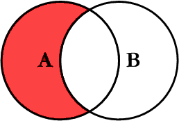

# LEFT EXCLUDING JOIN

Deze query retourneert alle records in de linkertabel \(tabel A\) die **niet overeenkomen** met records in de rechtse tabel \(tabel B\). Eventuele kolommen uit de tabel B die vermeld worden in de select list bevatten sowieso de waarde `NULL`. Deze join wordt als volgt geschreven:

```sql
SELECT <select_list>
FROM A
LEFT JOIN B
-- ook hier kan het zijn dat de linkertabel de primary key bevat
ON A.B_Id = B.Id
WHERE A.B_Id IS NULL
-- LET OP:
-- hier moet je altijd de foreign key kolom gebruiken
-- een primary key kan immers nooit NULL zijn
```



Aandachtige lezers vragen zich misschien af of je hier wel een JOIN nodig hebt, want je gebruikt alleen data uit `A`. Je zou dus bijna hetzelfde krijgen met volgende query:

```sql
SELECT <select_list>
FROM A
WHERE A.B_Id IS NULL
```

Er is een verschil, maar het is klein: je kan nu in de lijst met te selecteren kolommen geen kolommen van B meer kan vernoemen. Dat lijkt misschien geen groot gemis omdat ze alleen maar NULL bevatten, maar de left excluding join is een bouwsteen voor de outer join en die is wel zinvol.

