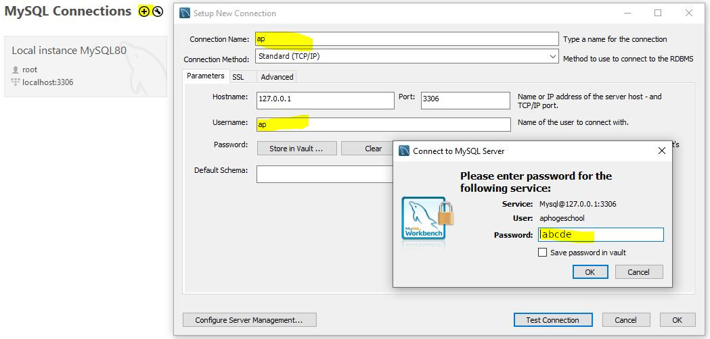

# OBJECT ACCESS CONTROL

## Definer

Hiermee kan je bepalen met welke MySQL account-privileges de stored procedure zal worden uitgevoerd.

Zonder `DEFINER` is de default de actuele gebruiker zijn rechten.

Enkel ingeval je `SYSTEM` rechten hebt, kan je een `DEFINER` bepalen voor de uitvoering van de stored procedure.

**Syntax**:

```sql
CREATE [DEFINER=gebruiker] PROCEDURE StoredProcedureName(parameter(s))
```

## Sql Security

Een stored procedure een `SECURITY` clausule bevatten met een waarde voor de `DEFINER` of de `INVOKER`.

**Syntax:**

```sql
CREATE [DEFINER=gebruiker] PROCEDURE StoredProcedureName(parameter(s)
SQL SECURITY [DEFINER | INVOKER]
```

### SQL SECURITY DEFINER

Met de `DEFINER` zal de stored procedure in de beveiligingscontext worden uitgevoerd bepaald door het `DEFINER`-attribuut.

Hierdoor kan een stored procedure worden uitgevoerd met meer rechten dan de gebruiker zelf heeft.

### SQL SECURITY INVOKER

Indien je gebruik maakt van het `INVOKER`-attribuut zal het `DEFINER`-attribuut geen effect meer hebben.

### Voorbeeld

In onderstaande stored procedure hebben we via het DEFINER-object bepaald dat de gebruiker alle rechten heeft die we zelf altijd hebben gebruikt.

Dit wil dus zeggen dat iedere gebruiker, ongeacht zijn security level, deze stored procedure kan uitvoeren met volledige rechten, omdat er `SQL SECURITY DEFINER` staat.


Let op! `DEFINER` is de defaultwaarde. Als je niet aandachtig bent, kan het dus zijn dat je users meer rechten geeft dan bedoeld.


```sql
USE `aptunes`;
DROP procedure IF EXISTS `VoorbeeldSecurity`;

DELIMITER $$
USE `aptunes`$$
CREATE DEFINER=databanken@'%' PROCEDURE `VoorbeeldSecurity` (
    titel VARCHAR(50))
SQL SECURITY DEFINER
BEGIN
    INSERT INTO Albums(Titel)
    VALUES(titel);
END$$

DELIMITER ;
```

We gaan een beetje verder en creëren een gebruiker ap@%. Het percentteken betekent dat het niet uitmaakt of de user op dezelfde machine werkt als die waarop de MySQL-server draait. Als je dat wel wil afdwingen, gebruik je localhost in plaats van %.


Als je de cursus mee hebt gevolgd zoals bedoeld, dus met een virtuele machine waarin je server draait, is localhost geen optie. Je virtuele machine wordt niet beschouwd als dezelfde machine als je fysieke machine.


```sql
CREATE USER 'ap'@'%' 
IDENTIFIED BY 'abcde';
```

Wat is belangrijk als volgende stap om te doen is deze gebruiker rechten geven om stored procedures uit te voeren.

```sql
GRANT EXECUTE ON aptunes.*
TO 'ap'@'%';
```

Hier staat de `*` voor _alle_ stored procedures. Je kan ook specifieke stored procedures toegankelijk maken. Je kan ook rechten op bepaalde databases, tabellen,... geven. We kunnen hier geen volledige lijst geven, maar de mogelijkheden vind je terug in [de officiële documentatie](https://dev.mysql.com/doc/refman/8.0/en/grant.html).

Vervolgens gaan we met deze gebruiker binnen MySQL inloggen. Doe dit als volgt.



Kijk even na op welke databases je enige rechten hebt.


Geef vervolgens aan welke db je wilt gebruiken.

```sql
USE aptunes;
```

Zoals je merkt, uit het schema-venster heb je enkel rechten op de stored procedures.


Om een stored procedure uit te voeren geef je volgende opdracht.

```sql
CALL VoorbeeldSecurity("Test vanuit ap user");
```

