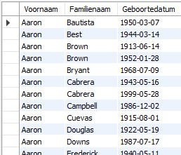
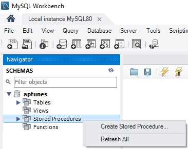
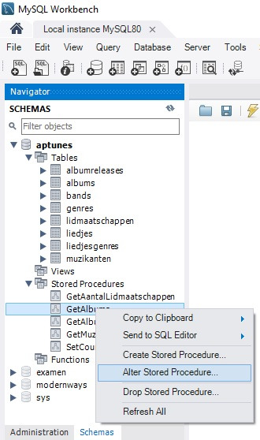
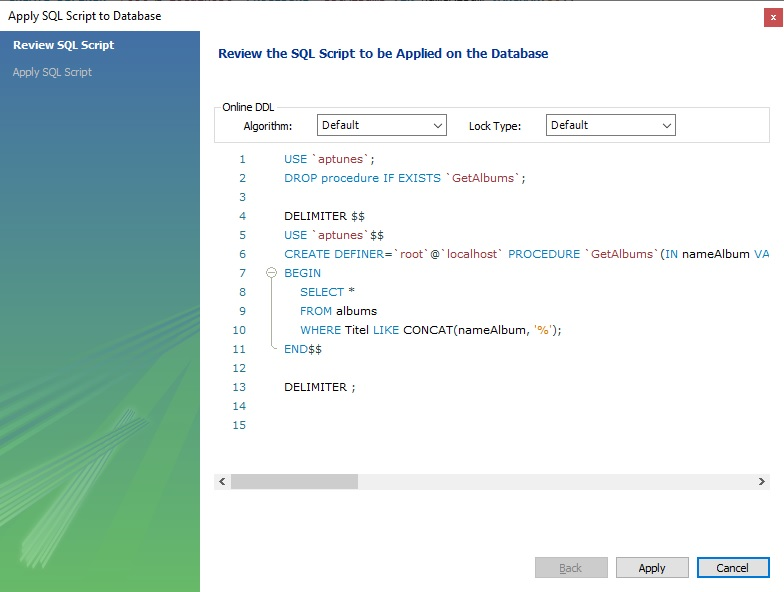
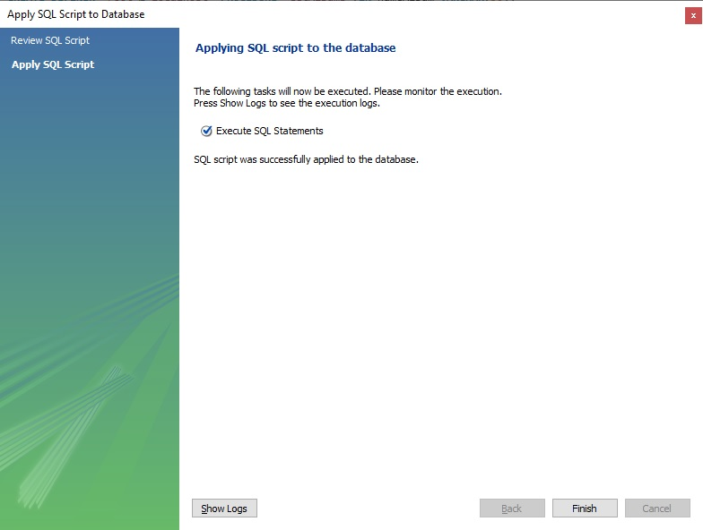

# CREATE

We baseren ons op de voorbeelddatabase vermeld binnen de rubriek [inleiding](inleiding.md).

Wanneer we onderstaand sql-statement uitvoeren, krijgen we de inhoud van de tabel muzikanten te zien.

```sql
SELECT 
    Voornaam,
    Familienaam,
    Geboortedatum
FROM 
    Muzikanten
-- onderstaande syntax is verkorte notatie voor kolom 1, kolom 2, kolom 3
ORDER BY 1,2,3;
```

Resultaat:



Mogelijk willen we deze opdracht wel vaker uitvoeren, of willen we een bepaalde gebruiker toestaan deze opdracht uit te voeren maar niets anders. Eén optie zou zijn om een view te creëren. Een tweede optie is om hier een stored procedure van te maken.

## CREATE PROCEDURE

Als we van bovenstaand sql-statement een stored procedure maken die we ten alle tijde kunnen aanroepen, doen we dit als volgt.

Binnen MySQL kiezen we binnen de sectie "Stored Procedures" via de rechtermuisknop voor "Create Stored Procedure". Daarna vullen we aan tot we dit hebben:



```sql
CREATE PROCEDURE `GetMuzikanten` ()
BEGIN
    SELECT 
        Voornaam,
        Familienaam,
        Geboortedatum
    FROM 
        Muzikanten
    ORDER BY 1,2,3; -- deze ; betekent niet dat de instructie mag uitgevoerd worden! ze is deel van de procedure
END
```


Deze code is niet geldig als .sql-script. Enkel de code die hierna wordt getoond is geldig als .sql-script.


Dan klik je op "Apply". Dit genereert dan code die je als script zou kunnen uitvoeren. De uitvoer zal zijn \(de betekenis van de gegenereerde extra's komt verderop aan bod\):

```sql
DELIMITER $$ -- betekent dat een statement pas afgesloten is na $$ i.p.v. ;
USE `aptunes`$$ -- we willen de procedure koppelen aan deze database
CREATE PROCEDURE `GetMuzikanten` ()
BEGIN
    SELECT 
        Voornaam,
        Familienaam,
        Geboortedatum
    FROM 
        Muzikanten
    ORDER BY 1,2,3; -- deze ; betekent niet dat de instructie mag uitgevoerd worden! ze is deel van de procedure
END$$ -- nu mag de CREATE PROCEDURE pas worden uitgevoerd

DELIMITER ; -- vanaf hier betekent ; weer dat een instructie mag worden uitgevoerd
```

Wat we nu hebben gedaan is een stored procedure creëren onder de naam `GetMuzikanten`.

Om deze stored procedure aan te roepen gebruiken we het `CALL` statement. Dit komt op hetzelfde neer als het oproepen van een methode in een "general purpose" programmeertaal zoals C♯ of Java.

```sql
CALL GetMuzikanten();
```

U zal zien dat hetzelfde resultaat wordt weergegeven als bij het gewone sql-statement hierboven.

Tot hiertoe lijkt een stored procedure erg op een view, maar dat is omdat we `SELECT` gebruikt hebben ter illustratie. Met een stored procedure kan je heel algemene taken voorstellen. Een stored procedure kan ook parameters hebben, zodat je er waarden aan kan doorgeven. Je kan bijvoorbeeld een stored procedure hebben die muzikanten met een specifieke geboortedatum weergeeft, die wordt ingevuld door de gebruiker. In dit geval is de geboortedatum dan de parameters van de stored procedure.

Tevens kan een stored procedure controlemechanismen bevatten, zoals IF, CASE en LOOP. Dit komt verder nog aan bod, maar erg veel van wat je leert in een cursus programmeren komt terug in stored procedures.

## STORED PROCEDURE AANPASSEN

Meest eenvoudige is om binnen MySQL Workbench rechts te klikken op de stored procedure die je wil wijzigen en dan voor de optie "alter stored procedure" te kiezen.



Nu krijg je opnieuw de definitie van de stored procedure en kan je wijzigen aanbrengen.  
Als je klaar bent, klik je op "apply".

MySQL Workbench zal het review venster openen. \(Hieronder getoond voor een andere procedure\)



In dit review venster zie je dat er eerst een `DROP PROCEDURE` wordt uitgevoerd, waarna de gewijzigde stored procedure opnieuw wordt aangemaakt met het `CREATE PROCEDURE.`

Druk nogmaals op "apply".



Finaal klik je op "finish" om de wijzigingen door te voeren.

