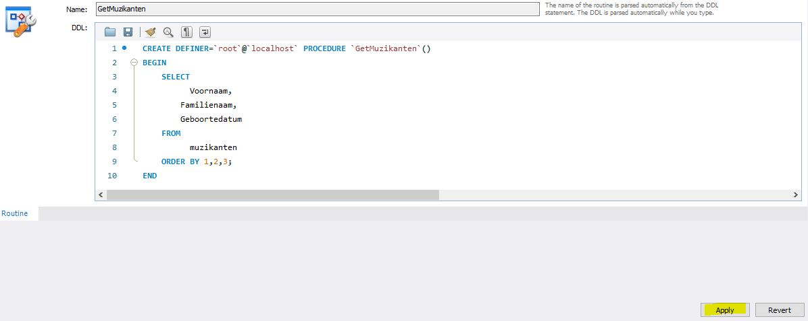
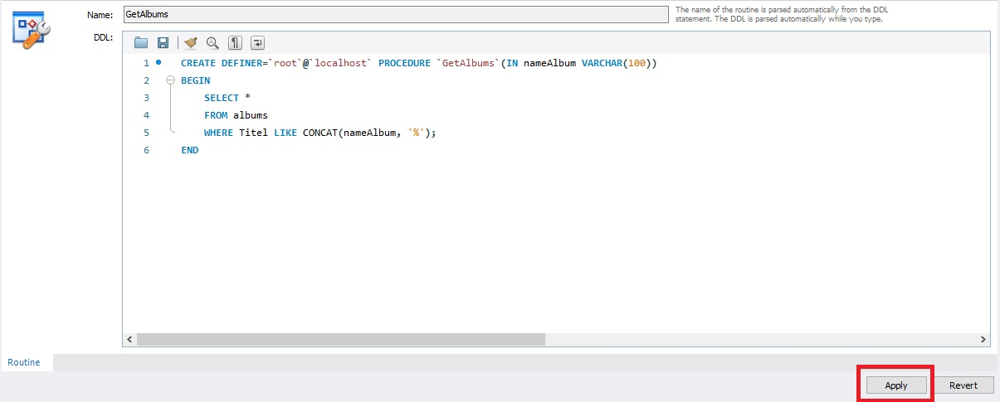

# CREATE

We baseren ons op de voorbeelddatabase vermeld binnen de rubriek [inleiding](inleiding.md).

Wanneer we onderstaand sql-statement uitvoeren, krijgen we de inhoud van de tabel muzikanten te zien.

```sql
SELECT 
	  Voornaam,
    Familienaam,
    Geboortedatum
FROM 
	  muzikanten
ORDER BY 1,2,3;
```

Resultaat:


## CREATE PROCEDURE

Als we van bovenstaand sql-statement een stored procedure maken die we ten alle tijde kunnen aanroepen, doen we dit als volgt.

Binnen MySQL kiezen we binnen de sectie "Stored Procedures" via de rechtermuisknop voor "Create Stored Procedure".


```sql
DELIMITER $$
USE `aptunes`$$
CREATE PROCEDURE `GetMuzikanten` ()
BEGIN
	SELECT 
		  Voornaam,
		Familienaam,
		Geboortedatum
	FROM 
		  muzikanten
	ORDER BY 1,2,3;
END$$

DELIMITER ;
```

U voert bovenstaande sql-code toe en kiest vervolgens voor "Apply"



Wat we nu hebben gedaan is louter een stored procedure gecreëerd onder de naam `GetMuzikanten`.

Om deze stored procedure aan te roepen gebruiken we het `CALL` statement.

```sql
CALL GetMuzikanten();
```

U zal zien dat hetzelfde resultaat wordt weergegeven als bij het gewone sql-statement hierboven.

Als u dezelfde stored procedure in dezelfde sessie opnieuw aanroept, voert MySQL de stored procedure gewoon uit vanuit de cache zonder deze opnieuw te hoeven compileren.

Een stored procedure kan parameters hebben, zodat u er waarden aan kunt doorgeven.U kunt bijvoorbeeld een stored procedure hebben die muzikanten per geboortedatum weergeeft. In dit geval is de geboortedatum dan de parameters van de stored procedure.

Tevens kan een stored procedure controlemechanismen bevatten, zoals IF, CASE en LOOP. Dit komt verder nog aan bod.

## STORED PROCEDURE AANPASSEN

Meest eenvoudige is om binnen MySQL Workbench rechts te klikken op de stored procedure die je wil wijzigen en dan voor de optie "alter stored procedure" te kiezen.


Nu krijg je opnieuw de definitie van de stored procedure en kan je wijzigen aanbrengen.  
Als je klaar bent, klik je op "apply".



MySQL Workbech zal het review venster openen.


In dit review venster zie je dat er eerst een `DROP PROCEDURE` wordt uitgevoerd, waarna de gewijzigde stored procedure opnieuw wordt aangemaakt met het `CREATE PROCEDURE.`

Druk nogmaals op "apply".


Finaal klik je op "finish" om de wijzigingen door te voeren.

