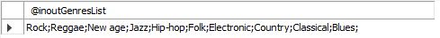
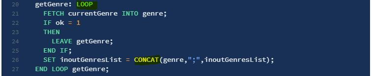

# CURSORS

Het resultaat van een stored procedure kunnen we een set van rijen die door de query binnen de stored procedure werd gegenereerd rij per rij verwerken.

```sql
USE `aptunes`;
DROP procedure IF EXISTS `VoorbeeldCursors`;

DELIMITER $$
USE `aptunes`$$
CREATE PROCEDURE `VoorbeeldCursors` (
	INOUT inoutGenresList VARCHAR(1000))
BEGIN
	DECLARE ok INTEGER DEFAULT 0;
  DECLARE genre VARCHAR(50) DEFAULT "";
    
  DECLARE currentGenre
  CURSOR FOR SELECT Naam FROM genres;
    
  DECLARE CONTINUE HANDLER
  FOR NOT FOUND SET ok = 1;
    
  OPEN currentGenre;
    
  getGenre: LOOP
		FETCH currentGenre INTO genre;
    IF ok = 1
    THEN
			LEAVE getGenre;
		END IF;
    SET inoutGenresList = CONCAT(genre,";",inoutGenresList);
	END LOOP getGenre;
    
  CLOSE currentGenre;
END$$

DELIMITER ;
```

Deze stored procedure roepen we als volgt aan.

```sql
SET @inoutGenresList = "";
CALL VoorbeeldCursors(@inoutGenresList);
SELECT @inoutGenresList;
```

Als resultaat krijgen we dan.



We hebben dus eerst een `CURSOR` gedeclareerd om de verschillende genres te doorlopen. Daarbij hebben we ook een `NOT FOUND HANDLER` gedeclareerd. 


Hierna openen we de `CURSOR` door het `OPEN`-statement.


Hierna behandelen we de lijst met genres en concatineren we deze met als tussenvoegsel een puntkomma \(;\).



In deze lus gebruiken we de `ok`-variabele om na te gaan of er nog een naam van een genre voorkomt in de lijst en indien niet de lus te beëindigen. We moeten uiteindelijk ook de `CURSOR` sluiten door het `CLOSE`-statement. 

