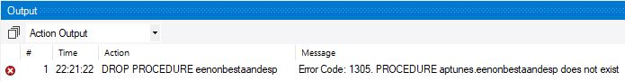
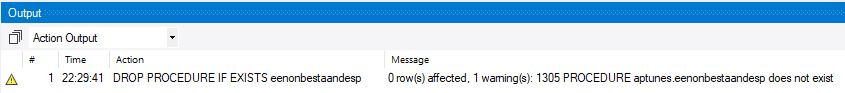
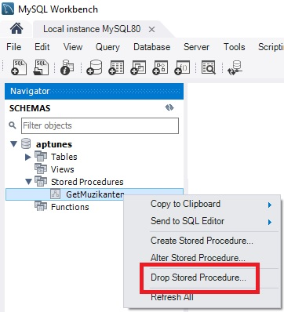
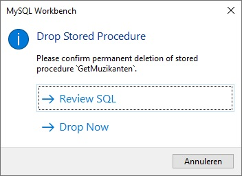
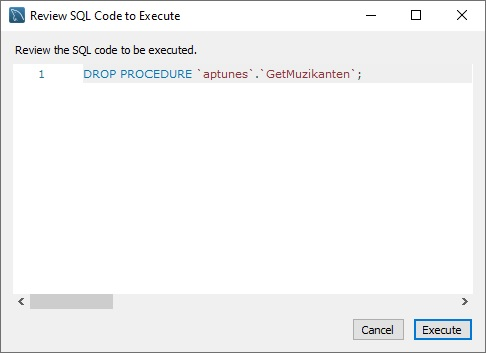

# DROP

Met dit statement verwijder je de stored procedure uit de database.

```sql
DROP PROCEDURE [IF EXISTS] storedprocedure_name;
```

Het is aan te raden om het `IF EXISTS` onderdeel in te bouwen, gezien indien de stored procedure niet zou bestaan, er een error wordt gegenereerd.

Verwijzende naar de aangemaakte stored procedure binnen het onderdeel CREATE, hieronder voor de volledigheid dit statement opnieuw.

```sql
DELIMITER $$
USE `aptunes`$$
CREATE PROCEDURE `ToonMuzikanten` ()
BEGIN
    SELECT 
        Voornaam,
        Familienaam,
        Geboortedatum
    FROM 
        Muzikanten
    ORDER BY 1,2,3;
END$$

DELIMITER ;
```

Om deze stored procedure te verwijderen is het voldoende volgend statement uit te voeren.

```sql
DROP PROCEDURE ToonMuzikanten;
```

Indien we de `DROP PROCEDURE` gebruiken zonder de `IF EXISTS` clausule, dan zou dit kunnen resulteren in volgende.

```sql
DROP PROCEDURE eenonbestaandesp;
```



Als we ditzelfde statement met de IF EXIST clausule uitvoeren krijgen we volgend resulaat.

```sql
DROP PROCEDURE IF EXISTS eenonbestaandesp;
```



Uiteraard kan je de stored procedure ook verwijderen door de mogelijkheden van MySQL Workbench te benutten.



Om te bekijken wat er juist zal uitgevoerd worden kies je de optie "review sql".



Volgend resultaat verkrijg je.



Door op de knop "execute" te klikken verwijder je permanent de stored procedure.

