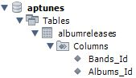
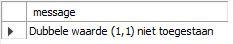
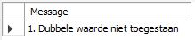

# ERROR HANDLING

Indien binnen een stored procedure zich een onverwachte fout zou voordoen is het belangrijk hierop gepast te reageren. 

Dit gepast reageren kan zijn van verder te gaan of het huidige blok code niet meer uit te voeren of een boodschap te geven.

Hieronder wordt het gebruik van handlers summier uitgelegd.

## Declare handler

**Syntax**

```sql
DECLARE actie [CONTINUE of EXIT] HANDLER FOR statement(s);
```

Zoals reeds blijkt uit bovenstaande syntax moet je voor actie ofwel `CONTINUE` of `EXIT` gebruiken.

Het onderdeel statement\(s\) kan één van onderstaande elementen zijn.

* MySQL-foutcode
* Een SQLSTATE-waarde, m.n. een SQLWARNING, NOTFOUND of SQLEXCEPTION-voorwaarde 
* Een voorwaarde gekoppeld aan een MySQL-foutcode of SQLSTATE-waarde.

**Hieronder enkele voorbeelden.**

De hieronder voorgestelde `handler` gaat verder wanneer zich een `error` voordoet en zet tevens de variabele `heeftError` op 1.

```sql
DECLARE CONTINUE HANDLER FOR SQLEXCEPTION 
SET heeftError = 1;
```

Als we een boodschap willen weergeven wanneer er zich een error voordoet dan kan dit met onderstaand voorbeeld waarbij tevens een `ROLLBACK` wordt uitgevoerd, waardoor alle mogelijke wijzigingen die de stored procedure zou hebben uitgevoerd teniet worden gedaan. Hierbij is het wel belangrijk om de  handler binnen de `BEGIN` en `END` van de stored procedure te schrijven, enkel dan zal de stored procedure worden gestopt wanneer er zich een error voordoet.

```sql
CREATE PROCEDURE spNaam()
spLabel: BEGIN
    DECLARE EXIT HANDLER FOR SQLEXCEPTION
    BEGIN
        ROLLBACK;
        SELECT 'Error: stored procdure is beëindigd en alle wijzigingen zijn ongedaan gemaakt.';
    END;
    -- vervolg van de sp...
END$$
```

Je kan ook handlers voor specifieke statements of error-codes schrijven, hieronder enkele voorbeelden.

Deze voorbeelden zijn allemaal met de `CONTINUE` optie, maar kan evengoed met de `EXIT` mogelijkheid worden geschreven.

```sql
DECLARE CONTINUE HANDLER FOR 1051
```

```sql
DECLARE CONTINUE HANDLER FOR SQLSTATE '123AB'
```

```sql
DECLARE CONTINUE HANDLER FOR SQLWARNING
```

```sql
DECLARE CONTINUE HANDLER FOR NOT FOUND
```

```sql
DECLARE CONTINUE HANDLER FOR SQLEXCEPTION
```

Enzovoort...

## Uitgewerkt voorbeeld

We werken voor dit voorbeeld met de tabel `albumreleases` binnen onze voorbeelddatabase aptunes. 



```sql
USE `aptunes`;
DROP procedure IF EXISTS `InsertAlbumReleases`;

DELIMITER $$
USE `aptunes`$$
CREATE DEFINER=`root`@`localhost` PROCEDURE `InsertAlbumReleases`(
	IN inBands_Id INT,
  IN inAlbums_Id INT)
BEGIN
	DECLARE EXIT HANDLER FOR 1062
  BEGIN
		SELECT CONCAT('Dubbele waarde (',inBands_Id,',',inAlbums_Id,') niet toegestaan') AS message;
  END;

	INSERT INTO albumreleases(Bands_Id,Albums_Id)
  VALUES(inBands_id,inAlbums_Id);
    
  SELECT COUNT(*)
  FROM albumreleases
  WHERE Bands_Id = inBands_Id;
END$$

DELIMITER ;
```

Bovenstaande stored procedure zal ingeval een dubbele waarde zou worden ingegeven, ttz. hetzelfde band\_id en album\_id, de boodschap geven dat dit niet is toegestaan.

In het andere geval zal het aantal albums voor een band\_id worden weergegeven.

**Uitvoering**

We voeren onderstaande `CALL` uit.

```sql
CALL InsertAlbumReleases(1,1);
```

En krijgen als resultaat het cijfer 1 van de `COUNT(*)` terug.

We voeren dezelfde `CALL` opnieuw uit en krijgen dan:



## Handler volgorde

Ingeval er verschillende `HANDLERS` zijn gedefinieerd die dezelfde `ERROR` afhandelen, dan zal MySQL de `HANDLER` uitvoeren die het meest aansluit bij de error op basis van onderstaande volgorde:

1. Je hebt gebruik gemaakt van een `ERROR`-code \(zie voorbeeld hierboven\);
2. Je maakt gebruik van een `SQLSTATE`, maar dit kan resulteren in meerdere error codes waardoor deze manier minder specifiek is;
3. Je gebruikt `SQLEXCEPTION` of `SQLWARNING` voor de `SQLSTATE` waarde. Dit is de meest generieke manier.

Als we dit toepassen op het gegeven voorbeeld, dan krijgen we hetvolgende.

```sql
USE `aptunes`;
DROP procedure IF EXISTS `InsertAlbumReleases`;

DELIMITER $$
USE `aptunes`$$
CREATE DEFINER=`root`@`localhost` PROCEDURE `InsertAlbumReleases`(
	IN inBands_Id INT,
  IN inAlbums_Id INT)
BEGIN
  DECLARE EXIT HANDLER FOR 1062 SELECT '1. Dubbele waarde niet toegestaan' Message; 
  DECLARE EXIT HANDLER FOR SQLEXCEPTION SELECT '2. SQLException' Message; 
  DECLARE EXIT HANDLER FOR SQLSTATE '23000' SELECT '3. SQLSTATE 23000' ErrorCode;
	
	INSERT INTO albumreleases(Bands_Id,Albums_Id)
  VALUES(inBands_id,inAlbums_Id);
    
  SELECT COUNT(*)
  FROM albumreleases
  WHERE Bands_Id = inBands_Id;
END$$

DELIMITER ;
```

Als we dan volgende CALL uitvoeren, krijgen we onderliggend resultaat.

```sql
CALL InsertAlbumReleases(1,1);
```



Je merkt op dat de eerste handler werd uitgevoerd en dit omdat de error 1062 exact aansluit bij de exception.

## Named handler

Zoals we in bovenstaande voorbeelden hebben gezien, gebruiken we error code 1062. Dit staat voor een "duplicate entry for key".

Het is waarschijnlijk minder goed verstaanbaar om een error-nummer te gebruiken en daardoor kunnen we de handler best een meer beschrijvende naam geven.

```sql
USE `aptunes`;
DROP procedure IF EXISTS `InsertAlbumReleases`;

DELIMITER $$
USE `aptunes`$$
CREATE DEFINER=`root`@`localhost` PROCEDURE `InsertAlbumReleases`(
	IN inBands_Id INT,
  IN inAlbums_Id INT)
BEGIN
	DECLARE DubbeleWaarde CONDITION FOR 1062;
    
  DECLARE EXIT HANDLER FOR DubbeleWaarde
  BEGIN
		SELECT CONCAT('Dubbele waarde (',inBands_Id,',',inAlbums_Id,') niet toegestaan') AS message;
  END;

	INSERT INTO albumreleases(Bands_Id,Albums_Id)
  VALUES(inBands_id,inAlbums_Id);
    
  SELECT COUNT(*)
  FROM albumreleases
  WHERE Bands_Id = inBands_Id;
END$$

DELIMITER ;
```

Zoals we zien, hebben we een `CONDITIE` gedeclareerd voor error code 1062. 

Nadien gebruiken we voor de `EXIT HANDLER` de verwijzing naar deze `CONDITIE`.

