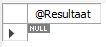
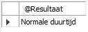
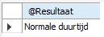

# IF -THEN-ELSE-ELSEIF

Drie mogelijkheden:

* [IF-THEN](if-then.md#if-then)
* [IF-THEN-ELSE](if-then.md#if-then-else)
* [IF-THEN-ELSEIF-ELSE](if-then.md#if-then-elseif-else)

Op basis van het resultaat van een IF-THEN-... statement kan je één of meerdere SQL statements uitvoeren en een aangepast resultaat op basis van de ingebouwde conditie weergeven.

## IF-THEN

**Syntax:**

```sql
IF conditie THEN 
   if-statement(s);
END IF;
```

Toegepast op onze voobeelddatabase en meer bepaald op de tabel `Liedjes`.

```sql
USE `aptunes`;
DROP procedure IF EXISTS `if_then`;

DELIMITER $$
CREATE DEFINER=`root`@`localhost` PROCEDURE `if_then`(
	IN pLiedjesId INT,
  OUT pResult VARCHAR(30))
BEGIN
	DECLARE song_length INT DEFAULT 0;
    
  SELECT Lengte 
  INTO song_length
  FROM Liedjes
  WHERE Id = pLiedjesId;
    
  IF song_length > 80 THEN
		SET pResult = 'Lange duurtijd';
	END IF;
END$$

DELIMITER ;
```

In bovenstaand voorbeeld creëren we een `IN` en `OUT` parameter voor de stored procedure `if_then`.\
De `pLiedjesId` wordt gebruikt om het Id van het liedje op te geven, hetgeen dan verder in de stored procedure wordt gebruikt. \
De output-parameter`pResult` wordt dan weer gebruikt om een waarde weer te geven buiten de stored procedure.

Het sql-statement gaat de lengte van het liedje met het `Id` dat bepaald is door de `IN-parameter pLiedjesId` bewaren in de lokale variabele `song_length`.

Vervolgens gaan we op basis van een `IF-THEN` constructie nagaan wat de inhoud van de lokale variabele `song_length` is en ingeval deze groter is dan 80 gaan we de `OUT-parameter` de waarde 'Lange duurtijd' geven.

Om de stored procedure correct op te roepen, hanteren we volgend statement.

```sql
CALL if_then(2716, @Resultaat);
SELECT @Resultaat;
```

Het resultaat is:

.JPG>)

Als je evenwel een id zou opgeven waarbij de lengte kleiner is dan 80, dan wordt er niets weergegeven.



Mocht je wel wensen dat er te allen tijde een resultaat wordt weergegeven, dan moet je minstens met de [`IF-THEN-ELSE`](if-then.md#if-then-else) of de [`IF-THEN-ELSEIF-ELSE`](if-then.md#if-then-elseif-else) werken, zie verder.

## IF-THEN-ELSE

**Syntax:**

```sql
IF conditie THEN
   if-statement(s);
ELSE
   else-statement(s);
END IF;
```

De procedure omschreven in het voorgaande deel [`IF-THEN`](if-then.md#if-then) wordt uitgebreid.

We voorzien nu dat wanneer de duurtijd meer dan 80 seconden bedraagt, er wordt weergegeven dat het een lange duurtijd betreft, in het andere geval wordt normale duurtijd weergeven.

Onderstaand voorbeeld laat zien hoe de IF-THEN-ELSE moet worden voorzien.

```sql
USE `aptunes`;
DROP procedure IF EXISTS `if_then_else`;

DELIMITER $$
CREATE PROCEDURE `if_then_else` (
	IN pLiedjesId INT,
  OUT pResult VARCHAR(30))
BEGIN
	DECLARE song_length INT DEFAULT 0;
    
  SELECT Lengte 
  INTO song_length
  FROM Liedjes
  WHERE Id = pLiedjesId;
    
  IF song_length > 80 THEN
		SET pResult = 'Lange duurtijd';
	ELSE
		SET pResult = 'Normale duurtijd';
	END IF;
END$$

DELIMITER ;
```

Hieronder het resultaat voor een id met een lengte van minder dan 80 sec.&#x20;

```sql
CALL if_then(1, @Resultaat);
SELECT @Resultaat;
```



In het geval dat de waarde groter is dan 80 sec., dan bekom je hetzelfde positieve resultaat als bij het onderdeel [`IF-THEN`](if-then.md#if-then) hierboven.

## IF-THEN-ELSEIF-ELSE

**Syntax:**

```sql
IF conditie THEN
   if-statement(s);
ELSEIF conditie THEN
   elseif-statement(s);
ELSE
   else-statement(s);
END IF;
```

De procedure omschreven in het voorgaande deel [`IF-THEN-ELSE`](if-then.md) wordt uitgebreid.

We voorzien nu dat wanneer de duurtijd meer dan 80 seconden bedraagt er wordt weergegeven dat het een lange duurtijd betreft, in het geval de duurtijd tussen de 70 en 80 ligt wordt normale duurtijd weergeven en in het geval dit minder dan 70 bedraagt wordt korte duurtijd getoond.

Onderstaand voorbeeld laat zien hoe de IF-THEN-ELSEIF-ELSE moet worden voorzien.

```sql
USE `aptunes`;
DROP procedure IF EXISTS `if_then_elseif_else`;

DELIMITER $$
CREATE PROCEDURE `if_then_elseif_else` (
	IN pLiedjesId INT,
  OUT pResult VARCHAR(30))
BEGIN
	DECLARE song_length INT DEFAULT 0;
    
  SELECT Lengte 
  INTO song_length
  FROM Liedjes
  WHERE Id = pLiedjesId;
    
  IF song_length > 80 THEN
		SET pResult = 'Lange duurtijd';
	ELSEIF song_length > 70 THEN
		SET pResult = 'Normale duurtijd';
	ELSE 
		SET pResult = 'Korte duurtijd';
	END IF;
END$$

DELIMITER ;
```

Hieronder het resultaat voor een id met een lengte van meer dan 70 sec. en minder dan 80 sec.

```sql
CALL if_then_elseif_else(15, @Resultaat);
SELECT @Resultaat;
```


