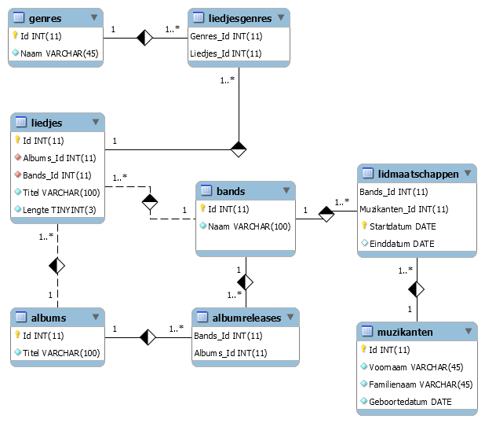

# Inleiding

## Voordelen van MySQL stored procedures:

* Verminder het netwerkverkeer  Stored procedures helpen het netwerkverkeer tussen applicaties en de database te verminderen. In plaats van meerdere lange sql statements vanuit een applicatie over het netwerk te versturen, hoeven deze applicaties ingeval van stored procedures alleen de naam en parameters van de opgeslagen procedures aan te roepen.
* Centraliseer zakelijke logica in de database zelf De stored procedures kunnen gebruikt worden om de business logica te implementeren en dus maar één keer te moeten aanmaken en onderhouden, die op hun beurt door meerdere applicaties kunnen worden \(her\)gebruikt. 
* Consistentere database De stored procedures helpen de inspanningen om dezelfde logica telkens te moeten herschrijven voor verschillende applicaties te verminderen en maken daardoor de database consistenter.
* Database is veiliger  De databasebeheerder kan passende rechten toekennen aan applicaties die alleen toegang hebben tot specifieke stored procedures zonder dat er rechten op de onderliggende tabellen moeten worden gegeven.

## Nadelen van MySQL stored procedures 

* Gebruik van hulpmiddelen  Als u veel stored procedures gebruikt, zal het geheugengebruik van elke verbinding aanzienlijk toenemen. Afhankelijk van het type database zal het overmatig gebruik van een groot aantal logische bewerkingen in de stored procedures het cpu-gebruik verhogen.

## Debugging 

Helaas biedt MySQL geen faciliteiten om stored procedures te debuggen. Andere enterprise database producten zoals Oracle en SQL Server bieden deze mogelijkheid wel.

## De voorbeelddatabase

Hieronder kan je het calibratiescript downloaden.



