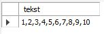

# LOOP

Een herhaling dient, zoals het woord doet veronderstellen, om code of statements een aantal keer achter elkaar uit te voeren.

**Syntax:**

```sql
[loop_benaming:] LOOP
    statement(s)
END LOOP
```

Merk op dat er geen loopconditie aanwezig is. Om de lus te verlaten, schirjf je `LEAVE`, gevolgd door de benaming van de lus die je wil verlaten.


Het `LEAVE` commando werkt ook in andere soorten lussen zoals `WHILE` en `REPEAT`


Hieronder een simpel voorbeeld van een stored procedure die een getal als parameter heeft en dan de getallen vanaf 1 tot het getal in kwestie in een tekenreeks plaatst en deze toont.

```sql
USE `aptunes`;
DROP procedure IF EXISTS `LoopDemo`;

DELIMITER $$
USE `aptunes`$$
CREATE DEFINER=`root`@`localhost` PROCEDURE `LoopDemo`(
    IN numberOfIterations INT
)
BEGIN
    DECLARE i INT DEFAULT 0;
    DECLARE producedText VARCHAR(255) DEFAULT '';
    concat_loop:  LOOP
        SET  i = i + 1;
        IF  i >= numberOfIterations THEN
            SET producedText = CONCAT(producedText,i);
            LEAVE concat_loop;
        ELSE
            SET producedText = CONCAT(producedText,i,',');
        END IF;
    END LOOP;
    SELECT producedText; 
END$$

DELIMITER ;
```

Om deze stored procedure op te roepen, hanteren we volgend statement. Waarbij we in onderstaand geval vragen om 10 cijfers weer te geven.

```sql
CALL LoopDemo(10);
```

Resultaat:


