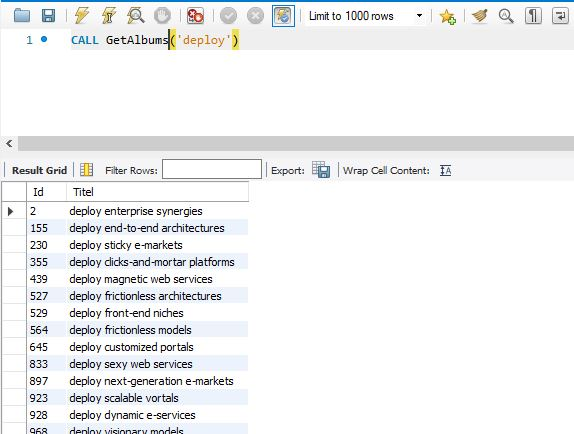
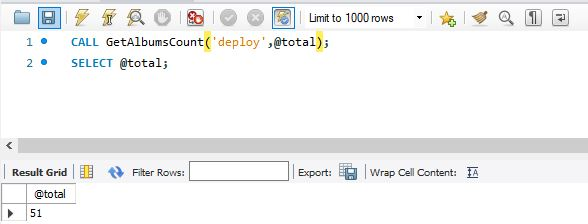
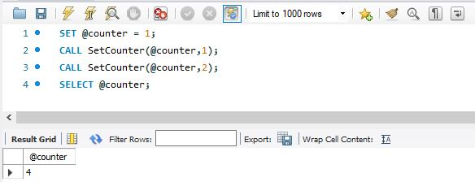

# PARAMETERS

Het gebruik van parameters is niet weg te denken bij het gebruik van stored procedures. Juist door het gebruik van parameters wordt het gebruik van stored procedures heel flexibel.

Er zijn drie mogelijkheden, nl. `IN`, `OUT` en `INOUT`.

### IN parameters

Dit is de standaard.

Net zoals bij methoden binnen een programmeertaal dient een argument worden meegegeven wanneer een stored procedure wordt aangeroepen die één of meerdere parameters verwacht.

IN betekent dat de waarde die als argument via een andere variabele wordt doorgegeven, niet wijzigt buiten de stored procedure. Enkel binnen de stored procedure kan de waarde van de parameter worden aangepast. Dit stemt overeen met een "call by value" in een algemene programmeertaal.

### OUT parameters

Zoals al doet vermoeden kan de waarde van een OUT-parameter wel binnen de opgeslagen procedure worden gewijzigd. Deze waarde kan dan worden doorgegeven aan het programma dat de stored procedure heeft opgeroepen.

In tegenstelling tot de `IN parameter`, kan je geen waarde meegeven voor een `OUT` parameter. Alleen de stored procedure kan er zelf een waarde voor invullen, die je dan kan lezen nadat de de stored procedure is afgelopen.

Zelfs als je een cursus programmeren hebt gevolgd, is het mogelijk dat je dit niet meteen herkent. De meeste programmeertalen gebruiken `return` om een resultaat terug te geven. Sommige \(vaak oudere\) programmeertalen gebruiken wel out parameters.

### INOUT parameters

Dit betreft de combinatie van de `IN parameter` en de `OUT parameter`. Dus zowel bij de start kan de inhoud worden bepaald en de stored procedure kan deze bij uitvoering ook aanpassen. **Als je kan kiezen voor een van de types hierboven, doe dat dan.** Dat is duidelijker.

## VOORBEELDEN

### IN

```sql
USE `aptunes`;
DROP procedure IF EXISTS `GetAlbums`;

DELIMITER $$
USE `aptunes`$$
CREATE DEFINER=`root`@`localhost` PROCEDURE `GetAlbums`(IN nameAlbum VARCHAR(100))
BEGIN
    SELECT *
    FROM Albums
    WHERE Titel LIKE CONCAT(nameAlbum, '%');
END$$

DELIMITER ;
```



### OUT

```sql
USE `aptunes`;
DROP procedure IF EXISTS `GetAlbumsCount`;

DELIMITER $$
CREATE PROCEDURE `GetAlbumsCount` (IN nameAlbum VARCHAR(100), OUT total INT)
BEGIN
    SELECT COUNT(*)
    INTO total
    FROM Albums
    WHERE Titel LIKE CONCAT(nameAlbum, '%');
END$$

DELIMITER ;
```

Als we deze stored procedure oproepen moeten we voor wat de `OUT-parameter` in het oproepend statement gebruik maken van het **@-symbool**. Dit duidt op een sessievariabele. De variabele is namelijk niet lokaal binnen de stored procedure.



Het is niet nodig om de `OUT-parameter` aan te roepen door dezelfde benaming te gebruiken, je had in bovenstaand voorbeeld perfect @totaal \(met twee `a`'s\) kunnen gebruiken. Ook dit is hetzelfde als in algemene programmeertalen: als een parameter van een functie bijvoorbeeld `name` heet, mag jij als argument een variabele `naam` invullen.

### INOUT

In onderstaand voorbeeld is de beginwaarde belangrijk, maar moet ze ook kunnen worden aangepast:

```sql
USE `aptunes`;
DROP procedure IF EXISTS `SetCounter`;

DELIMITER $$
CREATE PROCEDURE `SetCounter` (INOUT counter INT, IN startNumber INT)
BEGIN
    SET counter = counter + startNumber;
END$$
DELIMITER ;
```



