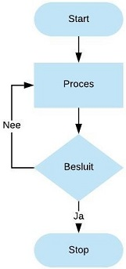
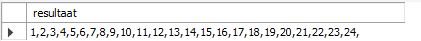

# REPEAT

De `REPEAT` herhalingsstructuur voert code of statements achter elkaar uit tot de conditie waar \(`TRUE`\) is.

**Syntax**

```sql
REPEAT
    statement(s)
UNTIL [conditie]
END REPEAT 
```

De `REPEAT` herhalingsstructuur controleert of de conditie waar \(`TRUE`\) is na de uitvoering van de statement\(s\). De gedefinieerde statement\(s\) worden dus in alle gevallen steeds minstens één keer uitgevoerd. 

Het schema hieronder geeft dit duidelijk weer.



Het principe van de REPEAT herhalingsstructuur wordt toegelicht aan de hand van onderstaande stored procedure waarbij nummers van 1 tot 25 worden geconcatineerd.

```sql
USE `aptunes`;
DROP procedure IF EXISTS `RepeatHerhalingsstructuur`;

DELIMITER $$
USE `aptunes`$$
CREATE DEFINER=`root`@`localhost` PROCEDURE `RepeatHerhalingsstructuur`()
BEGIN
	DECLARE teller INT DEFAULT 1;
    DECLARE resultaat VARCHAR(90) DEFAULT '';
    
    REPEAT
        SET resultaat = CONCAT(resultaat,teller,',');
        SET teller = teller + 1;
    UNTIL teller >= 25
    END REPEAT;
    
    -- toont het resultaat op het scherm
    SELECT resultaat;
END$$

DELIMITER ;
```

De uitvoering van deze stored procedure geeft volgend resultaat.



Kort uitgelegd:

Er worden twee variabelen gedeclareerd, nl. teller en resultaat. 

Zolang de teller niet groter of gelijk is aan 25 worden de statements waarbij de `CONCAT`-functie wordt gebruikt uitgevoerd.

