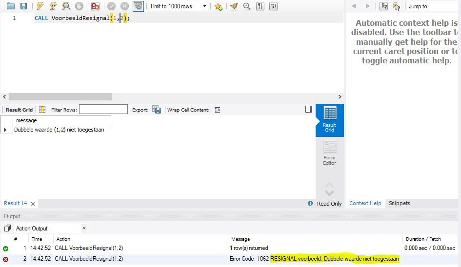

# RESIGNAL

Met dit statement kan je een fout \(gedeeltelijk\) afhandelen, maar toch de omringende omgeving op de hoogte brengen van wat zich heeft voorgedaan. Vergelijk het met de lector die een vraag krijgt van een student en deze niet volledig kan afhandelen. Hij onderneemt een aantal stappen, maar brengt uiteindelijk de vakgroepcoördinator op de hoogte. Die kan eventueel zelfs het opleidingshoofd op de hoogte brengen. Een fout kan dus steeds "naar boven" doorgegeven worden.

Ee ander voorbeeld is een telefoontje naar de helpdesk. Typisch kan de persoon aan de telefoon je helpen. Als dat niet zo is, belt die naar een technische dienst of ombudsman. Indien het om een zeer ernstige klacht gaat, wordt ze doorgegeven aan management,...

Het `RESIGNAL`-statement \(dat een signaal "doorgeeft"\) is gelijkaardig aan het `SIGNAL`-statement, behalve:

* `RESIGNAL` kan je enkel gebruiken binnen een handler \(`SIGNAL` daarentegen kan je eender waar gebruiken\)
* Je kan alle attributen aanpassen of weglaten, zelfs de `SQLSTATE`

Hieronder een voorbeeld.

```sql
USE `aptunes`;
DROP procedure IF EXISTS `VoorbeeldResignal`;

DELIMITER $$
USE `aptunes`$$
CREATE DEFINER=`root`@`localhost` PROCEDURE `VoorbeeldResignal`(
    IN inBands_Id INT,
    IN inAlbums_Id INT)
BEGIN
DECLARE DubbeleWaarde CONDITION FOR 1062;

    DECLARE EXIT HANDLER FOR DubbeleWaarde 
    BEGIN
        SELECT CONCAT('Dubbele waarde (',inBands_Id,',',inAlbums_Id,') niet toegestaan') AS message;
    -- aanpassing van een attribuut
        RESIGNAL SET MESSAGE_TEXT = 'RESIGNAL voorbeeld: Dubbele waarde niet toegestaan';
    END;

    INSERT INTO Albumreleases(Bands_Id,Albums_Id)
    VALUES(inBands_id,inAlbums_Id);

    SELECT COUNT(*)
    FROM Albumreleases
    WHERE Bands_Id = inBands_Id;
END$$

DELIMITER ;
```

Wanneer we deze stored procedure aanroepen met een waarde die reeds voorkomt, dan krijgen we niet enkel een gepaste boodschap in het resultatenscherm, maar ook een boodschap in het output-venster.



