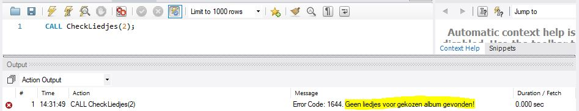

# SIGNAL

Met dit statements kan je een error of waarschuwing geven. Meestal gebeurt dit wanneer een stored procedure wordt uitgevoerd, maar het is strikt gesproken ook mogelijk `SIGNAL` te gebruiken buiten een stored procedure.

## Basisgebruik

Een `SIGNAL` geeft, zoals de naam het zegt, "een signaal". Dit signaal kan worden opgepikt door de code die signalerende code omringt.

Vergelijk het met de \(wat vereenvoudigde\) schoolomgeving:

* studenten krijgen opdrachten van lectoren
* lectoren krijgen opdrachten van vakgroepcoördinatoren
* vakgroepcoördinatoren krijgen opdrachten van opleidingshoofden
* opleidingshoofden krijgen opdrachten van departementshoofden

Als er zich ergens een probleem voordoet, contacteert diegene die het probleem is tegengekomen die hem opdrachten geeft.

### Voorbeeld 1 \(uit het echte leven\)

Jij \(een student\) krijgt een taak voor het vak Databanken. Je ontvangt die taak van de lector. Je moet bijvoorbeeld MySQL installeren op je systeem. Als het mis loopt, contacteer je de lector en geef je liefst zo veel mogelijk informatie over wat er precies gebeurt \(screenshot van de foutmelding,...\). De lector onderneemt dan bepaalde stappen om het probleem op te lossen. Hij stuurt je bijvoorbeeld een filmpje waarin de foutmelding wordt opgelost.

Wanneer jij de lector contacteert, geef je hem het **signaal** dat er iets mis is. Je geeft dat signaal aan de lector, **omdat hij je de opdracht gegeven heeft**. Hij zal het signaal dan **afhandelen**.

### Voorbeeld 2 \(uit het echte leven\)

De lector stelt vast dat bepaalde stof niet gegeven kan worden in de tijd die nog rest in het semester. Deze stof staat nochtans in de vakfiche en moet in principe gegeven worden, dus de lector kan niet zomaar een eigen oplossing verzinnen. Daarom contacteert hij de vakcoördinator. De vakcoördinator denkt er goed over na, maar ziet ook niet hoe het verder moet. Daarom contacteert de vakcoördinator het opleidingshoofd. Het opleidingshoofd staat toe uitzonderlijk te snoeien in de leerstof om zo het probleem op te lossen.

Wanneer de lector de vakcoördinator contacteert, geeft hij het **signaal** dat er iets mis is. Hij contacteert eerst de vakcoördinator, omdat dat de persoon is die hem directe opdrachten geeft. De vakcoördinator kan het probleem niet oplossen, dus hij **geeft het signaal door** naar het opleidingshoofd, omdat dat de persoon is die hem directe opdrachten geeft.

### Voorbeeld 3 \(uit het echte leven\)

Mijn rookdetector gaat 's nachts af. Ik merk dat er brand is uitgeslagen. Ik maak mijn gezin wakker, neem mijn huisdieren en loop naar buiten.

Ik heb de rookdetector geïnstalleerd en geactiveerd, dus ik heb hem eigenlijk de **opdracht** gegeven de niveaus van bepaalde partikels in de gaten te houden. De rookdetector stelt vast dat er iets mis is dat hij niet kan oplossen \(hij kan zelf geen brand blussen\), dus hij geeft mij een **signaal**. Ik kan zelf het probleem ook niet volledig ongedaan maken, maar ik kan wel op het signaal reageren.

### Signalen in code

Een `SIGNAL` statement "slaat alarm". Het laat aan omringende code weten dat er iets mis is. Wat mis is, wordt aangegeven met een specifieke `SQLSTATE`. Dit is een soort foutcode van 5 symbolen. De exacte combinatie van symbolen geeft aan over welk signaal het gaat. Vergelijk met de sirene van de politie, brandweer of ambulance. Het zijn allemaal "signalen" maar ze hebben allemaal een verschillende klank, zodat mensen er gepaster op kunnen reageren.

Een `SIGNAL` statement gebruik je met volgende syntax:

```sql
signal sqlstate '45000'; -- '45000' is een specifieke foutcode, mag anders zijn
```


Het is `'45000'`, geschreven als string. Niet `45000`, geschreven als getal. Sommige signalen beginnen met één of meerdere nullen en die hebben ook een betekenis. Dat gaat niet als je signalen voorstelt als getallen.


Probeer bovenstaand statement eens uit in MySQL Workbench. Er staat "Unhandled user-defined exception". Dit wil zeggen dat er een fout is opgetreden die in de code niet is afgehandeld.

Probeer ook eens:

```sql
signal sqlstate '01000';
```

Nu krijg je geen "echte" foutmelding, maar slechts een waarschuwing. Die heb je waarschijnlijk al vaker op je scherm zien verschijnen. Ze verhinderen normaal gezien niet dat latere code uitvoert. De reden dat je hier een waarschuwing ziet, is omdat dat is wat `'01000'` betekent.

Probeer ook eens volgende twee blokjes code:

```sql
signal sqlstate '45000';
select 'hallo';
```

```sql
signal sqlstate '01000';
select 'hallo';
```

Het eerste doet niets. Het tweede toont je toch `'hallo'`. Dat komt omdat een fout de uitvoering van de code \(in het default geval, zie verder\) afbreekt, terwijl een waarschuwing dat niet doet.

## Gebruik in een stored procedure

Meestal schrijf je geen signals in reeksen instructies. Ze komen vaker voor in stored procedures. Hier zie je een stored procedure die die liedjes op een bepaald album opzoekt. Een album zonder liedjes is waarschijnlijk verkeerd, dus als we dat vinden, signaleren we dat er een probleem is.

Hieronder zie je ook hoe extra informatie kan worden toegevoegd aan het signaal: `SET MESSAGE TEXT` enz. **maakt nog steeds deel uit van het `SIGNAL` statement \(want de `;` komt pas verder\)**. Dus het signaal krijgt extra informatie mee, waarmee we beter kunnen debuggen.

```sql
USE `aptunes`;
DROP procedure IF EXISTS `CheckLiedjes`;

DELIMITER $$
USE `aptunes`$$
CREATE DEFINER=`root`@`localhost` PROCEDURE `CheckLiedjes`(
    IN inAlbums_Id INT)
BEGIN
    DECLARE Teller INT;

  SELECT COUNT(Albums_Id) INTO Teller
  FROM Liedjes
  WHERE Albums_Id = inAlbums_id;

  IF(Teller < 1)
  THEN
    SIGNAL SQLSTATE '45000' -- GEEN PUNTKOMMA!
    SET MESSAGE_TEXT = 'Geen liedjes voor gekozen album gevonden!';
  else
    select * from Liedjes where Albums_Id = inAlbums_id;
  END IF;

END$$

DELIMITER ;
```

In bovenstaand voorbeeld hebben we gebruik gemaakt van `MESSAGE_TEXT`, maar dit kan ook `MYSQL_ERRORNO`, `CURSOR_NAME`, edm. zijn. Een volledige lijst van de soorten info die je kan meegeven vind je [in de officiële documentatie](https://dev.mysql.com/doc/refman/8.0/en/signal.html). Je hoeft deze niet uit het hoofd te kennen. Je moet vooral weten dat je kan aangeven om wat voor fout het gaat en waar de fout zich heeft voorgedaan \(bijvoorbeeld via `TABLE_NAME` en `COLUMN_NAME`\).

Wanneer we bovenstaande stored procedure aanroepen met een `Albums_Id` dat niet bestaat, krijgen we onderstaand resultaat.



