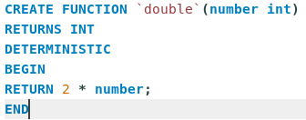
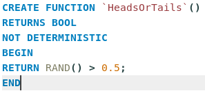

# Stored functies

Stored functies zijn, net als stored procedures, stappenplannen om tot een bepaald resultaat te komen, maar hun doel is verschillend. Stored procedures zijn in de eerste plaats bedoeld om taken in een specifieke database makkelijker uitvoerbaar te maken. Functies zijn in de eerste plaats bedoeld om zuiver inputs in outputs te transformeren. Dat wil niet zeggen dat je ze niet andersom kan gebruiken, maar dat zal minder handig werken.

### Verschil in gebruik met stored procedures

Een stored procedure `MijnProcedure` roep je op door middel van `CALL MijnProcedure()`. De procedure kan ook `IN` en `OUT` parameters hebben en beide plaats je tussen de ronde haakjes.

Een functie schrijf je gewoon zonder `CALL` en alle parameters zijn invoer, dus stemmen overeen met `IN` parameters in een stored procedure. De functie wordt dan uitgerekend en het resultaat wordt uiteindelijk gebruikt. Bijvoorbeeld: `CONCAT` is een ingebouwde functie en als je ergens `CONCAT('hello','world')` schrijft is het net alsof je op diezelfde plaats `'helloworld'` hebt geschreven.

### Determinisme

Een functie kan **deterministisch** of **niet-deterministisch** zijn. Een **deterministische** functie produceert voor dezelfde inputs altijd dezelfde outputs. `CONCAT` is een deterministische functie: `CONCAT('hello','world')` zal **altijd** `'helloworld'` produceren. Een **niet-determinische** functie kan bij identieke invoer toch verschillende uitvoer produceren. `RAND` is niet-deterministisch. `RAND()` kan de ene keer bijvoorbeeld `0.42` opleveren en de volgende keer weer `0.24`.

MySQL veronderstelt standaard dat een functie niet-deterministisch is als je het zelf niet aangeeft.


Om niet-deterministische functies te kunnen schrijven, kan het zijn dat je eerst de globale setting `log_bin_trust_function_creators` eenmalig moet aanzetten: `SET GLOBAL log_bin_trust_function_creators = TRUE;`


### Aanmaken van functies

De syntax om een functie aan te maken lijkt sterk op de syntax om een stored procedure aan te maken. Je doet dit dan ook via de **function editor** in Workbench:

In het algemeen kan je dezelfde zaken doen tussen de `begin` en `end` als in een stored procedure. Je kan dus variabelen declareren, procedures oproepen, `if` of lusstructuren gebruiken,... Wat hier nieuw is, is het woordje `returns`. Dit levert het berekende resultaat op.

Een voorbeeld van een deterministische functie is als volgt:

Een voorbeeld van een niet-deterministische functie:

Je kan niet afdwingen via het datatype dat een parameter niet-nullable is, maar je kan in het begin van de functie wel een fout signaleren als dat wel zo is.

## De referentie

MySQL voorziet veel ingebouwde functies. Als je algemene functionaliteit nodig hebt, is de kans groot dat deze al voorzien is. Raadpleeg [deze pagina van de officiële documentatie](https://dev.mysql.com/doc/refman/8.0/en/functions.html) om zeker te zijn van wat voorzien is en wat niet.
