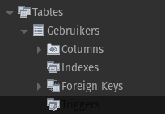

# Triggers

Triggers kunnen activeren voor of na een `INSERT`, `UPDATE` of `DELETE` in een tabel. Dit zijn de basisoperaties van de DML. Je gebruikt triggers om handelingen vast te leggen die moeten gebeuren in combinatie met deze statements, maar die misschien vergeten kunnen worden. **Als een trigger niet kan uitvoeren, voert de bijbehorende instructie ook niet uit.**

Typische voorbeelden zijn:

* loggen van aanpassingen (gewoonlijk door een extra `INSERT` te doen in een tabel die de aanpassingen opvolgt)
* extra error handling (door een fout te signaleren bij waarden die wel het juiste datatype hebben maar toch niet toegelaten zijn)

Ze zijn gekoppeld aan een bepaalde tabel, zoals je hier ziet in Workbench:




Triggers lopen niet alleen wanneer je letterlijk `INSERT`, `UPDATE` of `DELETE` uitvoert. Andere operaties die data invoegen, aanpassen of wissen kunnen ook triggers activeren.


### Aanmaken <a href="#aanmaken" id="aanmaken"></a>

Een trigger aanmaken doe je met volgende syntax, die is overgenomen uit de officiële documentatie (en wat vereenvoudigd is om enkel de zaken te tonen die wij behandelen):

```
CREATE
    TRIGGER trigger_name
    trigger_time trigger_event
    ON tbl_name FOR EACH ROW
    trigger_body

trigger_time: { BEFORE | AFTER }
trigger_event: { INSERT | UPDATE | DELETE }
```

De `trigger_body` is normaal één statement, maar je kan er meerdere statements in schrijven door eerst `BEGIN` te schrijven, dan je statements en dan `END`. Zoals bij stored procedures en functies moet je dan voor aanmaak van de trigger de delimiter wijzigen en na aanmaak van de trigger terugzetten. **Omdat er geen trigger editor is, gebeurt dit niet automatisch.** In de definitie van de trigger kan je ruwweg dezelfde instructies schrijven als in een stored procedure. In een trigger kan je ook gebruik maken van `OLD` of `NEW` om te verwijzen naar bepaalde kolomwaarden voor of na de aanpassing. Je kan alleen `OLD` **en** `NEW` gebruiken in een `UPDATE`, omdat dat het enige soort instructie is waarbij er een oude en een nieuwe waarde is voor een kolom. Het gedeelte `FOR EACH ROW` duidt op elke ingevoegde, aangepaste of verwijderde rij, niet op elke rij in de tabel.&#x20;

Een concreet voorbeeld kan bijvoorbeeld zijn:

```
drop trigger if exists log_personen_insert;

delimiter $$

CREATE TRIGGER log_personen_insert
    after insert
    ON Personen FOR EACH ROW
    begin
        declare huidigeTijd datetime;
        select now() into huidigeTijd;
        insert into PersonenLog (Id, Tijdstip)
        values (New.Id, huidigeTijd);
    end$$
    
delimiter ;
```

De declaratie is hier niet echt nodig, maar zo hebben we twee statements en hebben we een reden om `begin` en `end` te gebruiken.

Bepaalde acties zijn niet toegestaan. **Je kan bijvoorbeeld geen aanpassing doen aan de tabel waarop de trigger wordt uitgevoerd.** Anders zou je makkelijk een kettingreactie van triggers kunnen opstarten.

### Verwijderen

Dit doe je gewoonweg als volgt, waarbij `trigger_name` de naam is die je bij het aanmaken hebt ingesteld:

```sql
DROP TRIGGER trigger_name
```

### Uitvoering

* Een `BEFORE`-trigger loopt voor er een **poging** gedaan wordt om een operatie uit te voeren. Het is dus niet gegarandeerd dat die operatie ook zal slagen.
* Een `AFTER`-trigger loopt alleen als de operatie kan worden uitgevoerd.
* Als er een fout optreedt tijdens een trigger (`BEFORE` of `AFTER`), faalt de operatie die de trigger heeft geactiveerd.

