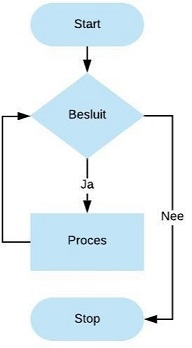
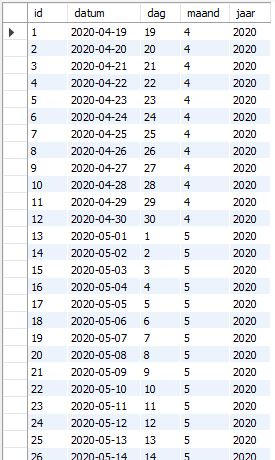

# WHILE

`WHILE` is ook een herhalingsstructuur die zorgt dat code of statements achter elkaar kunnen uitgevoerd worden zolang de conditie waar \(`TRUE`\) is.

**Syntax**

```sql
WHILE [conditie] DO
    statement(s)
END WHILE 
```

De `WHILE`-lus is controleert de conditie voordat het statement wordt uitgevoerd.

Onderstaand schema illustreert dit principe.



Om het principe van de `WHILE`-lus te tonen, maken we eerst een nieuwe tabel `kalender` aan.

```sql
CREATE TABLE kalender(
    id INT AUTO_INCREMENT,
    datum DATE UNIQUE,
    dag TINYINT NOT NULL,
    maand TINYINT NOT NULL,
    jaar INT NOT NULL,
    PRIMARY KEY(id)
);
```

Via onderstaande stored procedure gaan we de mogelijkheid voorzien om de tabel kalender van data te voorzien.

```sql
USE `aptunes`;
DROP procedure IF EXISTS `KalenderToevoegen`;

DELIMITER $$
USE `aptunes`$$
CREATE DEFINER=`root`@`localhost` PROCEDURE `KalenderToevoegen`(dd DATE)
BEGIN
INSERT INTO kalender(
        datum,
        dag,
        maand,
        jaar
    )
    VALUES(
        dd, 
        EXTRACT(DAY FROM dd),
        EXTRACT(MONTH FROM dd),
        EXTRACT(YEAR FROM dd)
    );
END$$

DELIMITER ;
```

Vervolgens zorgen we via een nieuwe stored procedure `KalenderVoegtoe` dat de zojuist gecreëerde tabel wordt gevuld met data beginnende vanaf een datum.

```sql
USE `aptunes`;
DROP procedure IF EXISTS `KalenderVoegtoe`;

DELIMITER $$
USE `aptunes`$$
CREATE DEFINER=`root`@`localhost` PROCEDURE `KalenderVoegtoe`(
	datumStart DATE,
    day INT)
BEGIN
	DECLARE teller INT DEFAULT 1;
    DECLARE dd DATE DEFAULT datumStart;

    WHILE teller <= day DO
        CALL KalenderToevoegen(dd);
        SET teller = teller + 1;
        SET dd = DATE_ADD(dd, INTERVAL 1 day);
    END WHILE;
END$$

DELIMITER ;
```

In bovenstaande stored procedure gebruiken we de `WHILE`-lus.

Zolang de teller kleiner of gelijk is aan het opgegeven aantal dagen, dan zullen data worden toegevoegd aan de gecreëerde tabel `kalender`. Dit door in de `WHILE`-lus de stored procedure `KalenderToevoegen` met als parameter een datum aan te roepen.

```sql
CALL KalenderVoegtoe('2020-04-19', 90);
```

Deze uitvoering van de stored procedure `KalenderVoegtoe` geeft volgend resultaat.



