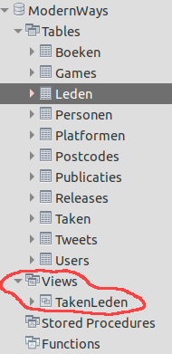

# CREATE

## Syntax

```sql
CREATE VIEW viewnaam
AS
SELECT ??? -- hier kan vanalles komen, maar er wordt een resultatenset getoond
```

## Voorbeeld

We baseren ons voorbeeld op onderstaande tabellen `Taken` en `Leden`.

**Taken**

| omschrijving | Id | Leden\_Id |
| :--- | :--- | :--- |
| bestek voorzien | 1 | 2 |
| frisdrank meebrengen | 2 | 1 |
| aardappelsla maken | 3 | 3 |

**Leden**

| voornaam | Id |
| :--- | :--- |
| Yannick | 1 |
| Bavo | 2 |
| Max | 3 |

Het uitganspunt van een view is bepaalde data die afkomstig is uit verschillende tabellen samen te brengen en te benaderen als één nieuwe virtuele tabel.

Onderstaande query haalt bepaalde data op uit de tabellen `Taken` en `Leden`.

```sql
SELECT Leden.voornaam, Taken.omschrijving
FROM Taken
INNER JOIN Leden
ON Leden.Id = Taken.Leden_Id;
```

Het resultaat van deze query is:

| voornaam | omschrijving |
| :--- | :--- |
| Yannick | frisdrank meebrengen |
| Bavo | bestek voorzien |
| Max | aardappelsla maken |

Als we het resultaat van bovenstaande query willen opslaan in een view, doen we dit op volgende manier:

```sql
CREATE VIEW TakenLeden
AS
SELECT Leden.voornaam, Taken.omschrijving
FROM Taken
INNER JOIN Leden ON Leden.Id = Taken.Leden_Id;
```

Eens je bovenstaande query `CREATE VIEW` hebt uitgevoerd wordt de view bewaard in de database.

In MySQL Workbench kan je een view vinden onder deze rubriek:



Nu kan je deze view bevragen zoals een gewone tabel.

```sql
SELECT *
FROM TakenLeden;
```

Wel belangrijk te weten dat een view de data niet fysisch bevat, maar telkens de query zal uitvoeren. Dat kan ons verder een heleboel schrijfwerk besparen bij complexe queries.

