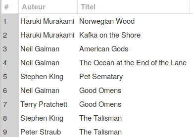
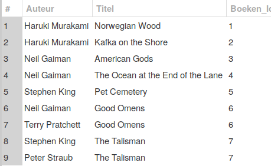
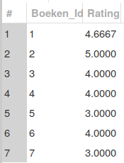
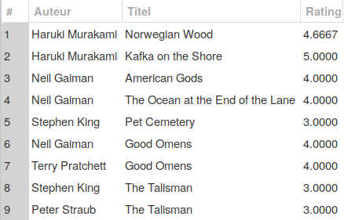

# Labo oefeningen

## Labo oefeningen

Start vanaf volgend calibratiescript, `0512__Calibratie.sql`:

```sql
DROP DATABASE  IF EXISTS `ApDB`;
CREATE DATABASE  IF NOT EXISTS `ApDB` /*!40100 DEFAULT CHARACTER SET utf8mb4 COLLATE utf8mb4_0900_ai_ci */ /*!80016 DEFAULT ENCRYPTION='N' */;
USE `ApDB`;
-- MySQL dump 10.13  Distrib 8.0.19, for Linux (x86_64)
--
-- Host: localhost    Database: ApDB
-- ------------------------------------------------------
-- Server version    8.0.17

/*!40101 SET @OLD_CHARACTER_SET_CLIENT=@@CHARACTER_SET_CLIENT */;
/*!40101 SET @OLD_CHARACTER_SET_RESULTS=@@CHARACTER_SET_RESULTS */;
/*!40101 SET @OLD_COLLATION_CONNECTION=@@COLLATION_CONNECTION */;
/*!50503 SET NAMES utf8 */;
/*!40103 SET @OLD_TIME_ZONE=@@TIME_ZONE */;
/*!40103 SET TIME_ZONE='+00:00' */;
/*!40014 SET @OLD_UNIQUE_CHECKS=@@UNIQUE_CHECKS, UNIQUE_CHECKS=0 */;
/*!40014 SET @OLD_FOREIGN_KEY_CHECKS=@@FOREIGN_KEY_CHECKS, FOREIGN_KEY_CHECKS=0 */;
/*!40101 SET @OLD_SQL_MODE=@@SQL_MODE, SQL_MODE='NO_AUTO_VALUE_ON_ZERO' */;
/*!40111 SET @OLD_SQL_NOTES=@@SQL_NOTES, SQL_NOTES=0 */;

--
-- Table structure for table `Boeken`
--

DROP TABLE IF EXISTS `Boeken`;
/*!40101 SET @saved_cs_client     = @@character_set_client */;
/*!50503 SET character_set_client = utf8mb4 */;
CREATE TABLE `Boeken` (
  `Titel` varchar(200) DEFAULT NULL,
  `Id` int(11) NOT NULL AUTO_INCREMENT,
  PRIMARY KEY (`Id`)
) ENGINE=InnoDB AUTO_INCREMENT=8 DEFAULT CHARSET=utf8mb4 COLLATE=utf8mb4_0900_ai_ci;
/*!40101 SET character_set_client = @saved_cs_client */;

--
-- Dumping data for table `Boeken`
--

LOCK TABLES `Boeken` WRITE;
/*!40000 ALTER TABLE `Boeken` DISABLE KEYS */;
INSERT INTO `Boeken` VALUES ('Norwegian Wood',1),('Kafka on the Shore',2),('American Gods',3),('The Ocean at the End of the Lane',4),('Pet Sematary',5),('Good Omens',6),('The Talisman',7);
/*!40000 ALTER TABLE `Boeken` ENABLE KEYS */;
UNLOCK TABLES;

--
-- Table structure for table `Personen`
--

DROP TABLE IF EXISTS `Personen`;
/*!40101 SET @saved_cs_client     = @@character_set_client */;
/*!50503 SET character_set_client = utf8mb4 */;
CREATE TABLE `Personen` (
  `Voornaam` varchar(25) CHARACTER SET utf8mb4 COLLATE utf8mb4_general_ci DEFAULT NULL,
  `Familienaam` varchar(50) CHARACTER SET utf8mb4 COLLATE utf8mb4_general_ci DEFAULT NULL,
  `Id` int(11) NOT NULL AUTO_INCREMENT,
  PRIMARY KEY (`Id`)
) ENGINE=InnoDB AUTO_INCREMENT=20 DEFAULT CHARSET=utf8mb4 COLLATE=utf8mb4_general_ci;
/*!40101 SET character_set_client = @saved_cs_client */;

--
-- Dumping data for table `Personen`
--

LOCK TABLES `Personen` WRITE;
/*!40000 ALTER TABLE `Personen` DISABLE KEYS */;
INSERT INTO `Personen` VALUES ('Samuel','Ijsseling',1),('Jacob','Van Sluis',2),('Emile','Benveniste',3),('Evert W.','Beth',4),('Rémy','Bernard',5),('Robert','Bly',6),('timothy','gowers',7),(NULL,'?',8),(NULL,'Ovidius',9),('Haruki','Murakami',10),('David','Mitchell',11),('Nick','Harkaway',12),('Thomas','Ligotti',13),('Neil','Gaiman',16),('Stephen','King',17),('Terry','Pratchett',18),('Peter','Straub',19);
/*!40000 ALTER TABLE `Personen` ENABLE KEYS */;
UNLOCK TABLES;

--
-- Table structure for table `Publicaties`
--

DROP TABLE IF EXISTS `Publicaties`;
/*!40101 SET @saved_cs_client     = @@character_set_client */;
/*!50503 SET character_set_client = utf8mb4 */;
CREATE TABLE `Publicaties` (
  `Boeken_Id` int(11) NOT NULL,
  `Personen_Id` int(11) NOT NULL,
  KEY `fk_Publicaties_Boeken` (`Boeken_Id`),
  KEY `fk_Publicaties_Personen` (`Personen_Id`),
  CONSTRAINT `fk_Publicaties_Boeken` FOREIGN KEY (`Boeken_Id`) REFERENCES `Boeken` (`Id`),
  CONSTRAINT `fk_Publicaties_Personen` FOREIGN KEY (`Personen_Id`) REFERENCES `Personen` (`Id`)
) ENGINE=InnoDB DEFAULT CHARSET=utf8mb4 COLLATE=utf8mb4_0900_ai_ci;
/*!40101 SET character_set_client = @saved_cs_client */;

--
-- Dumping data for table `Publicaties`
--

LOCK TABLES `Publicaties` WRITE;
/*!40000 ALTER TABLE `Publicaties` DISABLE KEYS */;
INSERT INTO `Publicaties` VALUES (1,10),(2,10),(3,16),(4,16),(5,17),(6,16),(6,18),(7,17),(7,19);
/*!40000 ALTER TABLE `Publicaties` ENABLE KEYS */;
UNLOCK TABLES;

--
-- Table structure for table `Reviews`
--

DROP TABLE IF EXISTS `Reviews`;
/*!40101 SET @saved_cs_client     = @@character_set_client */;
/*!50503 SET character_set_client = utf8mb4 */;
CREATE TABLE `Reviews` (
  `Boeken_Id` int(11) NOT NULL,
  `Rating` tinyint(4) NOT NULL
) ENGINE=InnoDB DEFAULT CHARSET=utf8mb4 COLLATE=utf8mb4_0900_ai_ci;
/*!40101 SET character_set_client = @saved_cs_client */;

--
-- Dumping data for table `Reviews`
--

LOCK TABLES `Reviews` WRITE;
/*!40000 ALTER TABLE `Reviews` DISABLE KEYS */;
INSERT INTO `Reviews` VALUES (1,4),(1,5),(1,5),(2,5),(3,3),(3,4),(3,4),(3,5),(4,4),(5,3),(6,4),(7,3);
/*!40000 ALTER TABLE `Reviews` ENABLE KEYS */;
UNLOCK TABLES;
/*!40103 SET TIME_ZONE=@OLD_TIME_ZONE */;

/*!40101 SET SQL_MODE=@OLD_SQL_MODE */;
/*!40014 SET FOREIGN_KEY_CHECKS=@OLD_FOREIGN_KEY_CHECKS */;
/*!40014 SET UNIQUE_CHECKS=@OLD_UNIQUE_CHECKS */;
/*!40101 SET CHARACTER_SET_CLIENT=@OLD_CHARACTER_SET_CLIENT */;
/*!40101 SET CHARACTER_SET_RESULTS=@OLD_CHARACTER_SET_RESULTS */;
/*!40101 SET COLLATION_CONNECTION=@OLD_COLLATION_CONNECTION */;
/*!40111 SET SQL_NOTES=@OLD_SQL_NOTES */;
```

## Oefening 1

Maak een view aan met naam `AuteursBoeken` waarmee je makkelijk een overzicht kan vragen van welke auteur welk\(e\) boek\(en\) heeft geschreven.

Je oplossing zou er exact zo moeten uitzien:



Noem het script om deze view aan te maken `0513__Oefening.sql`.

## Oefening 2

Pas, niet rechtstreeks in de tabel `Boeken` maar wel via de view `AuteursBoeken`, de titel _Pet Sematary_ aan naar _Pet Cemetery_.

Noem het script hiervoor `0514__Oefening.sql`.

Wat gebeurt er als je de naam "Stephen King" via deze view in "Steven King" wil veranderen? Waarom, denk je?

## Oefening 3 \(drie stappen\)

We willen een complexere versie van de bestaande view `AuteursBoeken`. We zullen hierbij ook de gemiddelde rating van elk boek plaatsen in een uitgebreide versie van de view, namelijk `AuteursBoekenRatings`. We zullen dit in stappen doen. Lees eerst de stappen, bekijk dan de figuren, voer dan de stappen uit.

1. Gebruik een `ALTER VIEW` om je bestaande view `AuteursBoeken` te voorzien van het `Id` uit de tabel`Boeken`. Toon `Id` hier wel als `Boeken_Id`. Noem het script dat de view aanpast `0515__Oefening.sql`.
2. Maak een view `GemiddeldeRatings` aan op basis van `Reviews`. Noem de kolom met het gemiddelde `Rating`. Noem het script dat de view maakt `0516__Oefening.sql`.
3. Maak de view`AuteursBoekenRatings` aan door een nieuwe view te maken gebaseerd op `AuteursBoeken` en `GemiddeldeRatings`. Noem het script dat de view maakt `0517__Oefening.sql`.







## Oefening 4

Vraag via de metadatabank op welke van je views updatable zijn en welke niet. Schrijf voor de meest complexe van de updatable views een `UPDATE` per kolom om te testen of je die kolom kan updaten. Je hoeft het script niet te bewaren, maar je moet in een gelijkaardige situatie \(bv. op het examen\) wel kunnen zeggen welke kolommen updatable zijn.

## Besluit

Uit de laatste oefening zie je dat er meerdere redenen zijn om een view op te bouwen uit andere views. Enerzijds om stap per stap het resultaat op te bouwen. Anderzijds omdat een view die niet-updatable views bevat zelf toch nog updatable kan zijn. Uiteraard zijn niet alle kolommen dan noodzakelijk updatable, maar het kan beter zijn dan het opbouwen van één grote niet-updatable view.

