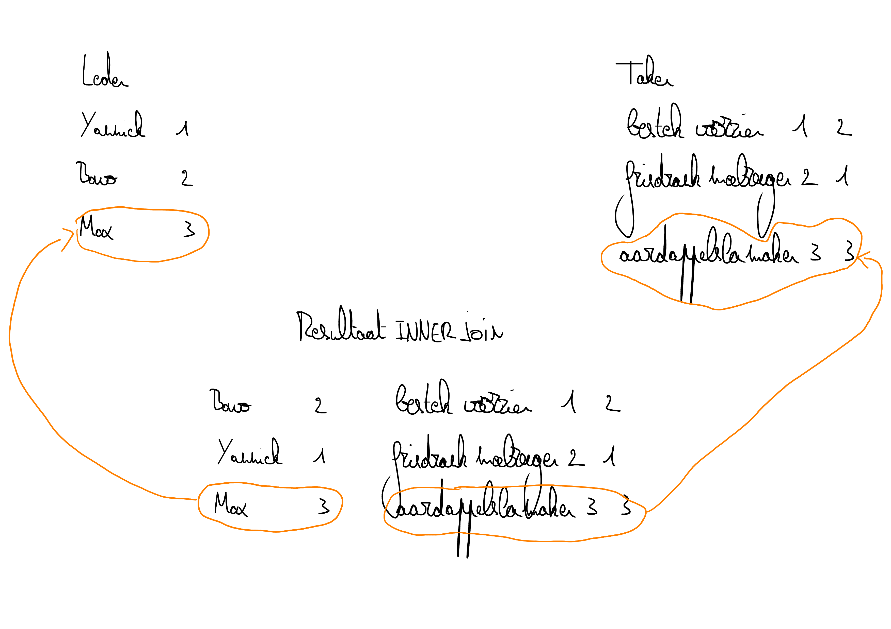

# UPDATE

Views kunnen **onder bepaalde omstandigheden** worden aangepast, ttz. de inhoud van de view kan op dezelfde wijze worden benaderd als een gewone tabel.

M.a.w. de [DML-commando's](../../semester-1-databanken-intro/deeltalen/dml/) zijn ook hier te gebruiken (met bepaalde technische beperkingen).

Er zijn hierbij wel enkele uitzonderingen in die zin dat **bij de creatie van de view** de query o.a. geen van volgende statements mag bevatten.

* `MIN`, `MAX`, `SUM`, `AVG` en `COUNT`
* `DISTINCT`
* `GROUP BY`
* `HAVING`
* `UNION`
* `LEFT JOIN` of `RIGHT JOIN` (en dus ook de `EXCLUDING` versies en `OUTER JOIN` via de workaround)
* Merk op: `INNER JOIN` mag wel!

Waarom zijn juist deze clausules niet toegelaten? De meeste ervan groeperen informatie op zo'n manier dat je de groepering niet altijd ongedaan kan maken. De niet-toegelaten `JOIN`s combineren informatie met `NULL`-waarden. Het zou niet zinvol zijn deze `NULL`-waarden aan te passen, want de aanpassingen zouden verloren gaan bij het herberekenen van de view.

## UPDATE VIEW

We baseren ons op de view die we onder de rubriek [CREATE ](create.md#voorbeeld)hebben aangemaakt. Deze gebruikt een `INNER JOIN`, maar dat verbiedt niet dat we updates doen.

```sql
USE ApDB;
UPDATE TakenLeden
SET Omschrijving = 'frisdrank voorzien'
WHERE Voornaam = 'Yannick';
```

Inspecteer `TakenLeden` en `Leden` nadat je deze opdracht hebt uitgevoerd. Wat zie je?

In een updatable view kan bepaald worden waar dergelijke aanpassingen echt moeten plaatsvinden. Volgende figuur toont het idee:



Er zijn helaas grenzen aan wat mogelijk is. Experimenteer met enkele DML-operaties met `TakenLeden`. Probeer o.a. een `INSERT` en een `DELETE` van telkens één rij.

## UPDATE VIEW INFORMATIE

Je kan nagaan of een view aanpasbaar is door in de metadatabank te kijken.

```sql
SELECT table_name, is_updatable
FROM information_schema.views
WHERE table_schema = 'ApDB';
```
